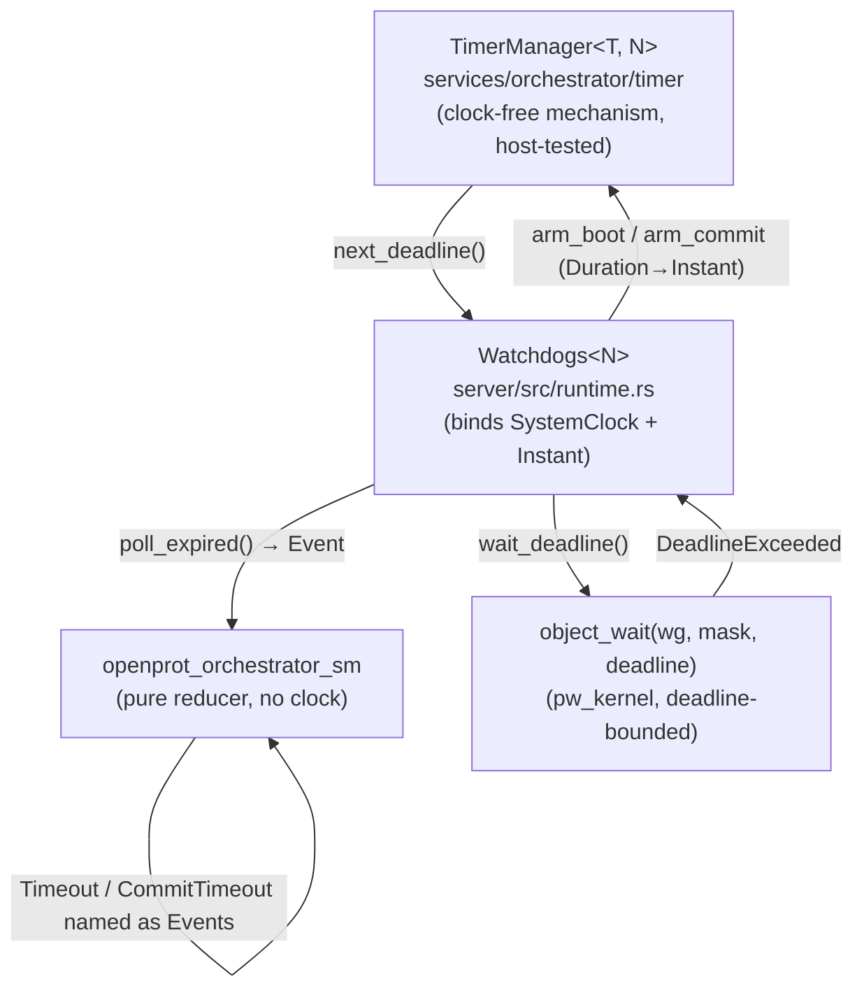

# Boot watchdog — design derivation

How the orchestrator's boot-watchdog shape (`TimerManager` → `Watchdogs`,
software timers driving `object_wait`) was reached, step by step. Each step
records the constraint that forced the next decision, so the final shape reads as
a consequence rather than a choice.

## Step 0 — What the orchestrator actually asks for

The orchestrator state machine (`openprot_orchestrator_sm`) is a pure reducer: it
consumes `Event`s and emits `Effect`s, and it **owns no clock**. It only *names*
two time-driven behaviors as events:

- `Event::Timeout(id)` — a released component never reported its boot-progress
  signal (`ComponentReady` for Active, `Booted` for Passive) within its window.
- `Event::CommitTimeout` — an activated update never reported `BootConfirmed`
  within the commit window.

Everything else about time — when to start counting, how long the window is,
which clock — is left to the runtime. So the design problem is *not* "build a
watchdog"; it is "build the smallest thing that turns elapsed time into those two
events, given the runtime the sm runs on."

## Step 1 — Separate policy from mechanism

The sm's doc comments pin down who owns what:

- **Policy** (the per-component boot window, the commit window) belongs to the
  runtime/config — it knows the platform and the components.
- **Mechanism** (track deadlines, tell me which is nearest, tell me which fired)
  is all that is missing.

Decision: the timer component carries **no policy and no clock**. It only tracks
"which deadline is nearest" and "turn an expiry into the `Event` the sm expects."
This is what keeps the sm pure and the timer testable.

## Step 2 — Use the primitive the runtime already blocks on

The runtime is a pw_kernel userspace loop. It already blocks on
`syscall::object_wait(wg, mask, deadline)`, which is **deadline-bounded**: it
returns `Err(DeadlineExceeded)` when the deadline passes with no signal.

So the runtime does not need a separate timer task, a timer thread, or an IPC
call on the arm/cancel path. It needs exactly **one absolute deadline** to hand
to the `object_wait` it is already making. That single fact shapes the whole API:

> The timer's primary output is *one* deadline (`next_deadline`), and its input
> after each wake is *now* (`poll(now)`).

## Step 3 — Multiplex many logical watchdogs onto one deadline

The sm can have several watchdogs live at once: a speculative `Passive` walk
releases components before gating, so every released component can be awaiting its
boot-progress signal simultaneously, plus the single commit watchdog. But
`object_wait` takes one deadline.

Decision: the timer **multiplexes**. It stores up to `N` per-component boot
deadlines plus one commit slot, and collapses them to the nearest via
`next_deadline()`. On wake, `poll(now)` pops the single nearest *due* watchdog and
returns its event; the caller loops until `None` to drain everything that came due
in the same tick. One-shot: a fired watchdog is gone until re-armed.

```
arm_boot(C0)  arm_boot(C1)  arm_commit
     \            |            /
      \           |           /
       +----- next_deadline() -----+   → object_wait(wg, mask, deadline)
                                          (wakes on signal OR DeadlineExceeded)
       +--------- poll(now) --------+   → drains Timeout(C0) / Timeout(C1) /
                                          CommitTimeout, nearest-first
```

## Step 4 — Make the deadline type generic → a host-testable leaf crate

The bookkeeping (nearest-of-N, re-arm replaces, one-shot pop, boot-wins-tie) is
pure logic and the part most worth unit-testing. But the kernel `Instant` only
exists on the ast10x0 target, which would force every timer test onto QEMU.

Decision: make the instant type a generic parameter `T: Copy + Ord`. The logic
crate (`services/orchestrator/timer`, `openprot_orchestrator_timer`) then:

- is `#![no_std]`, `#![forbid(unsafe_code)]`, depends only on the sm + `heapless`,
- is a **leaf crate** with no kernel dependency, so it builds and tests on the
  host,
- gets exhaustive fake-clock unit tests (`T = u64`): nearest, re-arm-replaces,
  one-shot, cancel, tie-break, drain-in-loop.

`TimerManager<T, const N: usize>` is the result — the mechanism, clock-free.

## Step 5 — Bind the real clock in a thin adapter

The target still needs real time. Rather than push the clock into the generic
crate, a thin adapter in the (kernel-locked) server crate instantiates it:

`Watchdogs<N>` wraps `TimerManager<Instant, N>` and does only the two things the
generic crate deliberately omitted:

- translate the loop's *relative* windows (`Duration`) into *absolute* deadlines
  via `SystemClock::now().checked_add_duration(after)`,
- read `now` from `SystemClock` inside `poll_expired()`.

`wait_deadline()` returns exactly the argument for `object_wait`; `poll_expired()`
is called in a loop after each wake. The clock lives in one ~40-line file
(`server/src/runtime.rs`); everything else is host-tested.

Why monotonic: `SystemClock` is the monotonic SysTick, the correct clock for a
watchdog — no wall-clock jumps or regressions can make a deadline fire early or
never.

## Step 6 — Make cancellation stale-safe instead of race-free

A watchdog often needs cancelling (component reported in, update committed). In a
loop that races timer expiry against incoming signals, a *race-free* cancel would
need locking or a cancellation handshake.

But the sm already tolerates late fires: it **drops** a `Timeout` for a component
no longer awaiting boot, and a `CommitTimeout` with no update in flight. That
means a cancel that loses the race is harmless — the late event becomes a dropped
event, never a false recovery.

Decision: cancellation is **best-effort** (`cancel_boot`/`cancel_commit` are plain
`swap_remove` / `= None`, no-op if absent). This removes all locking from the
arm/cancel path and is *sound only because* it leans on the sm's existing
drop-stale contract. The design shape is co-designed with the sm, not bolted on.

## Step 7 — Bound N to the chain, fail toward liveness not safety

`N` must cap concurrent boot watchdogs. Set `N` = chain length: the sm never has
more than the whole chain awaiting boot at once. A full buffer then can't happen
for a valid chain.

For the impossible-by-construction overflow, the choice is: panic, or drop the
arm. Dropping means the component simply gets no timeout — a *liveness* gap
(caught later by other supervision) rather than a *safety* failure or a crash in
security-relevant firmware. So `arm_boot` drops on full. This makes `N ≥ max
concurrent awaiting` a documented configuration invariant.

## Step 8 — Cross-check against a shipping reference

The aspeed-zephyr PFR (a production eRoT) resolves the same problem the same way:

- Its per-component boot watchdogs (BMC/ACM/BIOS/ME) are Zephyr **software
  `k_timer`s** (`K_TIMER_DEFINE(pfr_bmc_timer, …)`), armed/stopped on checkpoint
  progress, whose callbacks inject `GenerateStateMachineEvent(WDT_TIMEOUT, …)`
  into the state machine — software timer → SM event, exactly this shape.
- Its **hardware** watchdog is reserved for the RoT protecting *itself* (ABR /
  FMCWDT2 auto-boot-recovery), and is disabled once the RoT is up. It is never
  wired into the SM as a component supervisor.

This corroborates the split: OS timers for per-component boot supervision;
hardware watchdog (if any) for RoT self-recovery, a separate concern. The one
delivery difference — aspeed posts from an ISR into a FIFO, openprot polls
`poll_expired()` after a deadline-bounded `object_wait` — is a runtime detail, not
a shape difference.

## Resulting shape



Run-loop sketch:

```text
loop {
    let deadline = wd.wait_deadline();               // nearest of N boot + commit
    match object_wait(WG, mask, deadline) {
        Ok(_)                    => { /* real signal → dispatch to sm */ }
        Err(DeadlineExceeded)    => {
            while let Some(ev) = wd.poll_expired() {  // drain everything due
                orchestrator.dispatch(ev);            // Timeout(id) / CommitTimeout
            }
        }
    }
    // effects from dispatch drive arm_boot / cancel_boot / arm_commit / cancel_commit
}
```

## Validation

- **Host unit tests** on `TimerManager<u64, 4>`: nearest, re-arm-replaces,
  one-shot, cancel, tie-break, drain-in-loop.
- **On-target QEMU test** (`//target/ast10x0/tests/orchestrator/timer`): drives
  `Watchdogs<4>` against the real `SystemClock` + `object_wait` deadline through
  four cases (single boot deadline, nearest-of-two ordering, commit watchdog,
  cancellation) — reports `TEST_RESULT:PASS`.

## Open item

The mechanism is complete and validated; the remaining work is **wiring**: the
dispatch loop must translate the sm's effect trace into
`arm_boot` (on `ReleaseReset`), `cancel_boot` (on `ComponentReady`/`Booted`),
`arm_commit` (on `ActivateUpdate`), `cancel_commit` (on `CommitSvnFloor`), and
re-arm across a recovery re-walk. `Watchdogs` already exposes exactly those
operations; that effect→timer glue is not in a run loop yet.
