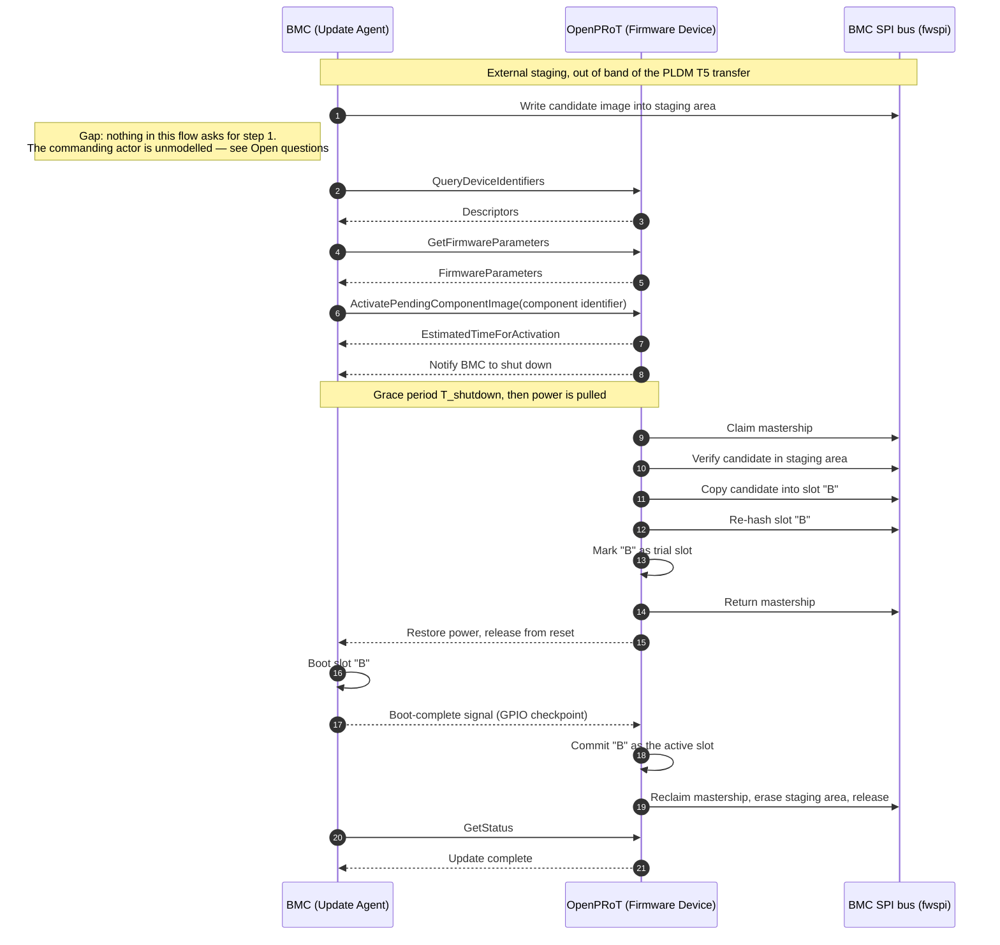
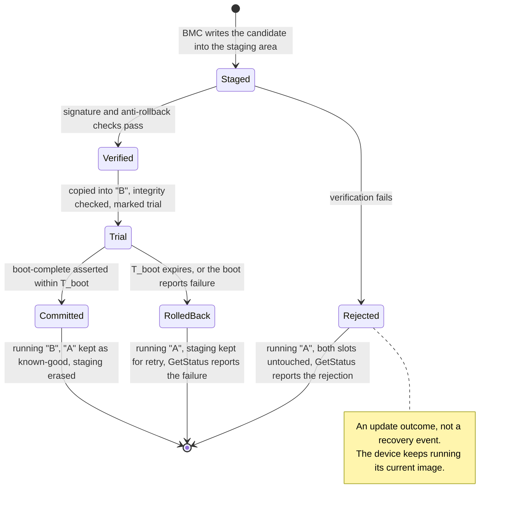

# OCP Global Demo Proposal

Status: Draft

## Proposal

Build a small Update Agent leveraging pldm-lib/pldm-common to run on top of
OpenBMC on AST2700. Use OpenPRoT as the Firmware Device to execute the external
staging flow listed below.

The Update Agent will send `GetFirmwareParameters` for inventory, and
`ActivatePendingComponentImage` to signal OpenPRoT to begin this flow.

"External staging" means the BMC places the candidate image into the staging
area itself, out of band of the PLDM Type 5 component image transfer. The flow
therefore begins at activation rather than at `RequestUpdate`, and
`ActivatePendingComponentImage` is the command that hands the staged image to
OpenPRoT.

## Layout assumptions

The flow below assumes the following. These need confirming before the diagram
can be treated as settled — see [Open questions](#open-questions).

*   The BMC firmware flash on `fwspi` is dual-bank: slots `"A"` and `"B"`, with
    one active at a time. `"A"` is the active slot when the flow starts.
*   The staging area is a region of the BMC flash rather than storage private
    to OpenPRoT, which is why OpenPRoT must claim mastership before it can
    verify or copy the candidate. Aspeed's PFR firmware for this silicon places
    staging in BMC flash the same way, and goes further: it carves a separate
    staging region per updatable component — 64 MiB for the BMC, 1 MiB for the
    RoT's own image, 4 MiB for the CPLD — each holding a *signed capsule*
    rather than a bare image. See its `ast2700_dual_flash_amd` board
    configuration.
*   OpenPRoT controls BMC power and reset, and can arbitrate mastership of
    `fwspi`.

## Flow

The message flow for a successful update. Verification and boot supervision can
both fail; rather than nest those branches here, every outcome is drawn
separately in [Outcomes](#outcomes) below.

## Outcomes

The candidate's lifecycle, and the three states the platform can come to rest
in. Each terminal state names what the BMC is running, what happened to the
staging area, and what the Update Agent reads back from `GetStatus`.

## Notes on the flow

*   **Failures are read back, never pushed.** BMC power is already down by the
    time the candidate is verified, so OpenPRoT cannot report a bad image to the
    BMC at that moment. Every outcome is instead reported through `GetStatus`
    once the BMC is running again, which is how
    [Firmware Update](../specification/services/fwupdate.md) already describes
    the Update Agent learning that activation finished.

*   **Rejection is not recovery.** A candidate that fails verification is
    discarded and the device keeps running its current image, matching
    `UpdateRejected` → `DiscardStaged` → `Ready` and INV4 in the
    [Orchestrator State Machine](./orchestrator/orchestrator-machine.md).
    `Rejected` and `RolledBack` are distinct terminal states and neither is a
    completed update.

*   **Trial before commit.** `"B"` is marked as a trial slot and only committed
    once a good boot is observed. If nothing is committed, `"A"` is still active
    and the fallback is automatic. This is the `set_trial` → `release` →
    `supervise_boot` → `commit` shape documented on the `BootControl`
    capability in `services/orchestrator/capabilities/src/boot_control.rs`.

*   **Staging is erased last.** Erasing only after a committed boot keeps the
    transferred image available for a retry and leaves no window in which a
    power loss costs a re-transfer over PLDM. The cost is that the erase needs
    a second mastership claim while the BMC is running.

*   **Nothing in this flow commands step 1.** The diagram has three
    participants and none of them asks the BMC to stage an image. In a
    deployment the instruction comes from a fourth actor above the BMC — an
    operator or fleet-management system — and the Update Agent is the process
    that receives it, writes the candidate, and then speaks PLDM to OpenPRoT.
    That actor is worth naming because the update it asks for takes down the
    machine it is talking to: from `ActivatePendingComponentImage` until power
    is restored there is no management path to the BMC, and
    `EstimatedTimeForActivation` is only an estimate of how long that lasts.
    Whatever drives the flow has to expect the endpoint to disappear and
    return, and has to remember across that gap that an update was in flight.

*   **Two distinct verifications.** The check on the candidate is an
    authenticity check — signature plus anti-rollback. The check after the
    copy into `"B"` is an integrity check that the write landed correctly.
    They are not the same operation.

*   **Boot success is a signalled checkpoint, not an assumption.** The
    boot-complete indication is a GPIO the orchestrator reads
    (`services/orchestrator/hal-adapters/src/gpio_boot_monitor.rs`), judged
    against a checkpoint window. A BMC that hangs is distinguished from one that
    reports a failure by the verdict's cause — `TimedOut` versus
    `DeviceRetriable` / `DeviceFatal` in
    `services/orchestrator/capabilities/src/boot_watch.rs`.

### Timeouts

| Timeout | Purpose | Backing mechanism |
|---|---|---|
| `T_shutdown` | Grace period between the shutdown request and pulling power | Value still to be decided |
| `EstimatedTimeForActivation` | Tells the Update Agent how long activation may take | PLDM T5 activation response |
| `T_boot` | Checkpoint window for the trial boot | `WalkVerdict::Waiting { deadline_millis }`, `FailureCause::TimedOut` |
| Commit window | Bounds how long a slot may stay activated but not committed | `TimerManager::arm_commit` / `Expired::Commit` in `services/orchestrator/timer` |

## Open questions

1.  **`T_shutdown`** — what grace period does the BMC get between the shutdown
    notification and OpenPRoT pulling power, and what happens if it is still
    running when the period expires?
2.  **Commit policy for `"A"`** — the flow keeps `"A"` as the known-good image
    indefinitely. If `"A"` is ever to be resynced to match `"B"`, what triggers
    it: a number of successful boots, an explicit Update Agent command, or a
    manual step? Note that resyncing costs another mastership claim and BMC
    power cycle, and gives up the rollback image.
3.  **Staging area layout** — staging living in BMC flash is settled by
    precedent, but three things are not. Does the demo carve one staging region
    per component as Aspeed's PFR does, or a single region? Is the staged unit
    a signed capsule or a bare image, since that decides what the verification
    step actually parses? And how does either shape sit with the flash
    topologies in [Use Cases](../specification/use_cases/README.md), which
    describe dual-flash-side-by-side as two parts with one partition each and
    direct-connect as one double-sized part — neither of which names a staging
    region at all?
4.  **What commands the staging write** — is the trigger for step 1 in scope
    for the demo, and what drives it: Redfish on the BMC, a fleet-management
    system, or a manual step on stage? Related: OpenPRoT is not told that
    staging happened and cannot distinguish a fresh candidate from one left
    over by a rolled-back attempt, since the rollback path deliberately keeps
    staging intact. Signature and anti-rollback checks still gate what runs, so
    nothing untrusted or downgraded gets in, but re-applying an identical
    version that was already tried is not caught. Passing the expected version
    or digest in the activation request would close it, if it is worth closing.

5.  **`ActivatePendingComponentImage` availability** — the command is not
    listed in the Type 5 command set in
    [PLDM](../specification/middleware/pldm.md), and it is not implemented in
    the pinned `pldm-common`, whose firmware-update command enum carries the
    DSP0267 1.2 commands plus the 1.3 downstream-device commands. Confirm
    whether the demo adds the command upstream or falls back to
    `ActivateFirmware`, and update the PLDM specification page to match.
