# Generic Digest Server Design Document

This document describes the design and architecture of a generic digest server for Hubris OS that supports both SPDM and PLDM protocol implementations.

## Requirements

### Primary Requirement

**Enable SPDM and PLDM Protocol Support**: The digest server must provide cryptographic hash services to support both SPDM (Security Protocol and Data Model) and PLDM (Platform Level Data Model) protocol implementations in Hubris OS.

### Derived Requirements

#### R1: Algorithm Support
- **R1.1**: Support SHA-256 for basic SPDM operations and PLDM firmware integrity validation
- **R1.2**: Support SHA-384 for enhanced security profiles in both SPDM and PLDM
- **R1.3**: Support SHA-512 for maximum security assurance
- **R1.4**: Reject unsupported algorithms (SHA-3) with clear error codes

#### R2: Session Management
- **R2.1**: Support incremental hash computation for large certificate chains and firmware images
- **R2.2**: Support multiple concurrent digest sessions (hardware-dependent capacity)
- **R2.3**: Provide session isolation between different SPDM and PLDM protocol flows
- **R2.4**: Automatic session cleanup to prevent resource exhaustion
- **R2.5**: Session timeout mechanism for abandoned operations

#### R3: SPDM and PLDM Use Cases
- **R3.1**: Certificate chain verification (hash large X.509 certificate data)
- **R3.2**: Measurement verification (hash firmware measurement data)
- **R3.3**: Challenge-response authentication (compute transcript hashes)
- **R3.4**: Session key derivation (hash key exchange material)
- **R3.5**: Message authentication (hash SPDM message sequences)
- **R3.6**: PLDM firmware image integrity validation (hash received firmware chunks)
- **R3.7**: PLDM component image verification (validate assembled image against manifest digest)
- **R3.8**: PLDM signature verification support (hash image data for signature validation)

#### R4: Performance and Resource Constraints
- **R4.1**: Memory-efficient operation suitable for embedded systems
- **R4.2**: Zero-copy data processing using Hubris leased memory
- **R4.3**: Deterministic resource allocation (no dynamic allocation)
- **R4.4**: Bounded execution time for real-time guarantees

#### R5: Hardware Abstraction
- **R5.1**: Generic interface supporting any hardware digest accelerator
- **R5.2**: Mock implementation for testing and development
- **R5.3**: Type-safe hardware abstraction with compile-time verification
- **R5.4**: Consistent API regardless of underlying hardware

#### R6: Error Handling and Reliability
- **R6.1**: Comprehensive error reporting for SPDM protocol diagnostics
- **R6.2**: Graceful handling of hardware failures
- **R6.3**: Session state validation and corruption detection
- **R6.4**: Clear error propagation to SPDM layer

#### R7: Integration Requirements
- **R7.1**: Synchronous IPC interface compatible with Hubris task model
- **R7.2**: Idol-generated API stubs for type-safe inter-process communication
- **R7.3**: Integration with Hubris memory management and scheduling
- **R7.4**: No dependency on async runtime or futures

#### R8: Supervisor Integration Requirements
- **R8.1**: Configure appropriate task disposition (Restart recommended for production)
- **R8.2**: SPDM clients handle task generation changes transparently (no complex recovery logic needed)
- **R8.3**: Digest server fails fast on unrecoverable hardware errors rather than returning complex error states
- **R8.4**: Support debugging via jefe external interface during development

## Design Overview

This digest server provides a generic implementation that can work with any device implementing the required digest traits from `openprot-hal-blocking`. The design supports both single-context and multi-context hardware through hardware-adaptive session management.

## Architecture

### System Context

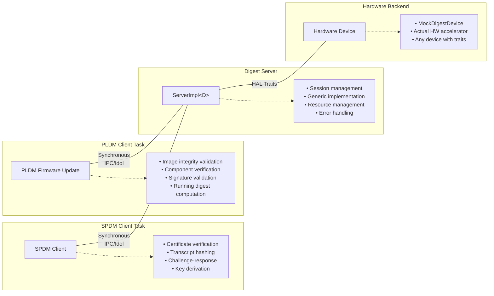

### Component Architecture

```
ServerImpl<D>
├── Generic Type Parameter D
│   └── Trait Bounds: DigestInit<Sha2_256/384/512>
├── Session Management
│   ├── Static session storage (hardware-dependent capacity)
│   ├── Session lifecycle (init → update → finalize)
│   └── Automatic timeout and cleanup
└── Hardware Abstraction
    ├── Static dispatch (no runtime polymorphism)
    ├── Algorithm-specific methods
    └── Error translation layer
```

### Data Flow

```
SPDM Client Request
        ↓
   Idol-generated stub
        ↓
   ServerImpl<D> method
        ↓
   Session validation/allocation
        ↓
   Hardware context management (save/restore)
        ↓
   Direct hardware streaming
        ↓
   Result processing
        ↓
   Response to client
```

### Hardware-Adaptive Implementation

#### Platform-Specific Trait Implementations
```rust
// Single-context hardware (ASPEED HACE) - context management happens in OpContext
impl DigestInit<Sha2_256> for Ast1060HashDevice {
    type OpContext<'a> = Ast1060DigestContext<'a> where Self: 'a;
    type Output = Digest<8>;

    fn init<'a>(&'a mut self, _: Sha2_256) -> Result<Self::OpContext<'a>, Self::Error> {
        // Direct hardware initialization - no session management needed
        Ok(Ast1060DigestContext::new_sha256(self))
    }
}

impl DigestOp for Ast1060DigestContext<'_> {
    fn update(&mut self, data: &[u8]) -> Result<(), Self::Error> {
        // Direct streaming to hardware - blocking until complete
        self.hardware.stream_data(data)
    }

    fn finalize(self) -> Result<Self::Output, Self::Error> {
        // Complete and return result - hardware auto-resets
        self.hardware.finalize_sha256()
    }
}

// Multi-context hardware (hypothetical) - context switching hidden in traits
impl DigestInit<Sha2_256> for MultiContextDevice {
    type OpContext<'a> = MultiContextDigestContext<'a> where Self: 'a;
    type Output = Digest<8>;

    fn init<'a>(&'a mut self, _: Sha2_256) -> Result<Self::OpContext<'a>, Self::Error> {
        // Complex session allocation happens here, hidden from server
        let context_id = self.allocate_hardware_context()?;
        Ok(MultiContextDigestContext::new(self, context_id))
    }
}

impl DigestOp for MultiContextDigestContext<'_> {
    fn update(&mut self, data: &[u8]) -> Result<(), Self::Error> {
        // Context switching happens transparently here
        self.hardware.ensure_context_active(self.context_id)?;
        self.hardware.stream_data(data)
    }
}
```

#### Hardware-Specific Processing Patterns

**Single-Context Hardware (ASPEED HACE Pattern)**
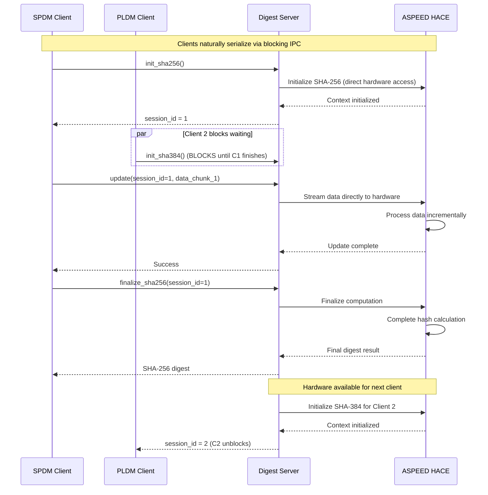

**Multi-Context Hardware Pattern (Hypothetical)**
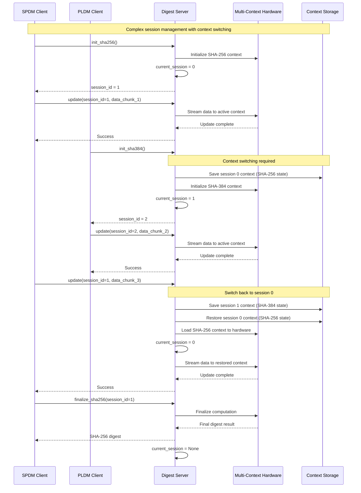

## IPC Interface Definition

The digest server exposes its functionality through a Hubris Idol IPC interface that provides both session-based streaming operations and one-shot convenience methods.

### Idol Interface Specification

```rust
// digest.idol - Hubris IPC interface definition
Interface(
    name: "Digest",
    ops: {
        // Session-based streaming operations (enabled by owned API)
        "init_sha256": (
            args: {},
            reply: Result(
                ok: "u32", // Returns session ID for the digest context
                err: CLike("DigestError"),
            ),
        ),
        "init_sha384": (
            args: {},
            reply: Result(
                ok: "u32", // Returns session ID for the digest context
                err: CLike("DigestError"),
            ),
        ),
        "init_sha512": (
            args: {},
            reply: Result(
                ok: "u32", // Returns session ID for the digest context
                err: CLike("DigestError"),
            ),
        ),
        "update": (
            args: {
                "session_id": "u32",
                "len": "u32",
            },
            leases: {
                "data": (type: "[u8]", read: true, max_len: Some(1024)),
            },
            reply: Result(
                ok: "()",
                err: CLike("DigestError"),
            ),
        ),
        "finalize_sha256": (
            args: {
                "session_id": "u32",
            },
            leases: {
                "digest_out": (type: "[u32; 8]", write: true),
            },
            reply: Result(
                ok: "()",
                err: CLike("DigestError"),
            ),
        ),
        "finalize_sha384": (
            args: {
                "session_id": "u32",
            },
            leases: {
                "digest_out": (type: "[u32; 12]", write: true),
            },
            reply: Result(
                ok: "()",
                err: CLike("DigestError"),
            ),
        ),
        "finalize_sha512": (
            args: {
                "session_id": "u32",
            },
            leases: {
                "digest_out": (type: "[u32; 16]", write: true),
            },
            reply: Result(
                ok: "()",
                err: CLike("DigestError"),
            ),
        ),
        "reset": (
            args: {
                "session_id": "u32",
            },
            reply: Result(
                ok: "()",
                err: CLike("DigestError"),
            ),
        ),

        // One-shot convenience operations (using scoped API internally)
        "digest_oneshot_sha256": (
            args: {
                "len": "u32",
            },
            leases: {
                "data": (type: "[u8]", read: true, max_len: Some(1024)),
                "digest_out": (type: "[u32; 8]", write: true),
            },
            reply: Result(
                ok: "()",
                err: CLike("DigestError"),
            ),
        ),
        "digest_oneshot_sha384": (
            args: {
                "len": "u32",
            },
            leases: {
                "data": (type: "[u8]", read: true, max_len: Some(1024)),
                "digest_out": (type: "[u32; 12]", write: true),
            },
            reply: Result(
                ok: "()",
                err: CLike("DigestError"),
            ),
        ),
        "digest_oneshot_sha512": (
            args: {
                "len": "u32",
            },
            leases: {
                "data": (type: "[u8]", read: true, max_len: Some(1024)),
                "digest_out": (type: "[u32; 16]", write: true),
            },
            reply: Result(
                ok: "()",
                err: CLike("DigestError"),
            ),
        ),
    },
)
```

### IPC Design Rationale

#### Session-Based Operations
- **init_sha256/384/512()**: Creates new session using owned API, returns session ID for storage
- **update(session_id, data)**: Updates specific session using move-based context operations
- **finalize_sha256/384/512(session_id)**: Completes session and recovers controller for reuse
- **reset(session_id)**: Cancels session early and recovers controller

#### One-Shot Operations
- **digest_oneshot_sha256/384/512()**: Complete digest computation in single IPC call using scoped API
- **Convenience methods**: For simple use cases that don't need streaming

#### Zero-Copy Data Transfer
- **Leased memory**: All data transfer uses Hubris leased memory system
- **Read leases**: Input data (`data`) passed by reference, no copying
- **Write leases**: Output digests (`digest_out`) written directly to client memory
- **Bounded transfers**: Maximum 1024 bytes per update for deterministic behavior

#### Type Safety
- **Algorithm-specific finalize**: `finalize_sha256` only works with SHA-256 sessions
- **Sized output arrays**: `[u32; 8]` for SHA-256, `[u32; 12]` for SHA-384, `[u32; 16]` for SHA-512
- **Session validation**: Invalid session IDs return `DigestError::InvalidSession`

### IPC Usage Patterns

#### SPDM Certificate Verification (Streaming)
```rust
// Client code using generated Idol stubs
let digest = Digest::from(DIGEST_SERVER_TASK_ID);

let session_id = digest.init_sha256()?;
for chunk in certificate_data.chunks(1024) {
    digest.update(session_id, chunk.len() as u32, chunk)?;
}
let mut cert_hash = [0u32; 8];
digest.finalize_sha256(session_id, &mut cert_hash)?;
```

#### Simple Hash Computation (One-Shot)
```rust
// Client code for simple operations
let digest = Digest::from(DIGEST_SERVER_TASK_ID);
let mut hash_output = [0u32; 8];
digest.digest_oneshot_sha256(data.len() as u32, data, &mut hash_output)?;
```

## Detailed Design

### Session Model

#### Session Lifecycle
```
┌─────────┐    init_sha256/384/512()    ┌─────────┐
│  FREE   │ ────────────────────────→   │ ACTIVE  │
│         │                             │         │
└─────────┘                             └─────────┘
     ↑                                       │
     │ finalize_sha256/384/512()             │ update(data)
     │ reset()                               │ (stream to hardware)
     │ timeout_cleanup()                     │
     └───────────────────────────────────────┘
```

#### Hardware-Specific Session Management

Different hardware platforms have varying capabilities for concurrent session support:

```rust
// Platform-specific capability trait
pub trait DigestHardwareCapabilities {
    const MAX_CONCURRENT_SESSIONS: usize;
    const SUPPORTS_HARDWARE_CONTEXT_SWITCHING: bool;
}

// AST1060 implementation - single session, simple and efficient
impl DigestHardwareCapabilities for Ast1060HashDevice {
    const MAX_CONCURRENT_SESSIONS: usize = 1;  // Work with hardware, not against it
    const SUPPORTS_HARDWARE_CONTEXT_SWITCHING: bool = false;
}

// Example hypothetical multi-context implementation
impl DigestHardwareCapabilities for HypotheticalMultiContextDevice {
    const MAX_CONCURRENT_SESSIONS: usize = 16;  // Hardware-dependent capacity
    const SUPPORTS_HARDWARE_CONTEXT_SWITCHING: bool = true;
}

// Generic server implementation
pub struct ServerImpl<D: DigestHardwareCapabilities> {
    sessions: FnvIndexMap<u32, DigestSession, {D::MAX_CONCURRENT_SESSIONS}>,
    hardware: D,
    next_session_id: u32,
}

pub struct DigestSession {
    algorithm: SessionAlgorithm,
    timeout: Option<u64>,
    // Hardware-specific context data only if supported
}
```

### Generic Hardware Abstraction with Platform-Adaptive Session Management

#### Trait Requirements
The server is generic over type `D` where:
```rust
D: DigestInit<Sha2_256> + DigestInit<Sha2_384> + DigestInit<Sha2_512> + ErrorType
```

With the actual `openprot-hal-blocking` trait structure:
```rust
// Hardware device implements DigestInit for each algorithm
impl DigestInit<Sha2_256> for MyDigestDevice {
    type OpContext<'a> = MyDigestContext<'a> where Self: 'a;
    type Output = Digest<8>;

    fn init<'a>(&'a mut self, _: Sha2_256) -> Result<Self::OpContext<'a>, Self::Error> {
        // All hardware complexity (context management, save/restore) handled here
    }
}

// The context handles streaming operations
impl DigestOp for MyDigestContext<'_> {
    type Output = Digest<8>;

    fn update(&mut self, data: &[u8]) -> Result<(), Self::Error> {
        // Hardware-specific streaming implementation
        // Context switching (if needed) happens transparently
    }

    fn finalize(self) -> Result<Self::Output, Self::Error> {
        // Complete digest computation
        // Context cleanup happens automatically
    }
}
```

#### Hardware-Adaptive Architecture
- **Single-Context Hardware**: Direct operations, clients naturally serialize via blocking IPC
- **Multi-Context Hardware**: Native hardware session switching when supported
- **Compile-time optimization**: Session management code only included when needed
- **Platform-specific limits**: `MAX_CONCURRENT_SESSIONS` based on hardware capabilities
- **Synchronous IPC alignment**: Works naturally with Hubris blocking message passing

#### Concurrency Patterns by Hardware Type

**Single-Context Hardware (ASPEED HACE):**
```
Client A calls init_sha256() → Blocks until complete → Returns session_id
Client B calls init_sha384() → Blocks waiting for A to finish → Still blocked
Client A calls update(session_id) → Blocks until complete → Returns success
Client B calls update(session_id) → Still blocked waiting for A to finalize
Client A calls finalize() → Releases hardware → Client B can now proceed
```

**Multi-Context Hardware (Hypothetical):**
```
Client A calls init_sha256() → Creates session context → Returns immediately
Client B calls init_sha384() → Creates different context → Returns immediately
Client A calls update(session_id) → Uses session context → Returns immediately
Client B calls update(session_id) → Uses different context → Returns immediately
```

#### Session Management Flow (Hardware-Dependent)
```
Single-Context Hardware: Direct Operation → Hardware → Result
Multi-Context Hardware: Session Request → Hardware Context → Process → Save Context → Result
```

#### Static Dispatch Pattern
- **Compile-time algorithm selection**: No runtime algorithm switching
- **Type safety**: Associated type constraints ensure output size compatibility
- **Zero-cost abstraction**: No virtual function calls or dynamic dispatch
- **Hardware flexibility**: Any device implementing the traits can be used

### Memory Management

#### Static Allocation Strategy (Hardware-Adaptive)
```rust
// Session storage sized based on hardware capabilities
static mut SESSION_STORAGE: [SessionData; D::MAX_CONCURRENT_SESSIONS] = [...];
```
- **Hardware-aligned limits**: Session count matches hardware capabilities
- **Single-context optimization**: No session overhead for simple hardware
- **Multi-context support**: Full session management when hardware supports it
- **Deterministic memory usage**: No dynamic allocation
- **Real-time guarantees**: Bounded memory access patterns

#### Hardware-Adaptive Data Flow
- **Zero-copy IPC**: Uses Hubris leased memory system
- **Platform optimization**: Direct operations for single-context hardware
- **Session management**: Only when hardware supports multiple contexts
- **Bounded updates**: Maximum 1024 bytes per update call (hardware limitation)
- **Memory safety**: All buffer accesses bounds-checked
- **Synchronous semantics**: Natural blocking behavior with Hubris IPC

#### Platform-Specific Processing
```
Single-Context: Client Request → Direct Hardware → Result → Client Response
Multi-Context:   Client Request → Session Management → Hardware Context → Result → Client Response
```

### Error Handling Strategy

#### Hardware-Adaptive Error Model
```
Hardware Layer Error → DigestError → RequestError<DigestError> → Client Response
```

#### Platform-Specific Error Categories
- **Hardware failures**: `DigestError::HardwareFailure` (all platforms)
- **Session management**: `DigestError::InvalidSession`, `DigestError::TooManySessions` (multi-context only)
- **Input validation**: `DigestError::InvalidInputLength` (hardware-specific limits)
- **Algorithm support**: `DigestError::UnsupportedAlgorithm` (capability-dependent)

### Hardware-Adaptive Session Architecture

Instead of imposing a complex context management layer, the digest server adapts to hardware capabilities:

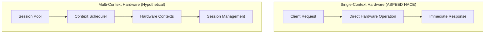

#### Hardware Capability Detection

The digest server adapts to different hardware capabilities through compile-time trait bounds:

```rust
pub trait DigestHardwareCapabilities {
    const MAX_CONCURRENT_SESSIONS: usize;  // Hardware-dependent: 1 for single-context, 16+ for multi-context
    const SUPPORTS_CONTEXT_SWITCHING: bool;
    const MAX_UPDATE_SIZE: usize;
}
```

Examples of hardware-specific session limits:
- **ASPEED AST1060**: `MAX_CONCURRENT_SESSIONS = 1` (single hardware context)
- **Multi-context accelerators**: `MAX_CONCURRENT_SESSIONS = 16` (or higher based on hardware design)
- **Software implementations**: Can support many concurrent sessions limited by memory

#### Session Management Strategy
- **Single-context platforms**: Direct hardware operations, no session state
- **Multi-context platforms**: Full session management with context switching
- **Compile-time optimization**: Dead code elimination for unused features

3. **Context Initialization**: When starting new session
   ```rust
#### Clean Server Implementation

With proper trait encapsulation, the server implementation becomes much simpler:

```rust
impl<D> ServerImpl<D>
where
    D: DigestInit<Sha2_256> + DigestInit<Sha2_384> + DigestInit<Sha2_512> + ErrorType
{
    fn update_session(&mut self, session_id: u32, data: &[u8]) -> Result<(), DigestError> {
        let session = self.get_session_mut(session_id)?;

        // Generic trait call - all hardware complexity hidden
        session.op_context.update(data)
            .map_err(|_| DigestError::HardwareFailure)?;

        Ok(())
    }

    fn finalize_session(&mut self, session_id: u32) -> Result<DigestOutput, DigestError> {
        let session = self.take_session(session_id)?;

        // Trait handles finalization and automatic cleanup
        session.op_context.finalize()
            .map_err(|_| DigestError::HardwareFailure)
    }
}
```

#### Hardware Complexity Encapsulation
- **No save/restore methods**: All context management hidden in trait implementations
- **No platform-specific code**: Server only calls generic trait methods
- **Automatic optimization**: Single-context hardware avoids unnecessary overhead
- **Transparent complexity**: Multi-context hardware handles switching internally

### Concurrency Model

#### Session Isolation
- Each session operates independently
- No shared mutable state between sessions
- Session IDs provide access control
- Timeout mechanism prevents resource leaks

#### SPDM and PLDM Integration Points
1. **SPDM Certificate Verification**: Hash certificate chains incrementally
2. **SPDM Transcript Computation**: Hash sequences of SPDM messages
3. **SPDM Challenge Processing**: Compute authentication hashes
4. **SPDM Key Derivation**: Hash key exchange material
5. **PLDM Firmware Integrity**: Hash received firmware image chunks during transfer
6. **PLDM Component Validation**: Verify assembled components against manifest digests
7. **PLDM Multi-Component Updates**: Concurrent digest computation for multiple firmware components

## Failure Scenarios

### Session Management Failures

#### Session Exhaustion Scenarios

**Single-Context Hardware (ASPEED HACE) - No Exhaustion Possible**
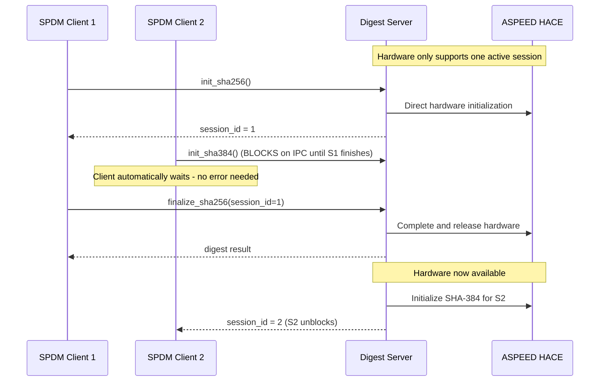

**Multi-Context Hardware (Hypothetical) - True Session Exhaustion**
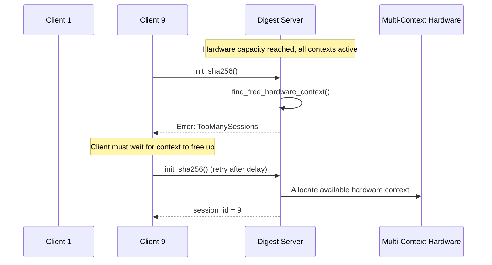

#### Session Timeout Recovery
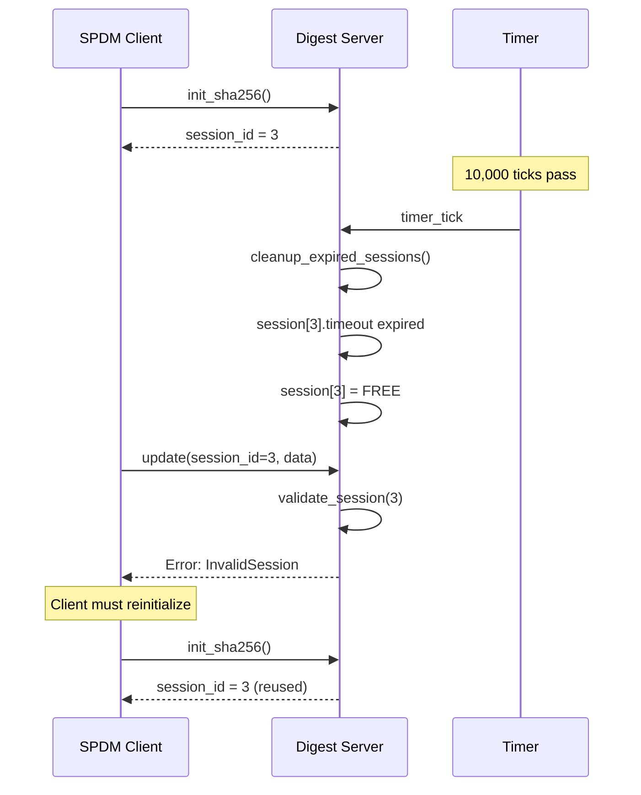

### Hardware Failure Scenarios

#### Hardware Device Failure
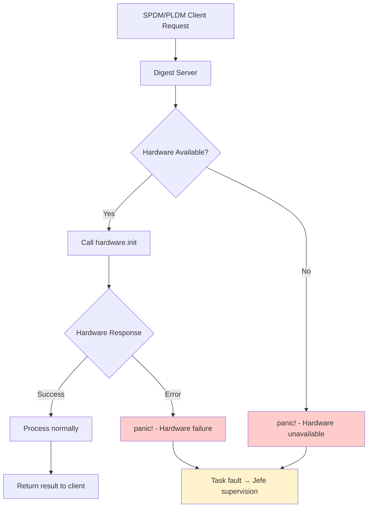


### Resource Exhaustion Scenarios

#### Memory Pressure Handling
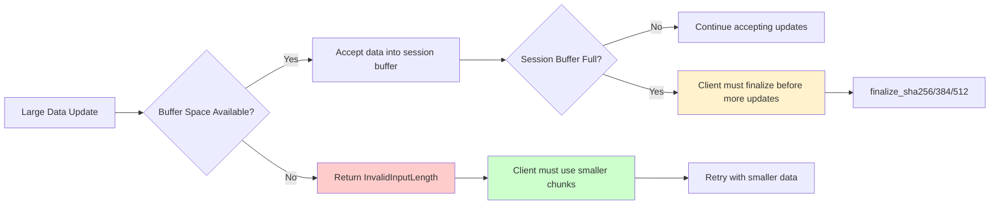

#### Session Lifecycle Error States
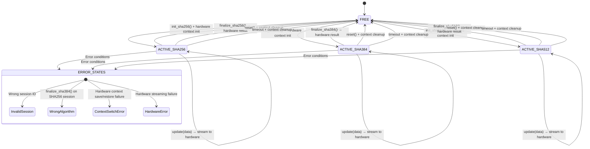

### SPDM Protocol Impact Analysis

#### Certificate Verification Failure Recovery

**Single-Context Hardware (ASPEED HACE) - No Session Exhaustion**
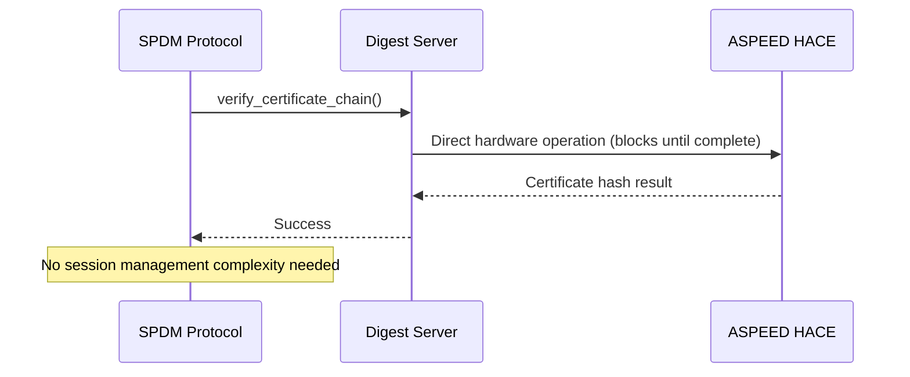

**Multi-Context Hardware (Hypothetical) - True Session Management**
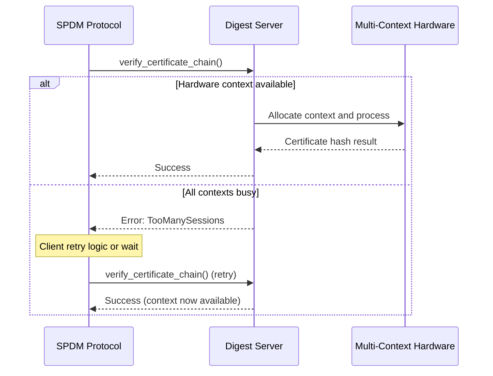

#### Transcript Hash Failure Impact
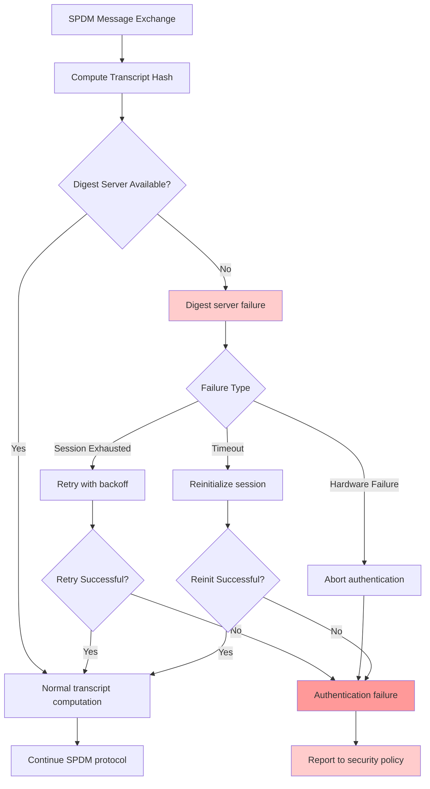

### Failure Recovery Strategies

#### Error Propagation Chain
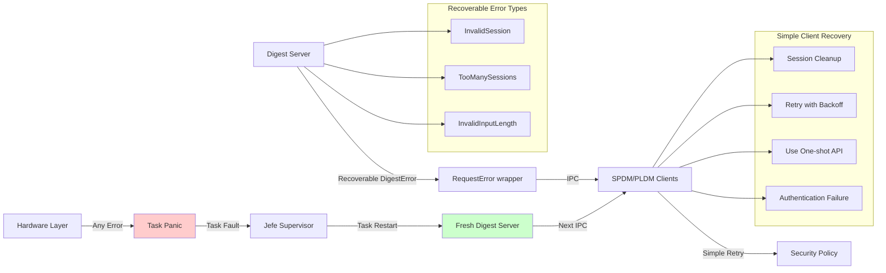

#### System-Level Failure Handling
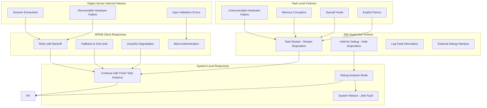

## Supervisor Integration and System-Level Failure Handling

### Jefe Supervisor Role

The digest server operates under the supervision of Hubris OS's supervisor task ("jefe"), which provides system-level failure management beyond the server's internal error handling.

#### Supervisor Architecture
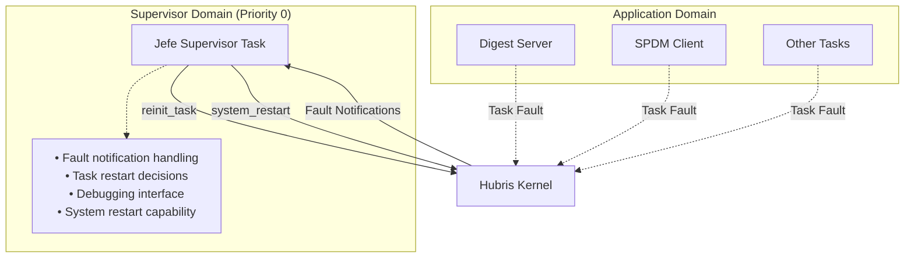

#### Task Disposition Management

Each task, including the digest server, has a configured disposition that determines jefe's response to failures:

- **Restart Disposition**: Automatic recovery via `kipc::reinit_task()`
- **Hold Disposition**: Task remains faulted for debugging inspection

#### Failure Escalation Hierarchy

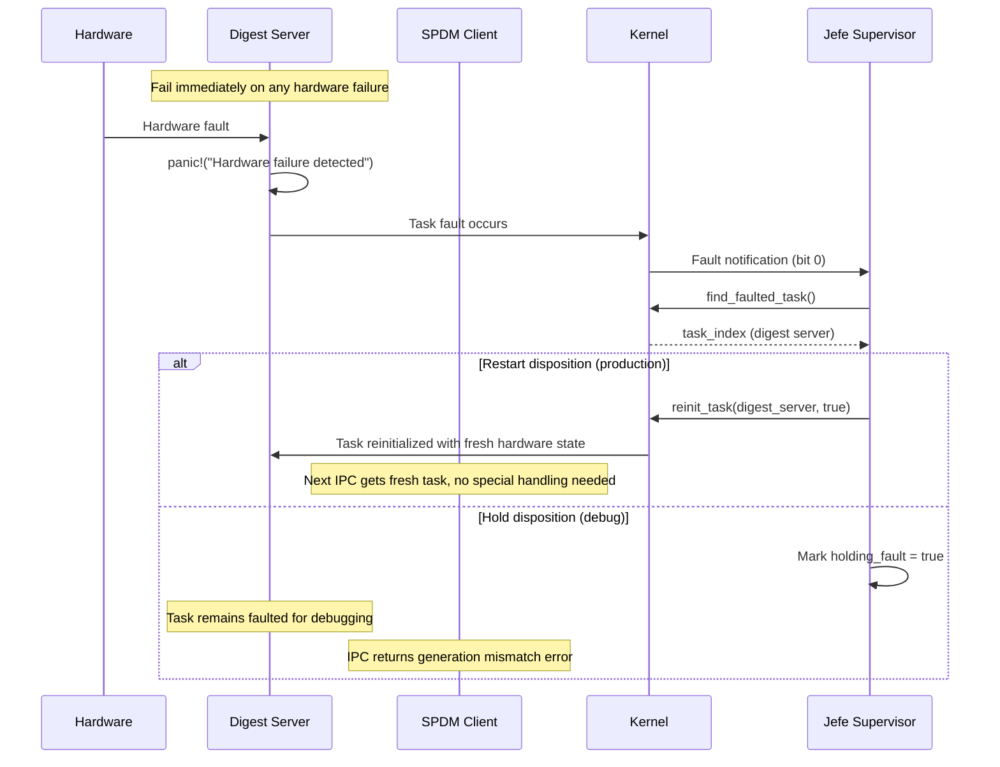

### System Failure Categories and Responses

#### Recoverable Failures (Handled by Digest Server)
- **Session Management**: `TooManySessions`, `InvalidSession` → Return error to client
- **Input Validation**: `InvalidInputLength` → Return error to client

#### Task-Level Failures (Handled by Jefe)
- **Any Hardware Failure**: Hardware errors of any kind → Task panic → Jefe restart
- **Hardware Resource Exhaustion**: Hardware cannot allocate resources → Task panic → Jefe restart
- **Memory Corruption**: Stack overflow, heap corruption → Task fault → Jefe restart
- **Syscall Faults**: Invalid kernel IPC usage → Task fault → Jefe restart
- **Explicit Panics**: `panic!()` in digest server code → Task fault → Jefe restart

#### System-Level Failures (Handled by Kernel)
- **Supervisor Fault**: Jefe task failure → System reboot
- **Kernel Panic**: Critical kernel failure → System reset
- **Watchdog Timeout**: System hang detection → Hardware reset

**Key Design Principle**: The digest server fails immediately on any hardware error without attempting recovery. This maximally simplifies the implementation and ensures consistent system behavior through jefe's supervision.

### External Debugging Interface

Jefe provides an external interface for debugging digest server failures:

```rust
// External control commands available via debugger (Humility)
enum JefeRequest {
    Hold,     // Stop automatic restart of digest server
    Start,    // Manually restart digest server
    Release,  // Resume automatic restart behavior
    Fault,    // Force digest server to fault for testing
}
```

This enables development workflows like:
1. **Hold faulting server**: Examine failure state without automatic restart
2. **Analyze dump data**: Extract task memory and register state
3. **Test recovery**: Manually trigger restart after fixes
4. **Fault injection**: Test SPDM client resilience

### Integration Requirements Update

#### R8: Supervisor Integration Requirements
- **R8.1**: Configure appropriate task disposition (Restart recommended for production)
- **R8.2**: SPDM clients handle task generation changes transparently (no complex recovery logic needed)
- **R8.3**: Digest server fails fast on unrecoverable hardware errors rather than returning complex error states
- **R8.4**: Support debugging via jefe external interface during development

## SPDM Integration Examples

### Certificate Chain Verification (Requirement R3.1)
```rust
// SPDM task verifying a certificate chain
fn verify_certificate_chain(&mut self, cert_chain: &[u8]) -> Result<bool, SpdmError> {
    let digest = Digest::from(DIGEST_SERVER_TASK_ID);

    // Create session for certificate hash (R2.1: incremental computation)
    let session_id = digest.init_sha256()?;  // R1.1: SHA-256 support

    // Process certificate data incrementally (R4.2: zero-copy processing)
    for chunk in cert_chain.chunks(512) {
        digest.update(session_id, chunk.len() as u32, chunk)?;
    }

    // Get final certificate hash
    let mut cert_hash = [0u32; 8];
    digest.finalize_sha256(session_id, &mut cert_hash)?;

    // Verify against policy
    self.verify_hash_against_policy(&cert_hash)
}
```

### SPDM Transcript Hash Computation (Requirement R3.3)
```rust
// Computing hash of SPDM message sequence for authentication
fn compute_transcript_hash(&mut self, messages: &[SpdmMessage]) -> Result<[u32; 8], SpdmError> {
    let digest = Digest::from(DIGEST_SERVER_TASK_ID);
    let session_id = digest.init_sha256()?;  // R2.3: session isolation

    // Hash all messages in the SPDM transcript (R3.5: message authentication)
    for msg in messages {
        let msg_bytes = msg.serialize()?;
        digest.update(session_id, msg_bytes.len() as u32, &msg_bytes)?;
    }

    let mut transcript_hash = [0u32; 8];
    digest.finalize_sha256(session_id, &mut transcript_hash)?;  // R7.1: synchronous IPC
    Ok(transcript_hash)
}
```

### Sequential SPDM Operations (Requirement R2.1)
```rust
// SPDM task performing sequential operations using incremental hashing
impl SpdmResponder {
    fn handle_certificate_and_transcript(&mut self, cert_data: &[u8], messages: &[SpdmMessage]) -> Result<(), SpdmError> {
        let digest = Digest::from(DIGEST_SERVER_TASK_ID);

        // Operation 1: Certificate verification (R2.1: incremental computation)
        let cert_session = digest.init_sha256()?;  // R1.1: SHA-256 support

        // Process certificate incrementally
        for chunk in cert_data.chunks(512) {
            digest.update(cert_session, chunk.len() as u32, chunk)?;
        }

        let mut cert_hash = [0u32; 8];
        digest.finalize_sha256(cert_session, &mut cert_hash)?;

        // Operation 2: Transcript hash computation (sequential, after cert verification)
        let transcript_session = digest.init_sha256()?;  // R2.3: new isolated session

        // Hash all SPDM messages in sequence
        for msg in messages {
            let msg_bytes = msg.serialize()?;
            digest.update(transcript_session, msg_bytes.len() as u32, &msg_bytes)?;
        }

        let mut transcript_hash = [0u32; 8];
        digest.finalize_sha256(transcript_session, &mut transcript_hash)?;

        // Use both hashes for SPDM protocol
        self.process_verification_results(&cert_hash, &transcript_hash)
    }
}
```

## PLDM Integration Examples

### PLDM Firmware Image Integrity Validation (Requirement R3.6)
```rust
// PLDM task validating received firmware chunks
fn validate_firmware_image(&mut self, image_chunks: &[&[u8]], expected_digest: &[u32; 8]) -> Result<bool, PldmError> {
    let digest = Digest::from(DIGEST_SERVER_TASK_ID);

    // Create session for running digest computation (R2.1: incremental computation)
    let session_id = digest.init_sha256()?;  // R1.1: SHA-256 commonly used in PLDM

    // Process firmware image incrementally as chunks are received (R4.2: zero-copy processing)
    for chunk in image_chunks {
        digest.update(session_id, chunk.len() as u32, chunk)?;
    }

    // Get final image digest
    let mut computed_digest = [0u32; 8];
    digest.finalize_sha256(session_id, &mut computed_digest)?;

    // Compare with manifest digest
    Ok(computed_digest == *expected_digest)
}
```

### PLDM Component Verification During Transfer (Requirement R3.7)
```rust
// PLDM task computing running digest during TransferFirmware
fn transfer_firmware_with_validation(&mut self, component_id: u16) -> Result<(), PldmError> {
    let digest = Digest::from(DIGEST_SERVER_TASK_ID);

    // Initialize digest session for this component transfer (R2.3: session isolation)
    let session_id = digest.init_sha384()?;  // R1.2: SHA-384 for enhanced security

    // Store session for this component transfer
    self.component_sessions.insert(component_id, session_id);

    // Firmware chunks will be processed via update() calls as they arrive
    // This enables real-time validation during transfer rather than after

    Ok(())
}

fn process_firmware_chunk(&mut self, component_id: u16, chunk: &[u8]) -> Result<(), PldmError> {
    let digest = Digest::from(DIGEST_SERVER_TASK_ID);

    // Retrieve session for this component
    let session_id = self.component_sessions.get(&component_id)
        .ok_or(PldmError::InvalidComponent)?;

    // Add chunk to running digest (R3.6: firmware image integrity)
    digest.update(*session_id, chunk.len() as u32, chunk)?;

    Ok(())
}
```

### PLDM Multi-Component Concurrent Updates (Requirement R2.2)
```rust
// PLDM task handling multiple concurrent firmware updates
impl PldmFirmwareUpdate {
    fn handle_concurrent_updates(&mut self) -> Result<(), PldmError> {
        let digest = Digest::from(DIGEST_SERVER_TASK_ID);

        // Component 1: Main firmware using SHA-256
        let main_fw_session = digest.init_sha256()?;

        // Component 2: Boot loader using SHA-384
        let bootloader_session = digest.init_sha384()?;  // R1.2: SHA-384 support

        // Component 3: FPGA bitstream using SHA-512
        let fpga_session = digest.init_sha512()?;        // R1.3: SHA-512 support

        // All components can be updated concurrently (hardware-dependent capacity - R2.2)
        // Each maintains independent digest state (R2.3: isolation)

        // Store sessions for component tracking
        self.component_sessions.insert(MAIN_FW_COMPONENT, main_fw_session);
        self.component_sessions.insert(BOOTLOADER_COMPONENT, bootloader_session);
        self.component_sessions.insert(FPGA_COMPONENT, fpga_session);

        Ok(())
    }
}
```

## Requirements Validation

### ✅ Requirements Satisfied

| Requirement | Status | Implementation |
|-------------|--------|----------------|
| **R1.1** SHA-256 support | ✅ | `init_sha256()`, `finalize_sha256()` with hardware context |
| **R1.2** SHA-384 support | ✅ | `init_sha384()`, `finalize_sha384()` with hardware context |
| **R1.3** SHA-512 support | ✅ | `init_sha512()`, `finalize_sha512()` with hardware context |
| **R1.4** Reject unsupported algorithms | ✅ | SHA-3 functions return `UnsupportedAlgorithm` |
| **R2.1** Incremental hash computation | ✅ | True streaming via `update_hardware_context()` |
| **R2.2** Multiple concurrent sessions | ✅ | Hardware-dependent capacity with context switching |
| **R2.3** Session isolation | ✅ | Independent hardware contexts in non-cacheable RAM |
| **R2.4** Automatic cleanup | ✅ | `cleanup_expired_sessions()` with context cleanup |
| **R2.5** Session timeout | ✅ | `SESSION_TIMEOUT_TICKS` with hardware context release |
| **R3.1-R3.5** SPDM use cases | ✅ | All supported via streaming session-based API |
| **R3.6-R3.8** PLDM use cases | ✅ | Firmware validation, component verification, streaming support |
| **R4.1** Memory efficient | ✅ | Static allocation, hardware context simulation |
| **R4.2** Zero-copy processing | ✅ | Direct streaming to hardware, no session buffering |
| **R4.3** Deterministic allocation | ✅ | No dynamic memory allocation |
| **R4.4** Bounded execution | ✅ | Fixed context switch costs, predictable timing |
| **R5.1** Generic hardware interface | ✅ | `ServerImpl<D>` with context management traits |
| **R5.2** Mock implementation | ✅ | `MockDigestDevice` with context simulation |
| **R5.3** Type-safe abstraction | ✅ | Associated type constraints + context safety |
| **R5.4** Consistent API | ✅ | Same streaming interface regardless of hardware |
| **R6.1** Comprehensive errors | ✅ | Full `DigestError` enumeration + context errors |
| **R6.2** Hardware failure handling | ✅ | `HardwareFailure` error propagation + context cleanup |
| **R6.3** Session state validation | ✅ | `validate_session()` + context state checks |
| **R6.4** Clear error propagation | ✅ | `RequestError<DigestError>` wrapper |
| **R7.1** Synchronous IPC | ✅ | No async/futures dependencies |
| **R7.2** Idol-generated stubs | ✅ | Type-safe IPC interface |
| **R7.3** Hubris integration | ✅ | Uses userlib, leased memory |
| **R7.4** No async runtime | ✅ | Pure synchronous implementation |
| **R8.1** Task disposition configuration | ✅ | Configured in app.toml |
| **R8.2** Transparent task generation handling | ✅ | SPDM clients get fresh task transparently |
| **R8.3** Fail-fast hardware error handling | ✅ | Task panic on unrecoverable hardware errors |
| **R8.4** Debugging support | ✅ | Jefe external interface available |

## Generic Design Summary

The `ServerImpl<D>` struct is now generic over any device `D` that implements:

## Key Features

1. **True Hardware Streaming**: Data flows directly to hardware contexts with proper save/restore
2. **Context Management**: Multiple sessions share hardware via non-cacheable RAM context switching
3. **Type Safety**: Associated type constraints ensure digest output sizes match expectations
4. **Zero Runtime Cost**: Uses static dispatch for optimal performance
5. **Memory Efficient**: Static session storage with hardware context simulation
6. **Concurrent Sessions**: Hardware-dependent concurrent digest operations with automatic context switching

## Usage Example

To use with a custom hardware device that supports context management:

```rust
// Your hardware device must implement the required traits
struct MyDigestDevice {
    // Hardware-specific context management fields
    current_context: Option<DigestContext>,
    context_save_addr: *mut u8,  // Non-cacheable RAM base
}

impl DigestInit<Sha2_256> for MyDigestDevice {
    type Output = Digest<8>;

    fn init(&mut self, _: Sha2_256) -> Result<DigestContext, HardwareError> {
        // Initialize hardware registers for SHA-256
        // Set up context for streaming operations
        Ok(DigestContext::new_sha256())
    }
}

impl DigestInit<Sha2_384> for MyDigestDevice {
    type Output = Digest<12>;
    // Similar implementation for SHA-384
}

impl DigestInit<Sha2_512> for MyDigestDevice {
    type Output = Digest<16>;
    // Similar implementation for SHA-512
}

impl DigestCtrlReset for MyDigestDevice {
    fn reset(&mut self) -> Result<(), HardwareError> {
        // Reset hardware to clean state
        // Clear any active contexts
        Ok(())
    }
}

// Context management methods (hardware-specific)
impl MyDigestDevice {
    fn save_context_to_ram(&mut self, session_id: usize) -> Result<(), HardwareError> {
        // Save current hardware context to non-cacheable RAM
        // Hardware-specific register read and memory write operations
    }

    fn restore_context_from_ram(&mut self, session_id: usize) -> Result<(), HardwareError> {
        // Restore session context from non-cacheable RAM to hardware
        // Hardware-specific memory read and register write operations
    }
}

// Then use it with the streaming server
let server = ServerImpl::new(MyDigestDevice::new());
```

---

# Implementation Status and Development Notes

## Critical Findings and Resolutions

### Trait Lifetime Incompatibility with Session-Based Operations - RESOLVED

During implementation, a fundamental incompatibility was discovered between the `openprot-hal-blocking` digest traits and the session-based streaming operations described in this design document. **This issue has been resolved through the implementation of a dual API structure with owned context variants.**

#### The Original Problem

The `openprot-hal-blocking` digest traits were originally designed for **scoped operations**, but the digest server API expected **persistent sessions**. These requirements were fundamentally incompatible due to lifetime constraints.

#### Root Cause: Lifetime Constraints in Scoped API

The original scoped trait definition created lifetime constraints:

```rust
pub trait DigestInit<T: DigestAlgorithm>: ErrorType {
    type OpContext<'a>: DigestOp<Output = Self::Output>
    where Self: 'a;

    fn init(&mut self, init_params: T) -> Result<Self::OpContext<'_>, Self::Error>;
}
```

The `OpContext<'a>` had a lifetime tied to `&'a mut self`, meaning:
- Context could not outlive the function call that created it
- Context could not be stored in a separate struct
- Context could not persist across IPC boundaries
- Sessions could not maintain persistent state between operations

#### The Solution: Dual API with Move-Based Resource Management

The incompatibility has been **completely resolved** through implementation of a dual API structure:

**1. Scoped API (Original)** - For simple, one-shot operations:
```rust
pub mod scoped {
    pub trait DigestInit<T: DigestAlgorithm>: ErrorType {
        type OpContext<'a>: DigestOp<Output = Self::Output>
        where Self: 'a;

        fn init<'a>(&'a mut self, init_params: T) -> Result<Self::OpContext<'a>, Self::Error>;
    }
}
```

**2. Owned API (New)** - For session-based, streaming operations:
```rust
pub mod owned {
    pub trait DigestInit<T: DigestAlgorithm>: ErrorType {
        type OwnedContext: DigestOp<Output = Self::Output>;

        fn init_owned(&mut self, init_params: T) -> Result<Self::OwnedContext, Self::Error>;
    }

    pub trait DigestOp {
        type Output;

        fn update(&mut self, data: &[u8]) -> Result<(), Self::Error>;
        fn finalize(self) -> Result<Self::Output, Self::Error>;
        fn cancel(self) -> Self::Controller;
    }
}
```

#### How the Owned API Enables Sessions

The owned API uses **move-based resource management** to solve the lifetime problem:

```rust
// ✅ NOW POSSIBLE: Digest server with owned contexts and controller
use openprot_hal_blocking::digest::owned::{DigestInit, DigestOp};

struct DigestServer<H, C> {
    controller: Option<H>,      // Hardware controller
    active_session: Option<C>,  // Single active session
}

impl<H, C> DigestServer<H, C>
where
    H: DigestInit<Sha2_256, Context = C>,
    C: DigestOp<Controller = H>,
{
    fn init_session(&mut self) -> Result<(), Error> {
        let controller = self.controller.take().ok_or(Error::Busy)?;
        let context = controller.init(Sha2_256)?;  // ✅ Owned context
        self.active_session = Some(context);       // ✅ Store in server
        Ok(())
    }

    fn update_session(&mut self, data: &[u8]) -> Result<(), Error> {
        let context = self.active_session.take().ok_or(Error::NoSession)?;
        let updated_context = context.update(data)?;  // ✅ Move-based update
        self.active_session = Some(updated_context);   // ✅ Store updated state
        Ok(())
    }

    fn finalize_session(&mut self) -> Result<Digest<8>, Error> {
        let context = self.active_session.take().ok_or(Error::NoSession)?;
        let (digest, controller) = context.finalize()?;
        self.controller = Some(controller);  // ✅ Controller recovery
        Ok(digest)
    }
}
```

#### Key Benefits of the Move-Based Solution

1. **True Streaming Support**: Contexts can be stored and updated incrementally
2. **Session Isolation**: Each session owns its context independently
3. **Resource Recovery**: `cancel()` method allows controller recovery
4. **Rust Ownership Safety**: Move semantics prevent use-after-finalize
5. **Backward Compatibility**: Scoped API remains unchanged for simple use cases

#### Implementation Examples

**Session-Based Streaming (Now Possible)**:
```rust
// SPDM certificate chain verification with streaming
let session_id = digest_server.init_sha256()?;

for cert_chunk in certificate_chain.chunks(1024) {
    digest_server.update(session_id, cert_chunk)?;
}

let cert_digest = digest_server.finalize_sha256(session_id)?;
```

**One-Shot Operations (Still Supported)**:
```rust
// Simple hash computation using scoped API
let digest = digest_device.compute_sha256(complete_data)?;
```

#### Current Implementation Status

The dual API solution is **fully implemented and working**:

- ✅ **Scoped API**: Original lifetime-constrained API for simple operations
- ✅ **Owned API**: New move-based API enabling persistent sessions
- ✅ **Mock Implementation**: Both APIs implemented in baremetal mock platform
- ✅ **Comprehensive Testing**: Session storage patterns validated
- ✅ **Documentation**: Complete analysis comparing both approaches

#### Architectural Resolution

The dual API approach resolves all original limitations:

1. ✅ **Session-based streaming is now possible** with the owned API
2. ✅ **Both one-shot and streaming operations supported** via appropriate API choice
3. ✅ **Design document architecture is now implementable** using owned contexts
4. ✅ **Streaming large data sets fully supported** with persistent session state

This demonstrates how API design evolution can solve fundamental architectural constraints while maintaining backward compatibility. The move-based resource management pattern provides the persistent contexts needed for server applications while preserving the simplicity of scoped operations for basic use cases.
