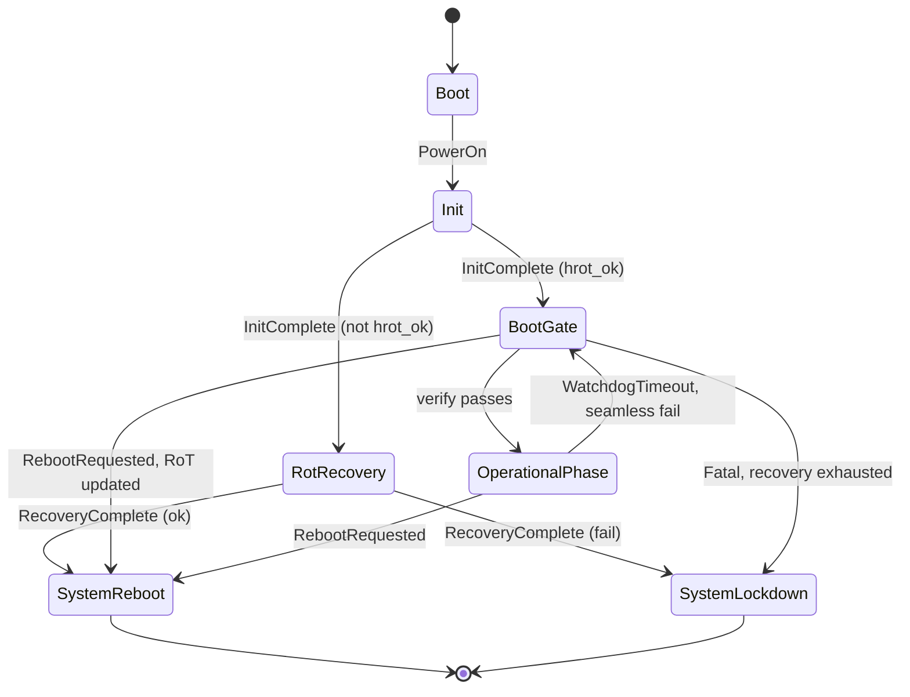
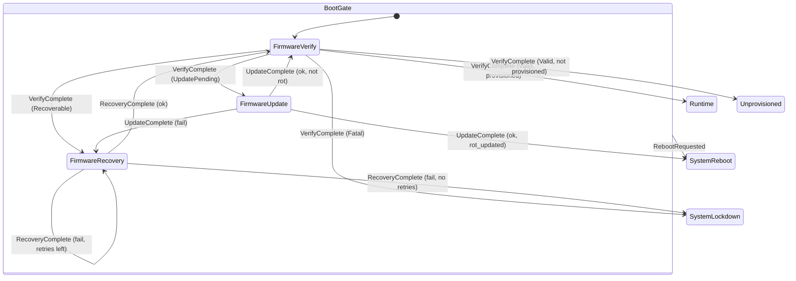
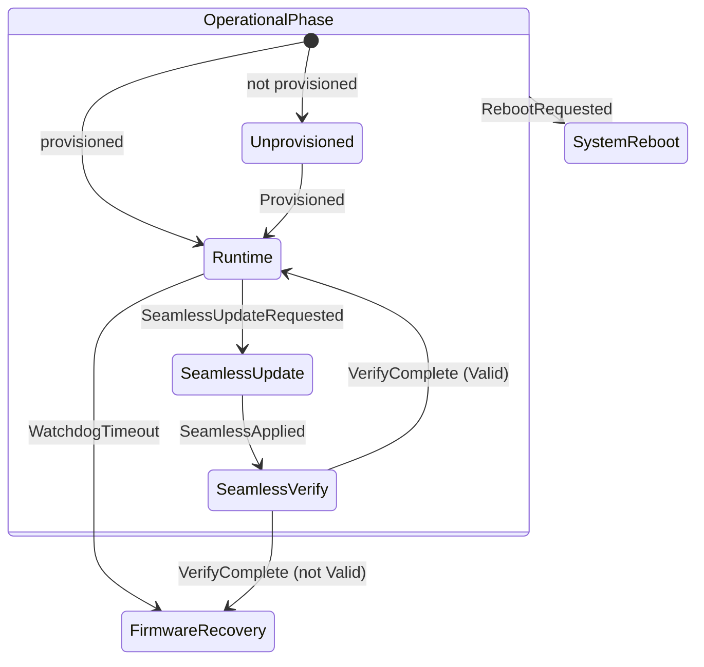

# Resiliency Orchestrator — Design

This document covers the internal design of the Resiliency Orchestrator SM:
the state hierarchy, state diagrams, effect catalog, and SM context fields.

For the component architecture, domain model, Verifier, and extension points
see `docs/src/architecture.md`. For the service-level specification see
`docs/src/specification/services/orchestrator.md`.

---

## State hierarchy

The SM is a hierarchical state machine. States are organized as follows:

```
Boot
Init
RotRecovery
BootGate              (superstate)
├── FirmwareVerify
├── FirmwareRecovery
├── FirmwareUpdate
└── SystemLockdown
OperationalPhase      (superstate)
├── Unprovisioned
├── Runtime
├── SeamlessUpdate
└── SeamlessVerify
SystemReboot
```

`SystemReboot` and `SystemLockdown` are terminal for the current boot session.
A hardware reboot restarts the machine externally; no `RebootComplete` event
is consumed because the process does not resume.

### Known limitation — Non-Uniform System State Principle

The orchestrator SHALL support system states in which different devices are in
different operational conditions. The orchestrator SHALL NOT require the system
to reach a globally uniform state prior to enabling execution of individual
devices.

The current SM satisfies this on *re-entry* (watchdog timeout path) via
`hold_mask`. On the *initial boot path* all domains move through a single
`BootGate` flow together. This is an acknowledged simplification. The required
evolution is toward per-domain parallel verification flows. See
`docs/src/architecture.md` for the full discussion.

---

## Diagram 1 — Overview (superstates collapsed)



---

## Diagram 2 — BootGate internals



---

## Diagram 3 — OperationalPhase internals



---

## SM context

```rust
pub struct Orchestrator {
    pub recovery_attempts: u8,
    pub boot_count:        u32,
    pub provisioned:       bool,
    pub hold_mask:         BootTargetMask,
    pub(crate) pending:    heapless::Vec<Effect, 16>,
}
```

| Field | Owner | Purpose |
|-------|-------|---------|
| `recovery_attempts` | SM | Counts recovery retries; bounds recovery loops |
| `boot_count` | SM | Incremented on each `SystemReboot` entry |
| `provisioned` | SM | Gates `Unprovisioned` vs `Runtime` on `OperationalPhase` entry |
| `hold_mask` | SM | Set by transition handlers before entering `BootGate`; controls which domains `on_enter_boot_gate` holds |
| `pending` | SM | Bounded effect queue drained by the runner after each `sm.handle()` |

**Selective boot hold.** `HoldBoot` is not always emitted for every domain.
The transition handler records the intended hold in `hold_mask` *before*
transitioning into `BootGate`, because entry actions cannot see the triggering
event. A fresh boot holds both domains; a `WatchdogTimeout { target }` holds
only the timed-out domain.

---

## Effect catalog

`BootTarget` identifies which domain's boot line is being controlled:

```rust
pub enum BootTarget {
    RoT,
    HostTarget,
}
```

| Effect | When emitted | Platform action |
|--------|-------------|-----------------|
| `StartVerification(BootTarget)` | `FirmwareVerify` entry | Request Verifier to appraise the domain |
| `HoldBoot(BootTarget)` | `BootGate` entry, per `hold_mask` | Assert boot-hold for the domain |
| `ReleaseBoot(BootTarget)` | `Runtime` / `Unprovisioned` entry | Deassert boot-hold for the domain |
| `ArmWatchdog` | `Runtime` entry | Start domain watchdog timers |
| `DisarmWatchdog` | `Runtime` exit | Stop domain watchdog timers |
| `ArmMonitors` | `OperationalPhase` entry | Enable reset and platform monitors |
| `DisarmMonitors` | `OperationalPhase` exit | Disable reset and platform monitors |
| `SetPlatformState(s)` | Various entry actions | Publish state over IPC / LEDs |
| `LogPanic` | `SystemReboot` entry | Record last-panic cause |
| `Reboot` | `SystemReboot` entry | Issue hardware reboot (does not return) |
| `HaltBoot` | `SystemLockdown` entry | Hold all domains; set lockdown platform state |

**Boot release lives in child entries.** `ReleaseBoot` for both domains is
emitted by child entry actions (`on_enter_runtime` / `on_enter_unprovisioned`),
not by the `OperationalPhase` superstate entry. The superstate entry only emits
`ArmMonitors`.

---

## What stays in the SM vs. what goes to the platform

| Concern | Location |
|---------|----------|
| State transitions and guards | SM |
| Recovery attempt counter | SM (`recovery_attempts`) |
| Boot count | SM (`boot_count`) |
| Provisioning flag | SM (`provisioned`) |
| Domain hold mask | SM (`hold_mask`) |
| Triggering verification | Platform (via `Effect::StartVerification`) |
| Domain boot hold/release | Platform (via `Effect::HoldBoot` / `ReleaseBoot`) |
| Watchdog arm/disarm | Platform (via `Effect::ArmWatchdog` / `DisarmWatchdog`) |
| Hardware reboot call | Platform (via `Effect::Reboot`) |
| IPC channel reads | Runner (event ingestion) |
| Config-gated behavior | Platform impl or Runner |
| Attestation backends, target-specific security controllers | Platform impl |
