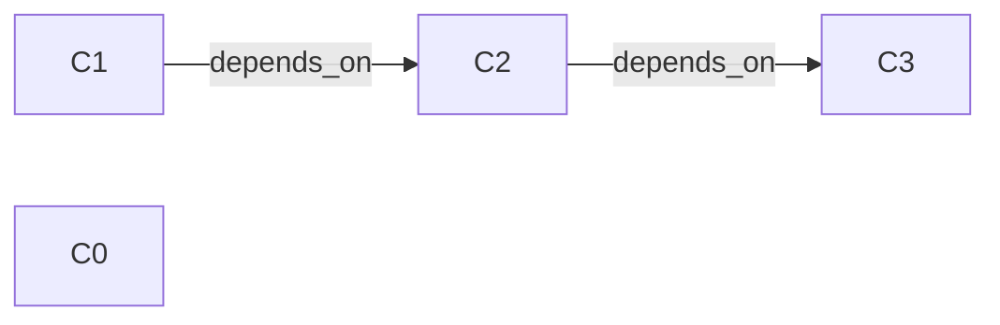

# How `cascade_hold` isolates a dependency subtree (BFS explained)

When a `Cascading` component fails, isolating just that one component is not
enough: anything that depends on it is now running on top of a device we no
longer trust, so it has to come down too — and so does anything that depends on
*those*, and so on. `cascade_hold` walks that dependency subtree and gates every
component it reaches. It does so with a **breadth-first search (BFS)**.

## What BFS is

BFS is a way to visit every node reachable from a starting node in a graph. It
explores in "rings": first the start node, then everything one hop away, then
everything two hops away, and so on. It uses a first-in-first-out (FIFO)
worklist — a queue of nodes discovered but not yet processed. You take the next
node off the front, look at its neighbours, add any new ones to the back, and
repeat until the queue drains.

The contrast is depth-first search (DFS), which follows one path as far as it
goes before backing up. For this job the *order* doesn't matter — we just need
to reach and gate every component in the subtree — so BFS is chosen because it
is trivial to write with a growing list and an index, with no recursion (which
matters in a `no_std`, fixed-stack firmware reducer).

## The dependency graph here

The "graph" is the chain of components. Each component may name **one** other
component it `depends_on`. An edge points from a dependency to its dependents:
if `C2.depends_on == Some(C1)`, then `C1 → C2`. `cascade_hold` starts at the
failed component (`root`) and follows those edges outward.

Note the propagation rule: a component is pulled into the cascade purely because
it `depends_on` something already gated — **regardless of its own
`FailurePolicy`**. A `Required` component that hangs off a failed `Cascading`
one still gets isolated.

## The code

```rust
fn cascade_hold(&mut self, ctx: &mut Sink<E>, root: ComponentId) {
    let mut frontier: heapless::Vec<ComponentId, N> = heapless::Vec::new();
    if self.gate_one(ctx, root) {
        let _ = frontier.push(root);
    }
    let mut i = 0;
    while let Some(&holder) = frontier.get(i) {
        i += 1;
        let mut newly_gated: heapless::Vec<ComponentId, N> = heapless::Vec::new();
        for &(id, attrs) in self.chain.iter() {
            if attrs.depends_on == Some(holder) && !self.is_gated(id) {
                let _ = newly_gated.push(id);
            }
        }
        for id in newly_gated {
            if self.gate_one(ctx, id) {
                let _ = frontier.push(id);
            }
        }
    }
}
```

Mapping the pieces to standard BFS:

- **The queue** is `frontier` — the list of already-gated components whose
  dependents still need visiting.
- **The read cursor** is `i`. Because we only ever *append* to `frontier` and
  advance `i` forward, items are processed in the order they were discovered:
  that FIFO order is exactly what makes this breadth-first.
- **"Visiting" a node** means scanning the chain for every component whose
  `depends_on` names the current `holder` and is not already gated.
- **`gate_one`** does the actual work (emit `AssertReset` + `ReportIsolated`,
  mark the component `Isolated`) and returns `true` only if the component was
  *newly* gated. That return value is the **visited-set** guard: a component
  already gated is never enqueued again, so the loop cannot cycle even if the
  dependency graph did.

There is no separate `visited` set because "is this already gated?" *is* the
visited check — `is_gated` in the scan, and the boolean from `gate_one` at
enqueue time.

## A worked example (two hops)

Chain: `C0` (required), `C1` (cascading), `C2` (required, `depends_on C1`),
`C3` (required, `depends_on C2`). `C1` reports corruption.



Trace of `cascade_hold(C1)`:

| Step | `frontier` (queue) | `i` | `holder` | Dependents found | Action |
|---|---|---|---|---|---|
| gate root | `[C1]` | 0 | — | — | gate `C1` |
| visit C1 | `[C1, C2]` | 1 | `C1` | `C2` (`depends_on C1`) | gate `C2`, enqueue |
| visit C2 | `[C1, C2, C3]` | 2 | `C2` | `C3` (`depends_on C2`) | gate `C3`, enqueue |
| visit C3 | `[C1, C2, C3]` | 3 | `C3` | none | — |
| done | `frontier.get(3)` is `None` | 4 | — | — | loop ends |

Result: `C1`, `C2`, and `C3` are all gated (`AssertReset` + `ReportIsolated`
each); `C0` is untouched because nothing links it to the cascade. The key point
is the **second** iteration: `C3` is only found because visiting `C2` — itself
discovered during the walk — re-scans for *its* dependents. A single-level
isolation would have stopped after gating `C2` and left `C3` running on an
untrusted `C2`.

This transitive, multi-iteration behaviour is what
`cascading_runtime_corruption_cascades_transitively` in `tests.rs` exercises;
the shallower `cascading_runtime_corruption_cascades` only reaches one hop and
never forces the second iteration.

## Why it terminates

Every enqueue is guarded by `gate_one` returning `true`, which happens at most
once per component (the second attempt finds it already `Isolated` and returns
`false`). So `frontier` can grow to at most `N` entries, `i` only moves forward,
and the loop stops as soon as `i` passes the last enqueued component. Cycles in
the dependency data — which chain validation already forbids — could not hang
this loop even if they existed.
