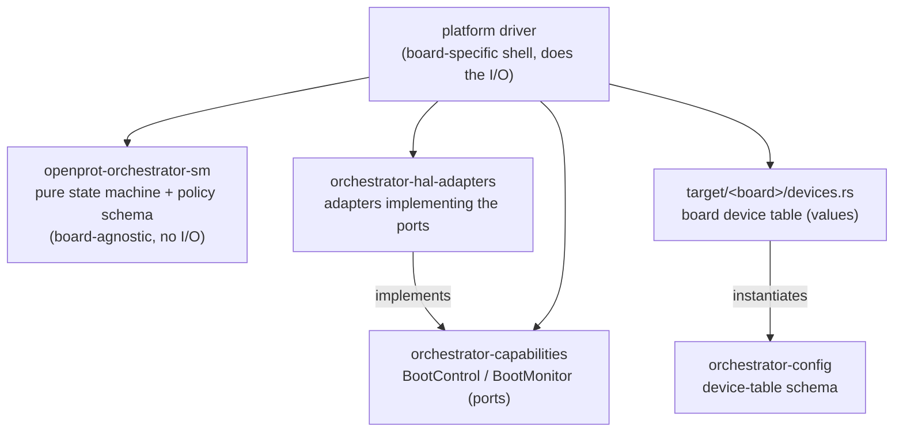

# Crate Layout

The orchestrator is split into small crates along the I/O boundary. This page
explains why the contracts crate was renamed from `api` and divided into
`orchestrator-capabilities` and `orchestrator-config`.

## Why `api` was the wrong name

Elsewhere in the tree, `<service>/api` names a **client-facing, inbound**
service contract: the types and traits a *client* uses to call *into* a service
over IPC. `mctp-api`, for example, "provides the client-side API for interacting
with the MCTP service" — `Application → MctpClient trait → mctp-api → IPC →
MCTP Server`. `i2c/api` has the same shape.

The orchestrator has no such surface. It sits at the top of the platform and
*consumes* services (crypto, storage, transport, reset); nothing consumes it.
There is no `OrchestratorClient`, no inbound IPC contract. What the crate
actually held pointed the other way — `BootControl` and `BootMonitor` are
contracts the orchestrator uses to drive devices *outward*. Calling that `api`
borrowed a convention that did not apply and mislabeled the crate's role.

## Why it was split in two

The crate was also conflating two concerns with different audiences:

- **Capability contracts** — `BootControl` (actuation: drive a device's reset)
  and `BootMonitor` (observation: read a device's boot liveness). These are the
  *ports* the state machine's effects execute against; concrete adapters
  implement them in `orchestrator-hal-adapters`.
- **Board device-table schema** — `DeviceConfig`, `BootCheckpoint`,
  `BootSignal`, `CommitPolicy`, and the `validate` compile-time check. This is
  pure data shape, consumed by the board tables in `target/<board>/devices.rs`.

A board table needs only the schema to declare data; it should not have to name
the crate that also defines actuation traits. Splitting gives each concern its
own leaf:

- `orchestrator-capabilities` — the device-facing traits (the ports).
- `orchestrator-config` — the device-table schema.

The naming now pairs cleanly with the existing `orchestrator-hal-adapters`
(the adapters for those ports).

## Why the two schemas stay separate

There are two schemas by design, on opposite sides of the I/O boundary, and they
are deliberately *not* merged into one crate:

- `orchestrator-config` — the **I/O-binding** schema: reset signal ids,
  checkpoint signals, commit policy. It is generic over the board's signal
  types, so it is inherently board-shaped.
- `openprot-orchestrator-sm` (`model`) — the **policy-classification** schema:
  `ComponentAttrs` / `Chain` (component kind, failure policy, recovery region,
  dependencies). It names no signal ids and does no I/O.

The state machine is a dependency-free, board-agnostic core. Folding the
I/O-binding schema into it — or into a single shared schema crate the core
depends on — would drag board-specific signal-id generics into the pure logic
and erode that boundary. Keeping the two schemas apart preserves it.

## Resulting layers

Each of `orchestrator-capabilities`, `orchestrator-config`, and the `sm` is a
dependency-free leaf. The platform driver is the only piece that binds them
together and performs I/O.
