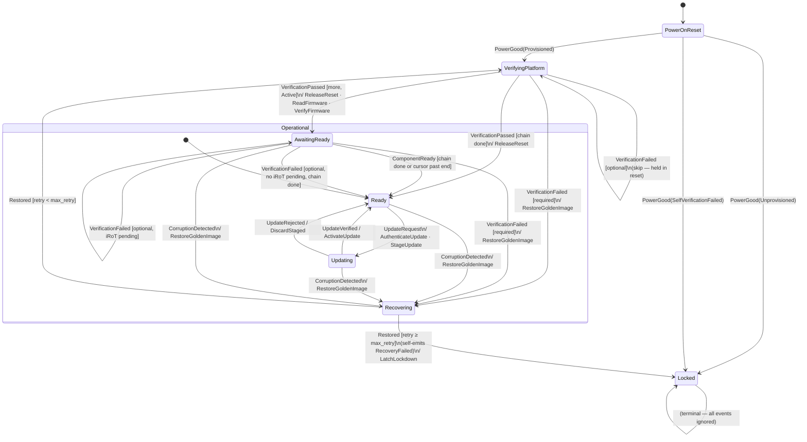

# State Machine

This document describes the state machine that lives in
`services/orchestrator/sm/src/lib.rs`: its states, shared storage, entry
actions, transition table, and the `Operational` superstate.

---

## Shared storage — `Rot<N>`

Every handler receives a `&mut Rot<N>` alongside the event and the `Sink`. This
struct is `statig`'s *shared storage*: a single allocation that persists across
events and is visible to every state and superstate. States carry no data; all
mutable state lives here.

| Field | Type | Purpose |
|---|---|---|
| `chain` | `Vec<(ComponentId, ComponentAttrs), N>` | Ordered trust chain, supplied by the shell at construction time. Never mutated after build. |
| `cursor` | `u8` | Index of the component currently under verification. Reset to 0 on every `VerifyingPlatform` entry. Advances on each `VerificationPassed` (and on optional `VerificationFailed`) via `Outcome::Handled`. |
| `failed` | `Option<ComponentId>` | The component that triggered the current recovery episode; `None` while healthy. Set on required `VerificationFailed` or `CorruptionDetected`. |
| `retry_count` | `u8` | Number of consecutive failed restore attempts. Cleared to 0 in `Ready`'s entry action — consecutive only (INV7). |
| `max_retry` | `u8` | Shell-chosen ceiling for `retry_count`. When `retry_count >= max_retry` the machine self-emits `RecoveryFailed` instead of re-walking the chain. |
| `awaiting` | `Option<ComponentId>` | The `Active` component whose iRoT readiness is currently outstanding. `Some` only while in `AwaitingReady`; `None` everywhere else (INV9). |

The effect buffer is deliberately **absent** from `Rot`. Effects flow through the
`Sink` (the `statig` context), which the orchestrator creates fresh for every
event and drains afterward.

---

## Context — `Sink`

The only thing a handler can do to the outside world is call `ctx.emit(effect)`.
`Sink` is an append-only `heapless::Vec<Effect, EFFECT_CAP>`. It can push; it
cannot pull, read, or do I/O. The orchestrator owns a fresh `Sink` per dispatch
and reads the effects out after `handle_with_context` returns.

---

## States

### `PowerOnReset`

The machine's initial state. The first event is always `PowerGood(PowerOnResult)`.

**Entry action**: none.

| Event | Guard | Effects | Next state |
|---|---|---|---|
| `PowerGood(Provisioned)` | — | — | `VerifyingPlatform` |
| `PowerGood(Unprovisioned)` | — | — | `Locked` |
| `PowerGood(SelfVerificationFailed)` | — | — | `Locked` |
| anything else | — | — | `Outcome::Super` (top level — discarded) |

---

### `VerifyingPlatform`

Walks the trust chain component-by-component. The cursor advances on each
`VerificationPassed` (or optional `VerificationFailed`) using `Outcome::Handled`
rather than a self-transition — a self-transition would re-run the entry action
and reset the cursor.

**Entry action**: reset `cursor` to 0, `awaiting` to `None`, emit
`ReadFirmware(chain[0])` + `VerifyFirmware(chain[0])`.

| Event | Guard | Effects | Next state |
|---|---|---|---|
| `VerificationPassed(id)` | more, current `Passive` | `ReleaseReset` · `ReadFirmware(next)` · `VerifyFirmware(next)` | `Handled` (cursor ++) |
| `VerificationPassed(id)` | more, current `Active` | `ReleaseReset` · `ReadFirmware(next)` · `VerifyFirmware(next)` | `AwaitingReady` (awaiting = Some(id)) |
| `VerificationPassed(id)` | chain done | `ReleaseReset(id)` | `Ready` |
| `VerificationFailed(id)` | `attrs.required` | — | `Recovering` (failed = Some(id)) |
| `VerificationFailed(id)` | `!attrs.required` | — | `Handled` (skip; cursor ++; if chain done → `Ready`) |
| anything else | — | — | `Outcome::Super` → `Operational` |

---

### `AwaitingReady`

Reached when an `Active` component passes eRoT authentication. The machine waits
here until the component's iRoT signals readiness via `ComponentReady`. The
speculative eRoT check for the next component (`ReadFirmware` + `VerifyFirmware`)
was already emitted by the `VerifyingPlatform` handler that triggered this
transition.

**Entry action**: none.

| Event | Guard | Effects | Next state |
|---|---|---|---|
| `ComponentReady(id)` | `id != awaiting` | — | `Handled` (stale/spurious — ignore, INV9) |
| `ComponentReady(id)` | `id == awaiting`, cursor in bounds | — | `Handled` (clear awaiting) |
| `ComponentReady(id)` | `id == awaiting`, cursor past end | — | `Ready` |
| `VerificationPassed(id)` | more | `ReleaseReset` · `ReadFirmware(next)` · `VerifyFirmware(next)` | `Handled` (cursor ++) |
| `VerificationPassed(id)` | chain done | `ReleaseReset(id)` | `Ready` |
| `VerificationFailed(id)` | `attrs.required` | — | `Recovering` (failed = Some(id), awaiting = None) |
| `VerificationFailed(id)` | `!attrs.required`, iRoT pending | — | `Handled` (skip; cursor ++) |
| `VerificationFailed(id)` | `!attrs.required`, no iRoT pending, chain done | — | `Ready` |
| anything else | — | — | `Outcome::Super` → `Operational` |

`ComponentReady` and `VerificationPassed` are independent and may arrive in
either order. Both must be seen before the walk advances. `awaiting` tracks
whether `ComponentReady` is still outstanding; the state itself tracks whether
`VerificationPassed` is still outstanding.

---

### `Ready`

Normal operational state: the full chain has been verified, all required
components are released, and the machine handles attestation, update requests,
and corruption events.

**Entry action**: reset `retry_count` to 0 (makes the cap count *consecutive*
failures — INV7).

| Event | Guard | Effects | Next state |
|---|---|---|---|
| `UpdateRequest` | — | — | `Updating` |
| anything else | — | — | `Outcome::Super` → `Operational` |

---

### `Updating`

An update is in progress.

**Entry action**: emit `AuthenticateUpdate` + `StageUpdate`.

| Event | Guard | Effects | Next state |
|---|---|---|---|
| `UpdateVerified` | — | `ActivateUpdate` | `Ready` |
| `UpdateRejected` | — | `DiscardStaged` | `Ready` (rejected update is not corruption — INV4) |
| anything else | — | — | `Outcome::Super` → `Operational` |

---

### `Recovering`

The machine is attempting to restore a corrupted or rejected component.

**Entry action**: emit `RestoreGoldenImage(rot.failed)` — exactly the named
component, not the whole chain (INV5).

| Event | Guard | Effects | Next state |
|---|---|---|---|
| `Restored(_)` | `retry_count + 1 < max_retry` | — | `VerifyingPlatform` (re-walk from top) |
| `Restored(_)` | `retry_count + 1 >= max_retry` | `Effect::Emit(RecoveryFailed)` | `Handled` (orchestrator queues `RecoveryFailed` next — INV7) |
| `RecoveryFailed` | — | — | `Locked` |
| anything else | — | — | `Outcome::Super` → `Operational` |

`Effect::Emit(RecoveryFailed)` is the *feedback-as-data* mechanism: the core
produces the event internally, the orchestrator intercepts and re-dispatches it
before returning, and the decision is visible in the effect trace.

**Why re-walk from `cursor = 0`?** After restoring a component the machine
re-enters `VerifyingPlatform` and re-verifies the entire chain from scratch
rather than resuming at the failed component. This is a deliberate conservative
policy: a corruption event may indicate a broader integrity problem, and the
CSA architecture's core principle — "no component executes unverified firmware"
(NIST SP 800-193) — requires that trust be re-established end-to-end before the
platform is considered healthy again. The CSA document does not prescribe the
exact recovery sequencing, but the re-walk implements the spirit of that
principle. Optional components that fail during the re-walk are skipped (held in
reset) as during initial boot; they are re-released only if they pass
`VerificationPassed` in the new walk.

---

### `Locked`

Terminal state. All events are discarded.

**Entry action**: emit `LatchLockdown` — instruct the shell to hold all
components in reset permanently.

---

## Superstate — `Operational`

`Ready`, `Updating`, `Recovering`, and `AwaitingReady` share this superstate.
When a leaf state returns `Outcome::Super`, `statig` calls the superstate handler.

| Event | Effects | Next state |
|---|---|---|
| `AttestationChallenge` | `SignAttestation` | `Handled` (no transition — INV6) |
| `CorruptionDetected(id)` | `attrs.required == true` | — | `Recovering` (failed = Some(id) — INV5) |
| `CorruptionDetected(id)` | `attrs.required == false` | `AssertReset(id)` | `Handled` (component gated; machine stays in current state) |
| anything else | — | — | `Outcome::Super` (discarded) |

---

## `statig` integration

The machine uses `statig` 0.4.1 with hand-written trait impls — no proc-macros.

| Trait | Implemented by | Role |
|---|---|---|
| `IntoStateMachine` | `Rot<N>` | Declares associated types and `initial() -> State`. |
| `StatigState<Rot<N>>` | `State` | `call_handler`, `call_entry_action`, `superstate`. |
| `StatigSuperstate<Rot<N>>` | `Superstate<'_>` | `call_handler` for events that fell through from a leaf state. |

`initial()` is a `fn() -> State` with no `self`, so the machine always starts
in `PowerOnReset`. The shell-supplied `PowerGood(PowerOnResult)` event is the
first real branching point.
