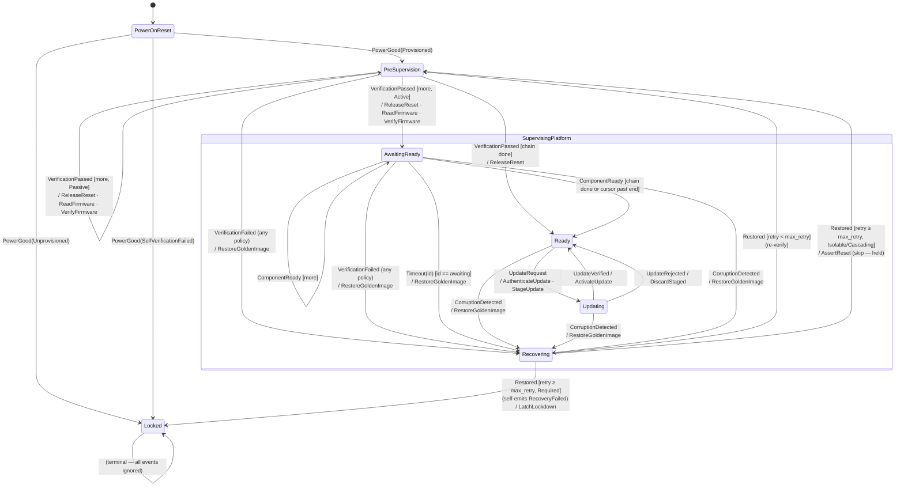

# State Machine

This document describes the state machine that lives in
`services/orchestrator/sm/src/lib.rs`: its states, shared storage, entry
actions, transition table, and the `SupervisingPlatform` superstate.

```mermaid
stateDiagram-v2
    [*] --> PowerOnReset

    PowerOnReset --> PreSupervision : PowerGood(Provisioned)
    PowerOnReset --> Locked             : PowerGood(Unprovisioned)
    PowerOnReset --> Locked             : PowerGood(SelfVerificationFailed)

    PreSupervision --> PreSupervision : VerificationPassed [more, Passive]<br/>/ ReleaseReset · ReadFirmware · VerifyFirmware
    PreSupervision --> AwaitingReady     : VerificationPassed [more, Active]<br/>/ ReleaseReset · ReadFirmware · VerifyFirmware
    PreSupervision --> Ready             : VerificationPassed [chain done]<br/>/ ReleaseReset
    PreSupervision --> Recovering        : VerificationFailed (any policy)<br/>/ RestoreGoldenImage

    AwaitingReady --> AwaitingReady : VerificationPassed [more]<br/>/ ReleaseReset · ReadFirmware · VerifyFirmware
    AwaitingReady --> Ready         : ComponentReady [chain done or cursor past end]
    AwaitingReady --> AwaitingReady : ComponentReady [more]
    AwaitingReady --> Recovering    : VerificationFailed (any policy)<br/>/ RestoreGoldenImage
    AwaitingReady --> Recovering    : Timeout(id) [id == awaiting]<br/>/ RestoreGoldenImage

    state SupervisingPlatform {
        Ready         --> Updating      : UpdateRequest<br/>/ AuthenticateUpdate · StageUpdate
        Updating      --> Ready         : UpdateVerified / ActivateUpdate
        Updating      --> Ready         : UpdateRejected / DiscardStaged
        Ready         --> Recovering    : CorruptionDetected<br/>/ RestoreGoldenImage
        Updating      --> Recovering    : CorruptionDetected<br/>/ RestoreGoldenImage
        AwaitingReady --> Recovering    : CorruptionDetected<br/>/ RestoreGoldenImage
    }

    Recovering --> PreSupervision : Restored [retry < max_retry]<br/>(re-verify)
    Recovering --> PreSupervision : Restored [retry ≥ max_retry, Isolable/Cascading]<br/>/ AssertReset (skip — held)
    Recovering --> Locked    : Restored [retry ≥ max_retry, Required]<br/>(self-emits RecoveryFailed) / LatchLockdown
    Locked     --> Locked    : (terminal — all events ignored)
```

---

## Shared storage — `Rot<N, E>`

Every handler receives a `&mut Rot<N, E>` alongside the event and the `Sink`.
This struct is the machine's *shared storage*: a single allocation that persists
across events and is visible to every handler. States are a plain `State` enum
(some variants carry a payload); all other mutable data lives here.

| Field | Type | Purpose |
|---|---|---|
| `chain` | `Vec<(ComponentId, ComponentAttrs), N>` | Ordered trust chain, supplied by the platform driver at construction time. Never mutated after build. |
| `cursor` | `u8` | Index of the component currently under verification. Reset to 0 on every `PreSupervision` entry. Advances on each `VerificationPassed`, and past any component marked `Isolated` in `statuses` (skipped without verification), via `Outcome::Handled`. |
| `statuses` | `Vec<ComponentStatus, N>` | One record per chain component, parallel by index. Each `ComponentStatus` is `{ lifecycle: ComponentLifecycle, retry: u8 }`. `lifecycle` (`Nominal` / `Isolated`) marks whether the component has been gated out of service — an `Isolated` component is held in reset and skipped on every walk. `retry` is its consecutive failed-restore count, kept per component so interleaved recoveries never share a budget. Durable across a return to `Ready` (only `retry` is cleared there; `Isolated` persists); reset only by a fresh `Rot` on `PowerOnReset`. |
| `max_retry` | `u8` | Ceiling for a component's `retry`, chosen by the platform driver. When `statuses[i].retry >= max_retry` recovery is **exhausted** and the failed component's recovery-failure policy (`Isolable`/`Cascading`/`Required`) is applied. |
| `_effect_cap` | `PhantomData<[u8; E]>` | Zero-sized; ties the effect-buffer size `E` to the type so the `E >= 2 * N + 2` bound is enforced at construction. |

Two pieces of per-episode data are **not** stored on `Rot`: the component whose
recovery is in progress and the `Active` component whose readiness is
outstanding. These live in the `State` payloads `Recovering(ComponentId)` and
`AwaitingReady(Option<ComponentId>)`, so they exist only while the machine is in
those states — the type system guarantees they cannot be read in any other.

The effect buffer is deliberately **absent** from `Rot`. Effects flow through the
`Sink` (the handler's context), which the orchestrator creates fresh for every
event and drains afterward.

---

## Context — `Sink`

The only thing a handler can do to the outside world is call `ctx.emit(effect)`.
`Sink` is an append-only `heapless::Vec<Effect, E>`. It can push; it
cannot pull, read, or do I/O. The orchestrator owns a fresh `Sink` per dispatch
and reads the effects out after the handler returns.

---

## States

### `PowerOnReset`

The machine's initial state. The first event is always `PowerGood(PowerOnResult)`.

**Entry action**: none.

| Event | Guard | Effects | Next state |
|---|---|---|---|
| `PowerGood(Provisioned)` | — | — | `PreSupervision` |
| `PowerGood(Unprovisioned)` | — | — | `Locked` |
| `PowerGood(SelfVerificationFailed)` | — | — | `Locked` |
| anything else | — | — | `Outcome::Super` (top level — discarded) |

---

### `PreSupervision`

Walks the trust chain component-by-component. The cursor advances on each
`VerificationPassed` (or optional `VerificationFailed`) using `Outcome::Handled`
rather than a self-transition — a self-transition would re-run the entry action
and reset the cursor.

**Entry action**: reset `cursor` to 0 and emit `ReadFirmware` + `VerifyFirmware`
for the first component **not** marked `Isolated` in `statuses` (`Isolated`
components stay in reset and are skipped). The `Isolated` marks are *not* cleared
here — they persist across re-walks so exhausted components are not re-verified.

| Event | Guard | Effects | Next state |
|---|---|---|---|
| `VerificationPassed(id)` | more, current `Passive` | `ReleaseReset` · `ReadFirmware(next)` · `VerifyFirmware(next)` | `Handled` (cursor ++) |
| `VerificationPassed(id)` | more, current `Active` | `ReleaseReset` · `ReadFirmware(next)` · `VerifyFirmware(next)` | `AwaitingReady(Some(id))` |
| `VerificationPassed(id)` | chain done | `ReleaseReset(id)` | `Ready` |
| `VerificationFailed(id)` | — | — | `Recovering(id)` — recovery is attempted first, regardless of the component's recovery-failure policy |
| `CorruptionDetected(id)` | `Required`/unknown | `RestoreGoldenImage` | `Recovering(id)` |
| `CorruptionDetected(id)` | `Isolable`/`Cascading` | `AssertReset` · `ReportIsolated` | `Handled` (component gated; walk continues) |
| anything else | — | — | `Outcome::Super` (top level — discarded) |

When advancing the cursor, any component marked `Isolated` is skipped without
verification — it stays in reset and no `ReadFirmware`/`VerifyFirmware` is emitted
for it. The recovery-failure policy (`Isolable`/`Cascading`/`Required`) is
**not** consulted for a *passing* walk; it is applied on failure — either here on
`CorruptionDetected`, or later in `Recovering` once restore attempts are
exhausted.

> **Corruption is handled here; attestation is not.** `PreSupervision` has no
> superstate link, so it handles `CorruptionDetected` *directly* (the two rows
> above) rather than inheriting the `SupervisingPlatform` behavior — a
> corruption report during the walk still triggers recovery (`Required`) or
> gating (`Isolable`/`Cascading`), even on an all-`Passive` chain that would
> otherwise self-loop here for the entire walk. `AttestationChallenge`, by
> contrast, falls through to the `anything else` row and is discarded: CSA
> defines no requirement to answer challenges before the chain walk completes.
> See `corruption_during_presupervision_selfloop_triggers_recovery` in
> `tests.rs`.

---

### `AwaitingReady`

Reached when an `Active` component passes eRoT authentication. The machine waits
here until the component's iRoT signals readiness via `ComponentReady`. The
speculative eRoT check for the next component (`ReadFirmware` + `VerifyFirmware`)
was already emitted by the `PreSupervision` handler that triggered this
transition.

**Entry action**: none.

| Event | Guard | Effects | Next state |
|---|---|---|---|
| `ComponentReady(id)` | `id != awaited` | — | `Handled` (stale/spurious — ignore, INV9) |
| `ComponentReady(id)` | `id == awaited`, cursor in bounds | — | `AwaitingReady(None)` (readiness satisfied; walk not yet done) |
| `ComponentReady(id)` | `id == awaited`, cursor past end | — | `Ready` |
| `VerificationPassed(id)` | more | `ReleaseReset` · `ReadFirmware(next)` · `VerifyFirmware(next)` | `Handled` (cursor ++) |
| `VerificationPassed(id)` | chain done | `ReleaseReset(id)` | `Ready` |
| `Timeout(id)` | `id == awaited` | — | `Recovering(id)` |
| `Timeout(id)` | `id != awaited` | — | `Handled` (stale — ignore) |
| `VerificationFailed(id)` | — | — | `Recovering(id)` — recovery attempted first |
| anything else | — | — | `Outcome::Super` → `SupervisingPlatform` |

`ComponentReady` and `VerificationPassed` are independent and may arrive in
either order. Both must be seen before the walk advances. The `AwaitingReady`
payload (`Some(id)`) tracks whether `ComponentReady` is still outstanding — it
becomes `None` once readiness arrives; the `cursor` tracks whether
`VerificationPassed` is still outstanding.

---

### `Ready`

Normal operational state: the full chain has been verified, all required
components are released, and the machine handles attestation, update requests,
and corruption events.

**Entry action**: reset every component's `retry` to 0 (makes the cap count
*consecutive* failures — INV7). The `Isolated` marks are **not** cleared — a
component isolated by exhausted recovery stays held across a return to `Ready`;
only a fresh `Rot` on `PowerOnReset` releases it.

| Event | Guard | Effects | Next state |
|---|---|---|---|
| `UpdateRequest` | — | — | `Updating` |
| anything else | — | — | `Outcome::Super` → `SupervisingPlatform` |

---

### `Updating`

An update is in progress.

**Entry action**: emit `AuthenticateUpdate` + `StageUpdate`.

> **Rejected** here has a specific meaning from the CSA authenticated-update
> sequence: the staged candidate failed verification — its signature did not
> validate under the platform's provisioned DSA public key (or it failed the
> anti-rollback/SVN check). A failed verification is answered with a reject, the
> candidate is discarded (`DiscardStaged`), and the device keeps running its
> current image. Rejection is therefore an *update* outcome, not a corruption of
> the running image — hence INV4 keeps it off the recovery path.

| Event | Guard | Effects | Next state |
|---|---|---|---|
| `UpdateVerified` | — | `ActivateUpdate` | `Ready` |
| `UpdateRejected` | — | `DiscardStaged` | `Ready` (INV4) |
| `CorruptionDetected(id)` | `Required`/unknown | `DiscardStaged` (then `RestoreGoldenImage` on entry) | `Recovering(id)` (update preempted; staged image discarded) |
| `CorruptionDetected(id)` | `Isolable`/`Cascading` | `AssertReset(id)` · `ReportIsolated(id)` | `Handled` (component gated; update continues, staged image kept) |
| anything else | — | — | `Outcome::Super` → `SupervisingPlatform` |

`Updating` handles `CorruptionDetected` in its own arm rather than inheriting the
superstate behavior, so that a *preemption* (transition out to `Recovering`) can
emit `DiscardStaged` first — the in-flight staged image would otherwise be
orphaned. An `Isolable`/`Cascading` corruption is gated and the update continues,
so its staged image is kept.

---

### `Recovering`

The machine is attempting to restore a corrupted or rejected component.

**Entry action**: emit `RestoreGoldenImage(failed)`, where `failed` is the
`Recovering(ComponentId)` payload — targets the failed component's *recovery
region*: all components sharing the same `RegionId` are restored together. The
core supplies the failed component ID; the platform driver resolves region
membership from the chain at startup. Only the named component triggers the
restore, but the
entire region is affected (not the whole chain — INV5).

| Event | Guard | Effects | Next state |
|---|---|---|---|
| `Restored(id)` | `id != failed` | — | `Handled` (stale — belongs to a displaced episode; the re-walk re-verifies it) |
| `Restored(id)` | `id == failed`, `retry + 1 < max_retry` | — | `PreSupervision` (re-verify — the restored image may pass) |
| `Restored(id)` | `id == failed`, cap reached, `Isolable` | `AssertReset(failed)` · `ReportIsolated(failed)` | `PreSupervision` (recovery exhausted: mark `failed` `Isolated`, reset its `retry`; the re-walk skips it) |
| `Restored(id)` | `id == failed`, cap reached, `Cascading` | `AssertReset` · `ReportIsolated` (per component) | `PreSupervision` (recovery exhausted: mark `failed` + `depends_on` dependents `Isolated`) |
| `Restored(id)` | `id == failed`, cap reached, `Required` | `ReportRecoveryFailed(failed)` · `Effect::Emit(RecoveryFailed)` | `Handled` (orchestrator queues `RecoveryFailed` next — INV7) |
| `RecoveryFailed` | — | — | `Locked` |
| anything else | — | — | `Outcome::Super` → `SupervisingPlatform` |

("cap reached" = `retry + 1 >= max_retry`.)

**Two-stage recovery (CSA-aligned).** A verification failure never skips a
component outright. Every failure — during initial boot or a re-walk — first
brings the machine here, to `Recovering`, which restores the failed component's
recovery region and re-verifies. Only when the restore attempts are *exhausted*
(`retry` reaches `max_retry` and the restored image still fails) does the
component's **recovery-failure policy** decide what happens next:

- `Isolable` — skip just this component; mark it `Isolated` (held in reset) and
  continue booting the rest of the platform.
- `Cascading` — skip this component *and* its `depends_on` dependents; continue
  booting the remainder.
- `Required` — stop entirely: self-emit `RecoveryFailed`, which drives the
  machine to `Locked`. (CSA's narrative docs call this outcome "platform
  halt" — same behavior, `Required` is the type-level name.)

This mirrors the CSA Boot Sequence **Recovery Policy**: recovery (region restore)
is attempted for *every* failed device first, and the `Isolable`/`Cascading`/
`Required` classification applies only *after* a recovery attempt itself
fails.

`Effect::Emit(RecoveryFailed)` is the *feedback-as-data* mechanism. It is easiest
to understand by asking why the machine doesn't just jump straight to `Locked`
when a `Required` component's retry cap is hit.

When a `Required` component's last restore attempt fails, the machine has a
decision to make: give up and lock down. It could act on that decision silently,
transitioning directly from `Recovering` to `Locked` inside the handler. Instead
it does something that
looks indirect at first: it emits `RecoveryFailed` as an *effect* — a piece of
data saying "a follow-up event named `RecoveryFailed` should happen next" — and
returns. The orchestrator sees that effect, puts `RecoveryFailed` at the front of
the queue, and dispatches it right away. That second event is what actually moves
the machine to `Locked`.

The payoff is that the give-up decision becomes a visible event rather than a
hidden jump. Anyone reading the effect trace sees `RecoveryFailed` appear at the
exact moment the cap was reached, and `Locked` is only ever entered one way — by
handling that event — no matter where the lockdown was triggered from. The core
never reaches out and changes its own state behind the scenes; every transition,
including its own internally-generated ones, travels through the same event path
and shows up in the same trace.

**Why re-walk from `cursor = 0`?** After restoring a component the machine
re-enters `PreSupervision` and re-verifies the entire chain from scratch
rather than resuming at the failed component. This is a deliberate conservative
policy: a corruption event may indicate a broader integrity problem, and the
CSA architecture's core principle — "no component executes unverified firmware"
(NIST SP 800-193) — requires that trust be re-established end-to-end before the
platform is considered healthy again. The CSA document does not prescribe the
exact recovery sequencing, but the re-walk implements the spirit of that
principle. Components already marked `Isolated` — those whose recovery was
exhausted under an `Isolable` or `Cascading` policy — are skipped during the
re-walk: they stay in reset and are not re-verified. Every other component is re-verified from
scratch, and a fresh failure restarts the two-stage recovery for that component.

---

### `Locked`

Terminal state. All events are discarded.

**Entry action**: emit `LatchLockdown` — instruct the platform driver to hold
all components in reset permanently.

---

## Superstate — `SupervisingPlatform`

`Ready`, `Updating`, `Recovering`, and `AwaitingReady` share this superstate.
When a leaf state returns `Outcome::Super`, the engine calls the superstate
handler (`handle_supervising`).

| Event | Guard | Effects | Next state |
|---|---|---|---|
| `AttestationChallenge` | — | `SignAttestation` | `Handled` (no transition — INV6) |
| `CorruptionDetected(id)` | `attrs.failure_policy == Required` | — | `Recovering(id)` (INV5) |
| `CorruptionDetected(id)` | `attrs.failure_policy != Required` | `AssertReset(id)` · `ReportIsolated(id)` | `Handled` (component gated; machine stays in current state) |
| anything else | — | — | `Outcome::Super` (discarded) |

---

## Centralizing the Supervision Contract

Four states run once the platform is up: `Ready`, `Updating`, `Recovering`, and
`AwaitingReady`. Two rules must hold in all four — an attestation challenge is
always answered, and a corruption report always starts recovery. Rather than
copy those rules into each state (where they can silently drift), the four states
sit under one superstate, `SupervisingPlatform`, that holds the **supervision
contract** exactly once. When a leaf state does not handle an event, it falls
through to the superstate handler, so each state handles what is unique to it and
the parent handles what they all share. This matters most for the in-between
states — `AwaitingReady` (still booting) and `Recovering` (still restoring) —
which are the easy ones to forget: putting them under the same parent means the
corruption rule applies to them automatically.

---

## Invariant Catalogue

The numbered invariants originate as docstrings on the tests that pin them in
`services/orchestrator/sm/src/tests.rs`; the transition tables above cite them by
number. This catalogue is the consolidated list — each invariant is enforced by
the named test(s).

| # | Invariant | Verified by |
|---|---|---|
| INV1–INV3 | Provisioned power-on walks the chain **in order**; no component is released before its eRoT-side verification passes. | `cold_boot_walks_chain_in_order` |
| INV4 | A rejected update rolls back via `DiscardStaged` and **never** enters `Recovering` — update failure is not corruption. | `update_rollback_is_not_recovery` |
| INV5 | Runtime corruption targets the **named** component and re-walks the chain from the top after restore. | `runtime_corruption_targets_component_and_rewalks` |
| INV6 | `AttestationChallenge` is answerable from **every** `SupervisingPlatform` state, with no transition. | `attestation_shared_across_supervising_platform_states` |
| INV7 | Recovery retries count **consecutive** failures only; after `MAX_RETRY` restores the core self-emits `RecoveryFailed` and latches `Locked`; a successful recovery resets the count. | `retry_cap_self_latches_via_emit`, `retry_count_resets_after_successful_recovery` |
| INV8 | Verify-before-release (whole-input-space): across arbitrary event sequences, a component is released only if it was verified since its most recent hold — never on a verification from before it was last taken down. This is the fuzz-checked form of "recovery is a re-boot". | `property_verify_before_release_holds_under_random_sequences` |
| INV9 | A `ComponentReady` for a component other than the awaited one is silently ignored. | `spurious_component_ready_is_ignored` |
| INV10 | An `Active` component **gates** the chain walk — the cursor does not advance past it until its `ComponentReady` arrives. | `active_component_gates_on_component_ready` |
| INV11 | `SelfVerificationFailed` at power-on latches `Locked` immediately, without entering `PreSupervision`. | `self_verification_failure_latches_immediately` |
| INV12 | `AttestationChallenge` is also handled in `AwaitingReady`. | `attestation_in_awaiting_ready` |

---

## Invariant Verification

The invariants for the `SupervisingPlatform` superstate describe the whole
superstate, not one state at a time. Because the hierarchy stores each rule at
that same superstate level, verifying an invariant is checking one authoritative
copy of the rule plus the four links into it — not reconciling four independent
copies spread across per-state tables.

| Invariant | Where it lives | To verify |
|---|---|---|
| INV6 — attestation answered in any `SupervisingPlatform` state, no transition | `AttestationChallenge → SignAttestation`, `Handled` (one row in `SupervisingPlatform`) | Read one row + confirm four states link to `SupervisingPlatform` |
| INV5 — corruption triggers recovery from any `SupervisingPlatform` state | `CorruptionDetected → Recovering` (one row in `SupervisingPlatform`) | Read one row + confirm four states link to `SupervisingPlatform` |

A state that forgets to link, or handles the event itself, silently drops out of
the rule — so the four links do matter. The win is that the safe thing is the
easy thing: a state that does nothing falls through to the shared rule.

`initial()` is a `fn() -> State` with no `self`, so the machine always starts
in `PowerOnReset`. The `PowerGood(PowerOnResult)` event supplied by the platform
driver is the first real branching point.
