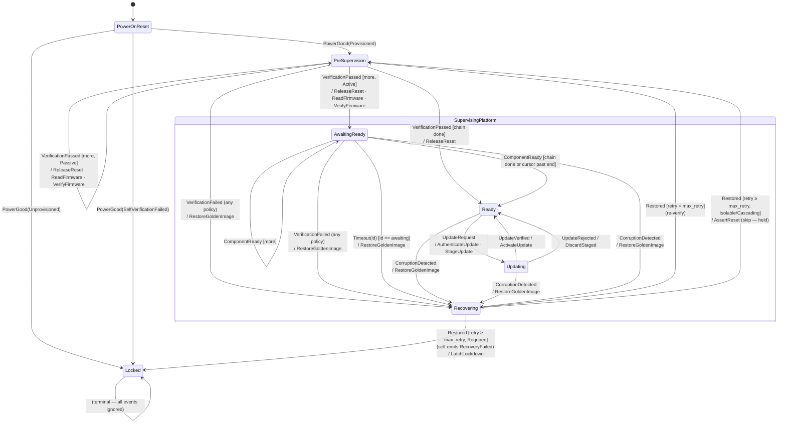

# State Machine

This document describes the state machine that lives in
`services/orchestrator/sm/src/lib.rs`: its states, shared storage, entry
actions, transition table, and the `SupervisingPlatform` superstate.

```mermaid
stateDiagram-v2
    [*] --> PowerOnReset

    PowerOnReset --> PreSupervision : PowerGood(Provisioned)
    PowerOnReset --> Locked             : PowerGood(Unprovisioned)
    PowerOnReset --> Locked             : PowerGood(SelfVerificationFailed)

    PreSupervision --> PreSupervision : VerificationPassed [more, Passive]<br/>/ ReleaseReset · ReadFirmware · VerifyFirmware
    PreSupervision --> AwaitingReady     : VerificationPassed [more, Active]<br/>/ ReleaseReset · ReadFirmware · VerifyFirmware
    PreSupervision --> Ready             : VerificationPassed [chain done]<br/>/ ReleaseReset
    PreSupervision --> Recovering        : VerificationFailed (any policy)<br/>/ RestoreGoldenImage

    AwaitingReady --> AwaitingReady : VerificationPassed [more]<br/>/ ReleaseReset · ReadFirmware · VerifyFirmware
    AwaitingReady --> Ready         : ComponentReady [chain done or cursor past end]
    AwaitingReady --> AwaitingReady : ComponentReady [more]
    AwaitingReady --> Recovering    : VerificationFailed (any policy)<br/>/ RestoreGoldenImage
    AwaitingReady --> Recovering    : Timeout(id) [id == awaiting]<br/>/ RestoreGoldenImage

    state SupervisingPlatform {
        Ready         --> Updating      : UpdateRequest<br/>/ AuthenticateUpdate · StageUpdate
        Updating      --> Ready         : UpdateVerified / ActivateUpdate
        Updating      --> Ready         : UpdateRejected / DiscardStaged
        Ready         --> Recovering    : CorruptionDetected<br/>/ RestoreGoldenImage
        Updating      --> Recovering    : CorruptionDetected<br/>/ RestoreGoldenImage
        AwaitingReady --> Recovering    : CorruptionDetected<br/>/ RestoreGoldenImage
    }

    Recovering --> PreSupervision : Restored [retry < max_retry]<br/>(re-verify)
    Recovering --> PreSupervision : Restored [retry ≥ max_retry, Isolable/Cascading]<br/>/ AssertReset (skip — held)
    Recovering --> Locked    : Restored [retry ≥ max_retry, Required]<br/>(self-emits RecoveryFailed) / LatchLockdown
    Locked     --> Locked    : (terminal — all events ignored)
```

---

## Shared storage — `Rot<N>`

Every handler receives a `&mut Rot<N>` alongside the event and the `Sink`. This
struct is `statig`'s *shared storage*: a single allocation that persists across
events and is visible to every state and superstate. States carry no data; all
mutable state lives here.

| Field | Type | Purpose |
|---|---|---|
| `chain` | `Vec<(ComponentId, ComponentAttrs), N>` | Ordered trust chain, supplied by the shell at construction time. Never mutated after build. |
| `cursor` | `u8` | Index of the component currently under verification. Reset to 0 on every `PreSupervision` entry. Advances on each `VerificationPassed`, and past any component in `held` (skipped without verification), via `Outcome::Handled`. |
| `held` | `Vec<ComponentId, N>` | Components skipped because their recovery was **exhausted**: an `Isolable` component, or a `Cascading` component plus its `depends_on` dependents. Not verified during the walk — held in reset, cursor advances past them. Populated in `Recovering` when `retry_count` reaches `max_retry`; persists across re-walks; cleared on `Ready` entry. |
| `failed` | `Option<ComponentId>` | The component whose recovery episode is in progress; `None` while healthy. Set on any `VerificationFailed`, `Timeout`, or `CorruptionDetected` of a managed component. |
| `retry_count` | `u8` | Number of consecutive failed restore attempts in the current recovery episode. Cleared to 0 in `Ready`'s entry action — consecutive only (INV7). |
| `max_retry` | `u8` | Shell-chosen ceiling for `retry_count`. When `retry_count >= max_retry` recovery is **exhausted** and the failed component's recovery-failure policy (`Isolable`/`Cascading`/`Required`) is applied. |
| `awaiting` | `Option<ComponentId>` | The `Active` component whose iRoT readiness is currently outstanding. `Some` only while in `AwaitingReady`; `None` everywhere else (INV9). |

The effect buffer is deliberately **absent** from `Rot`. Effects flow through the
`Sink` (the `statig` context), which the orchestrator creates fresh for every
event and drains afterward.

---

## Context — `Sink`

The only thing a handler can do to the outside world is call `ctx.emit(effect)`.
`Sink` is an append-only `heapless::Vec<Effect, EFFECT_CAP>`. It can push; it
cannot pull, read, or do I/O. The orchestrator owns a fresh `Sink` per dispatch
and reads the effects out after `handle_with_context` returns.

---

## States

### `PowerOnReset`

The machine's initial state. The first event is always `PowerGood(PowerOnResult)`.

**Entry action**: none.

| Event | Guard | Effects | Next state |
|---|---|---|---|
| `PowerGood(Provisioned)` | — | — | `PreSupervision` |
| `PowerGood(Unprovisioned)` | — | — | `Locked` |
| `PowerGood(SelfVerificationFailed)` | — | — | `Locked` |
| anything else | — | — | `Outcome::Super` (top level — discarded) |

---

### `PreSupervision`

Walks the trust chain component-by-component. The cursor advances on each
`VerificationPassed` (or optional `VerificationFailed`) using `Outcome::Handled`
rather than a self-transition — a self-transition would re-run the entry action
and reset the cursor.

**Entry action**: reset `cursor` to 0, set `awaiting` to `None`, emit
`ReadFirmware` + `VerifyFirmware` for the first component **not** in `held`
(`held` components stay in reset and are skipped). `held` is *not* cleared here —
it persists across re-walks so exhausted components are not re-verified.

| Event | Guard | Effects | Next state |
|---|---|---|---|
| `VerificationPassed(id)` | more, current `Passive` | `ReleaseReset` · `ReadFirmware(next)` · `VerifyFirmware(next)` | `Handled` (cursor ++) |
| `VerificationPassed(id)` | more, current `Active` | `ReleaseReset` · `ReadFirmware(next)` · `VerifyFirmware(next)` | `AwaitingReady` (awaiting = Some(id)) |
| `VerificationPassed(id)` | chain done | `ReleaseReset(id)` | `Ready` |
| `VerificationFailed(id)` | — | — | `Recovering` (failed = Some(id)) — recovery is attempted first, regardless of the component's recovery-failure policy |
| anything else | — | — | `Outcome::Super` (top level — discarded) |

When advancing the cursor, any component in `held` is skipped without
verification — it stays in reset and no `ReadFirmware`/`VerifyFirmware` is emitted
for it. The recovery-failure policy (`Isolable`/`Cascading`/`Required`) is
**not** consulted here; it is applied later, in `Recovering`, only if the restore
attempts are exhausted.

> **Deliberate exclusion, not an oversight.** Because `PreSupervision` has no
> `superstate()` link, a `CorruptionDetected` on an already-released component
> is discarded (the `anything else` row above) for as long as the machine
> keeps self-looping here — which, for an all-`Passive` chain, can span the
> entire walk. This is a current, intended decision: CSA defines no mechanism
> for detecting corruption of an already-released component's *live,
> executing* state, so there is no confirmed CSA requirement forcing
> continuous coverage from a component's own release. See
> `corruption_during_presupervision_selfloop_is_dropped` in `lib.rs` and the
> "Decision" note in [orchestrator-sm-walkthru.md](./orchestrator-sm-walkthru.md).

---

### `AwaitingReady`

Reached when an `Active` component passes eRoT authentication. The machine waits
here until the component's iRoT signals readiness via `ComponentReady`. The
speculative eRoT check for the next component (`ReadFirmware` + `VerifyFirmware`)
was already emitted by the `PreSupervision` handler that triggered this
transition.

**Entry action**: none.

| Event | Guard | Effects | Next state |
|---|---|---|---|
| `ComponentReady(id)` | `id != awaiting` | — | `Handled` (stale/spurious — ignore, INV9) |
| `ComponentReady(id)` | `id == awaiting`, cursor in bounds | — | `Handled` (clear awaiting) |
| `ComponentReady(id)` | `id == awaiting`, cursor past end | — | `Ready` |
| `VerificationPassed(id)` | more | `ReleaseReset` · `ReadFirmware(next)` · `VerifyFirmware(next)` | `Handled` (cursor ++) |
| `VerificationPassed(id)` | chain done | `ReleaseReset(id)` | `Ready` |
| `Timeout(id)` | `id == awaiting` | — | `Recovering` (failed = Some(id), awaiting = None) |
| `Timeout(id)` | `id != awaiting` | — | `Handled` (stale — ignore) |
| `VerificationFailed(id)` | — | — | `Recovering` (failed = Some(id), awaiting = None) — recovery attempted first |
| anything else | — | — | `Outcome::Super` → `SupervisingPlatform` |

`ComponentReady` and `VerificationPassed` are independent and may arrive in
either order. Both must be seen before the walk advances. `awaiting` tracks
whether `ComponentReady` is still outstanding; the state itself tracks whether
`VerificationPassed` is still outstanding.

---

### `Ready`

Normal operational state: the full chain has been verified, all required
components are released, and the machine handles attestation, update requests,
and corruption events.

**Entry action**: reset `retry_count` to 0 (makes the cap count *consecutive*
failures — INV7), and clear `held` and `failed` (a clean boot ends any recovery
episode and the skip set).

| Event | Guard | Effects | Next state |
|---|---|---|---|
| `UpdateRequest` | — | — | `Updating` |
| anything else | — | — | `Outcome::Super` → `SupervisingPlatform` |

---

### `Updating`

An update is in progress.

**Entry action**: emit `AuthenticateUpdate` + `StageUpdate`.

| Event | Guard | Effects | Next state |
|---|---|---|---|
| `UpdateVerified` | — | `ActivateUpdate` | `Ready` |
| `UpdateRejected` | — | `DiscardStaged` | `Ready` (rejected update is not corruption — INV4) |
| anything else | — | — | `Outcome::Super` → `SupervisingPlatform` |

---

### `Recovering`

The machine is attempting to restore a corrupted or rejected component.

**Entry action**: emit `RestoreGoldenImage(rot.failed)` — targets the failed
component's *recovery region*: all components sharing the same `RegionId` are
restored together. The core supplies the failed component ID; the shell resolves
region membership from the chain at startup. Only the named component triggers
the restore, but the entire region is affected (not the whole chain — INV5).

| Event | Guard | Effects | Next state |
|---|---|---|---|
| `Restored(_)` | `retry_count + 1 < max_retry` | — | `PreSupervision` (re-verify — the restored image may pass) |
| `Restored(_)` | cap reached, `failed` `Isolable` | `AssertReset(failed)` | `PreSupervision` (recovery exhausted: add `failed` to `held`, clear `failed`; the re-walk skips it) |
| `Restored(_)` | cap reached, `failed` `Cascading` | `AssertReset(failed)` · `AssertReset(dependent…)` | `PreSupervision` (recovery exhausted: add `failed` + `depends_on` dependents to `held`, clear `failed`) |
| `Restored(_)` | cap reached, `failed` `Required` | `Effect::Emit(RecoveryFailed)` | `Handled` (orchestrator queues `RecoveryFailed` next — INV7) |
| `RecoveryFailed` | — | — | `Locked` |
| anything else | — | — | `Outcome::Super` → `SupervisingPlatform` |

("cap reached" = `retry_count + 1 >= max_retry`.)

**Two-stage recovery (CSA-aligned).** A verification failure never skips a
component outright. Every failure — during initial boot or a re-walk — first
brings the machine here, to `Recovering`, which restores the failed component's
recovery region and re-verifies. Only when the restore attempts are *exhausted*
(`retry_count` reaches `max_retry` and the restored image still fails) does the
component's **recovery-failure policy** decide what happens next:

- `Isolable` — skip just this component; hold it in reset (`held`) and continue
  booting the rest of the platform.
- `Cascading` — skip this component *and* its `depends_on` dependents; continue
  booting the remainder.
- `Required` — stop entirely: self-emit `RecoveryFailed`, which drives the
  machine to `Locked`. (CSA's narrative docs call this outcome "platform
  halt" — same behavior, `Required` is the type-level name.)

This mirrors the CSA Boot Sequence **Recovery Policy**: recovery (region restore)
is attempted for *every* failed device first, and the `Isolable`/`Cascading`/
`Required` classification applies only *after* a recovery attempt itself
fails.

`Effect::Emit(RecoveryFailed)` is the *feedback-as-data* mechanism. It is easiest
to understand by asking why the machine doesn't just jump straight to `Locked`
when a `Required` component's retry cap is hit.

When a `Required` component's last restore attempt fails, the machine has a
decision to make: give up and lock down. It could act on that decision silently,
transitioning directly from `Recovering` to `Locked` inside the handler. Instead
it does something that
looks indirect at first: it emits `RecoveryFailed` as an *effect* — a piece of
data saying "a follow-up event named `RecoveryFailed` should happen next" — and
returns. The orchestrator sees that effect, puts `RecoveryFailed` at the front of
the queue, and dispatches it right away. That second event is what actually moves
the machine to `Locked`.

The payoff is that the give-up decision becomes a visible event rather than a
hidden jump. Anyone reading the effect trace sees `RecoveryFailed` appear at the
exact moment the cap was reached, and `Locked` is only ever entered one way — by
handling that event — no matter where the lockdown was triggered from. The core
never reaches out and changes its own state behind the scenes; every transition,
including its own internally-generated ones, travels through the same event path
and shows up in the same trace.

**Why re-walk from `cursor = 0`?** After restoring a component the machine
re-enters `PreSupervision` and re-verifies the entire chain from scratch
rather than resuming at the failed component. This is a deliberate conservative
policy: a corruption event may indicate a broader integrity problem, and the
CSA architecture's core principle — "no component executes unverified firmware"
(NIST SP 800-193) — requires that trust be re-established end-to-end before the
platform is considered healthy again. The CSA document does not prescribe the
exact recovery sequencing, but the re-walk implements the spirit of that
principle. Components already in `held` — those whose recovery was exhausted
under an `Isolable` or `Cascading` policy — are skipped during the re-walk: they
stay in reset and are not re-verified. Every other component is re-verified from
scratch, and a fresh failure restarts the two-stage recovery for that component.

---

### `Locked`

Terminal state. All events are discarded.

**Entry action**: emit `LatchLockdown` — instruct the shell to hold all
components in reset permanently.

---

## Superstate — `SupervisingPlatform`

`Ready`, `Updating`, `Recovering`, and `AwaitingReady` share this superstate.
When a leaf state returns `Outcome::Super`, `statig` calls the superstate handler.

| Event | Guard | Effects | Next state |
|---|---|---|---|
| `AttestationChallenge` | — | `SignAttestation` | `Handled` (no transition — INV6) |
| `CorruptionDetected(id)` | `attrs.failure_policy == Required` | — | `Recovering` (failed = Some(id) — INV5) |
| `CorruptionDetected(id)` | `attrs.failure_policy != Required` | `AssertReset(id)` | `Handled` (component gated; machine stays in current state) |
| anything else | — | — | `Outcome::Super` (discarded) |

---

## Centralizing the Supervision Contract

Four states run once the platform is up: `Ready`, `Updating`, `Recovering`, and
`AwaitingReady`. Two things must be true in all four, no matter which one the
machine is in — an attestation challenge always gets answered, and a corruption
report always starts recovery. Call those two shared rules the **supervision
contract**.

The question is where to write the contract down. One option is to copy it into
each of the four states. The problem with copies is that they drift: someone
edits one and forgets the others, and now corruption is handled in three states
but quietly ignored in the fourth. The other option is to write it once, in a
single place the four states share. That is what "centralizing" means here, and
it is the safer choice for a rule this important.

A **hierarchical state machine (HSM)** gives us that single place. In a plain
state machine every state handles its own events and nothing more. An HSM adds a
*superstate* — a parent that several states sit under. When a state does not
handle an event itself, the event falls through to the parent. So each state
handles what is unique to it, and the parent handles what they all share. Our
four states sit under one superstate, `SupervisingPlatform`, and that is
where the supervision contract lives — written exactly once.

To be fair to the alternative: a careful flat state machine could get the same
result by giving every state a default branch that calls one shared function.
That works, and it behaves identically. The difference is that the shared
function is a convention people have to remember to wire up in each state, while
the superstate is a single declared link. The rest of this section is about why
that difference is worth having.

The first reason is that there is only one copy to get right. In the flat
version each state's default branch is written by hand, so they can quietly
diverge — one calls the shared function, another does something slightly
different. With the superstate, each state points at the one `SupervisingPlatform`
handler and nothing else. What that single copy buys us for auditing and
verification is covered in [Invariant Verification](#invariant-verification)
below.

The second reason is that the superstate also covers the *in-between* states,
which are the easy ones to forget. `SupervisingPlatform` includes not just the settled
`Ready` state but also `AwaitingReady` (still booting) and `Recovering` (still
restoring). Corruption has to be handled even during those brief windows — and
those are exactly the states a developer is tempted to skip as "temporary."
Putting them under the same parent means the corruption rule applies to them
automatically, without anyone having to remember.

Extensibility helps too, though less dramatically. An event that applies
everywhere — attestation today, telemetry later — has one obvious home and is
added once. An event that needs to behave differently per state is no harder
than before: the state handles it itself, which simply overrides the parent.

One honest caveat: this is a strong default, not an ironclad guarantee. It works
as long as each state actually falls through to the parent and is correctly
linked to it. Someone can still break it by handling an event by mistake, or by
forgetting to link a new state. The real win is that the *safe* thing is the
easy thing — do nothing and the event falls through to the shared rule — whereas
the flat version makes the safe thing the line you have to remember to add. And
the payoff today is small in raw terms: the superstate shares just two events
across four states. The case rests on *which* two events they are — the
platform's corruption response — not on saving lines.

The cost is that reading one state no longer tells the whole story. To know what
`Ready` does with an event, you also have to know it falls through to
`SupervisingPlatform` and go read that. This is a trade, not a free win: the design takes
on more indirection \u2014 and a bit more machinery, since a flat state machine is just\na match on state and event while this adds superstates and the fall-through rule \u2014\nin exchange for removing duplication of the one rule where duplication is most\ndangerous. We accept that because the `statig` library is
used here without macros, so the fall-through is plain, visible code rather than
hidden generation, and the small amount of library machinery involved is
covered by the machine's tests. The alternative is not "no library" — it is a
hand-written dispatch loop we would have to maintain and test ourselves.

On balance the hierarchy is the right call. The rule it centralizes is the
platform's corruption response, so the single copy sits exactly where a silent
mismatch would do the most harm. And the shared set is expected to grow, not
stay put — transit tamper detection and telemetry queries are both
platform-wide operational events on the OpenPRoT roadmap, and both fit this
pattern directly. Two events is a floor, not a ceiling. Only if it stayed at
two forever would a flat state machine with a shared default become the simpler
choice worth reconsidering.

---

## Invariant Verification

The invariants for the `SupervisingPlatform` superstate describe the whole
superstate, not one state at a time. Because the hierarchy stores each rule at
that same superstate level, checking that the code matches the spec stays
simple instead of turning into a state-by-state comparison.

Take INV6: *"an attestation challenge is answered in any `SupervisingPlatform`
state without changing state."* In this design the rule itself is one line of code —
the `AttestationChallenge` row in the `SupervisingPlatform` handler. Reading that row
tells you *what* happens; to know it happens *everywhere it should*, you also
check that each of the four states is linked to the superstate (its
`superstate()` points at `SupervisingPlatform`) and does not handle the event itself.
That is one row plus four link checks:

| Invariant | Where it lives | To verify |
|---|---|---|
| INV6 — attestation answered in any `SupervisingPlatform` state, no transition | `AttestationChallenge → SignAttestation`, `Handled` (one row in `SupervisingPlatform`) | Read one row + confirm four states link to `SupervisingPlatform` |
| INV5 — corruption triggers recovery from any `SupervisingPlatform` state | `CorruptionDetected → Recovering` (one row in `SupervisingPlatform`) | Read one row + confirm four states link to `SupervisingPlatform` |

This is not free — the four links matter, because a state that forgets to link,
or handles the event itself, silently drops out of the rule. But it is far less
work than the flat alternative, which spreads each rule across all four state
tables. Checking INV6 there means finding all four copies, confirming they match,
and doing it again every time a new state is added. If two copies ever disagree,
the invariant silently holds in some states and fails in others, with nothing to
flag it. Both designs require you to look at all four states; the difference is
that the superstate leaves one authoritative copy of the rule to compare against,
while the flat version leaves four copies that must be proven equal to each
other.

That is what it means for the hierarchy to line up with the invariants: the rule
is written and implemented in one place, and verifying it is checking that one
place plus the links into it — not reconciling four independent copies.

---

## `statig` integration

The machine uses `statig` 0.4.1 with hand-written trait impls — no proc-macros.

| Trait | Implemented by | Role |
|---|---|---|
| `IntoStateMachine` | `Rot<N>` | Declares associated types and `initial() -> State`. |
| `StatigState<Rot<N>>` | `State` | `call_handler`, `call_entry_action`, `superstate`. |
| `StatigSuperstate<Rot<N>>` | `Superstate<'_>` | `call_handler` for events that fell through from a leaf state. |

`initial()` is a `fn() -> State` with no `self`, so the machine always starts
in `PowerOnReset`. The shell-supplied `PowerGood(PowerOnResult)` event is the
first real branching point.
