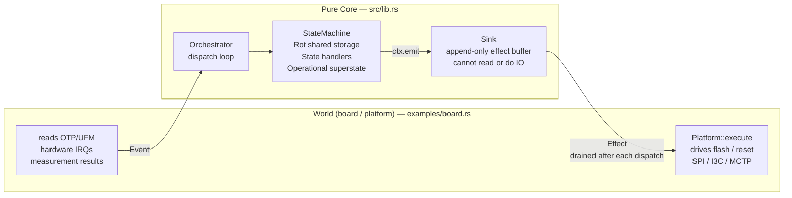

# Verification Model

This document describes how platform firmware verification is modelled in the
orchestrator state machine (`services/orchestrator/sm`): the problem it solves,
the types that carry the domain, the states that sequence the work, and the
boundary between the pure core and the platform that executes it.

---

## 1. The Problem

The eRoT (external Root of Trust — the discrete RoT device, e.g. on a DC-SCM)
must verify every platform component's firmware before releasing it from reset.
Two independent mechanisms do this:

1. **eRoT-side**: the eRoT reads the component's firmware image from the SPI
   flash it controls, verifies the signature and SVN against a Reference
   Integrity Manifest (RIM/PFM), and only then releases the component from reset.

2. **iRoT-side**: components with an integrated Root of Trust (e.g. a BMC SoC
   or CPU with Caliptra) perform their own independent local self-verification
   after reset. The eRoT must wait for this local check to complete before
   treating the component as trusted and advancing to the next one in the chain.

Components that have no integrated iRoT (e.g. a NIC) rely solely on the
eRoT-side check. The eRoT can advance immediately after releasing them.

This two-tier model — eRoT gate + optional iRoT gate — is the core problem the
verification states solve. It is grounded directly in the CSA architecture boot
sequence: "The eRoT and the iRoT provide complementary guarantees: the eRoT
controls whether a component is released from reset; the iRoT controls whether
the component's own firmware executes."

The **verification boundary** is the interface between the platform and the
pure state-machine core. Only verdicts cross it: the platform performs all
cryptographic work (reading flash, checking signatures and SVN) and then signals
the outcome via an event. The core never sees raw firmware data or hash values —
it only acts on the resulting `VerificationPassed` or `VerificationFailed`. This
keeps the core free of I/O and testable without hardware.

---

## 2. Domain Types

### `ComponentKind`

Classifies the iRoT gate for a component. Supplied by the platform at chain-build
time; the core never derives it.

```
Active  — has an integrated iRoT (e.g. Caliptra); both eRoT and iRoT checks apply
Passive — no integrated iRoT; only the eRoT check applies
```

In CSA terminology: `Active` corresponds to a *SoC with an integrated iRoT*
(e.g. a BMC or CPU with Caliptra). `Passive` corresponds to a *symbiont device*
— per NIST SP 800-193 §3.4, a device that lacks the capability to perform its
own firmware verification and relies on an external RoT (the eRoT, or an
intermediate RoT in a tiered model) to do so on its behalf.

### `FailurePolicy`

Determines what the orchestrator does when a component's firmware fails
verification.

```
Required   — attempt recovery; re-walk the chain after `Restored`; latch
             `Locked` if the retry cap is reached
Isolable   — hold the component in reset; advance past it; continue the walk
Cascading  — same as Isolable, and additionally hold in reset any component
             whose `depends_on` names this one
```

### `RegionId`

An opaque `u8` that groups components into a *recovery region*. Components
assigned the same `RegionId` must be restored together; when any region member
triggers `Recovering`, the platform issues a joint restore operation for the
entire region. The core treats the id as an equality key only and never
inspects the membership.

### `ComponentAttrs`

Per-component attributes:

```rust
pub struct ComponentAttrs {
    pub kind: ComponentKind,              // iRoT gate: Active | Passive
    pub failure_policy: FailurePolicy,    // verification-failure handling
    pub recovery_region: RegionId,        // which components are recovered together
    pub depends_on: Option<ComponentId>,  // cascade trigger: held if named component was skipped
}
```

| `failure_policy` | `VerificationFailed` behaviour |
|---|---|
| `Required` | → `Recovering`; component held in reset; chain walk halts until restored |
| `Isolable` | component held in reset; cursor advances; chain walk continues; no cascade to dependents |
| `Cascading` | component marked `Isolated` (held in reset); any component whose `depends_on` matches this id is also marked `Isolated` and skipped; cursor advances; chain walk continues |

A component that fails verification is **never** released from reset regardless
of its failure policy — releasing a component whose firmware failed verification
would mean running untrusted code, which breaks the trust invariant.

`depends_on` is only meaningful when the named component has `FailurePolicy::Cascading`.
Only `Cascading`-failed components (and their transitively cascade-skipped dependents)
are marked `Isolated`. Before emitting `ReadFirmware` for any component, the core
checks whether its `depends_on` names a component already marked `Isolated`; if so, the
depending component is also held in reset and marked `Isolated` without emitting
`ReadFirmware` or `VerifyFirmware`. This check repeats for each newly-isolated
component's successors until no further cascade is triggered. An `Isolable` failure
skips only the failed component; it marks nothing else `Isolated` and causes no
downstream cascade.

Convenience constructors: `ComponentAttrs::active_required()`,
`passive_required()`, `active_isolable()`, `passive_isolable()`,
`active_cascading()`, `passive_cascading()`.

### `ComponentId`

An opaque `u8` the core carries and equality-compares but never inspects. The
platform decides which id maps to which physical device.

### Events that cross the verification boundary

| Event | Direction | Meaning |
|---|---|---|
| `VerificationPassed(ComponentId)` | platform → core | The eRoT-side check passed: signature and SVN valid. |
| `VerificationFailed(ComponentId)` | platform → core | The eRoT-side check failed: image rejected. |
| `ComponentReady(ComponentId)` | platform → core | An `Active` component's integrated iRoT has finished its local verification and the component is operational (e.g. MCTP channel established). |
| `Timeout(ComponentId)` | platform → core | The platform's watchdog fired: the named `Active` component did not deliver `ComponentReady` within the platform-policy window. The platform arms the watchdog after emitting `ReleaseReset` and cancels it on `ComponentReady`. Treated as a verification failure for recovery purposes. |

### Effects the core emits for verification work

| Effect | Meaning |
|---|---|
| `ReadFirmware(ComponentId)` | Ask the platform to read the component's firmware image from eRoT-controlled flash. |
| `VerifyFirmware(ComponentId)` | Ask the platform to verify the image against the RIM/PFM. The platform responds with `VerificationPassed` or `VerificationFailed`. |
| `ReleaseReset(ComponentId)` | Release the named component from reset. Emitted only after `VerificationPassed`. |

These are descriptions, not actions. The platform's `Platform::execute` carries
them out; the core never touches hardware.

---

## 3. Sequencing by `ComponentAttrs`

### Active → Passive (happy path)

```
chain: [(C0, {Active, Required}), (C1, {Passive, Required})]

PreSupervision (entry):
  emit ReadFirmware(C0)
  emit VerifyFirmware(C0)

VerificationPassed(C0):           ← eRoT check done
  emit ReleaseReset(C0)
  emit ReadFirmware(C1)           ← speculative eRoT check of next
  emit VerifyFirmware(C1)
  cursor = 1, awaiting = Some(C0)
  → AwaitingReady

ComponentReady(C0):               ← C0's iRoT done
  awaiting = None
  Handled (stay in AwaitingReady, wait for VerificationPassed(C1))

VerificationPassed(C1):           ← speculative eRoT check resolved
  emit ReleaseReset(C1)
  chain done → Ready
```

### Isolable component failure (skip, continue)

```
chain: [(BMC, {Active, Required}), (NIC, {Passive, Isolable})]

VerificationPassed(BMC):
  emit ReleaseReset(BMC)
  emit ReadFirmware(NIC)
  emit VerifyFirmware(NIC)
  awaiting = Some(BMC) → AwaitingReady

VerificationFailed(NIC):          ← NIC firmware rejected; Isolable → skip
  NIC stays held in reset
  cursor advances past end
  awaiting is still Some(BMC) → stay in AwaitingReady

ComponentReady(BMC):              ← BMC iRoT done; cursor past end → Ready
  awaiting = None → Ready
```

### Concrete example: BMC (Active, required) → HOST (Active, required) → NIC (Passive, optional)

This matches the CSA single-node boot sequence.

```
chain: [(BMC, {Active, Required}), (HOST, {Active, Required}), (NIC, {Passive, Isolable})]

PreSupervision (entry):
  emit ReadFirmware(BMC)
  emit VerifyFirmware(BMC)          ← eRoT reads and checks BMC firmware from SPI flash

VerificationPassed(BMC):            ← eRoT: BMC firmware signature + SVN valid
  emit ReleaseReset(BMC)            ← eRoT releases BMC from reset; Caliptra iRoT runs
  emit ReadFirmware(HOST)           ← speculative: eRoT starts HOST firmware check
  emit VerifyFirmware(HOST)           while BMC's Caliptra iRoT is still booting
  cursor = 1, awaiting = Some(BMC)
  → AwaitingReady

ComponentReady(BMC):                ← BMC Caliptra iRoT done; MCTP channel up
  awaiting = None
  Handled (still in AwaitingReady, waiting for VerificationPassed(HOST))

VerificationPassed(HOST):           ← eRoT: HOST firmware signature + SVN valid
  emit ReleaseReset(HOST)           ← eRoT releases HOST from reset; Caliptra iRoT runs
  emit ReadFirmware(NIC)            ← speculative: eRoT starts NIC firmware check
  emit VerifyFirmware(NIC)            while HOST's Caliptra iRoT is still booting
  cursor = 2
  Handled (stay in AwaitingReady — still waiting on ComponentReady(HOST) and/or NIC result)

ComponentReady(HOST):               ← HOST Caliptra iRoT done; BIOS/UEFI executing
  awaiting = None
  Handled

VerificationPassed(NIC):            ← eRoT: NIC firmware valid (Passive — no iRoT gate)
  emit ReleaseReset(NIC)
  chain done → Ready
```

If NIC fails verification instead:
```
VerificationFailed(NIC):            ← NIC Isolable → skip; NIC stays held in reset
  cursor = 3 (past end)
  awaiting = None (already cleared by ComponentReady(HOST))
  → Ready
```

---

## 4. The Speculative Read Pattern

When an `Active` component passes eRoT verification the core does three things
in the same handler, before transitioning to `AwaitingReady`:

```
emit ReleaseReset(current)
emit ReadFirmware(next)        ← speculative: next eRoT check starts immediately
emit VerifyFirmware(next)      ← while current's iRoT is still booting
cursor += 1
awaiting = Some(current)
→ Transition(AwaitingReady)
```

This overlaps the integrated iRoT boot time of the current component with the
eRoT firmware read of the next. The two checks are independent (different
hardware paths), so the overlap is safe.

**Deliberate divergence from the CSA boot sequence diagram.** The CSA diagram
shows strictly sequential ordering — for example, the BMC MCTP channel is
established before the eRoT begins reading the CPU firmware. The
speculative-read pattern departs from this: the eRoT starts the next
component's firmware read as soon as the current one is released from reset,
without waiting for `ComponentReady`. The trust guarantee is fully preserved:
`ReleaseReset` for the next component is never emitted until that component's
own `VerificationPassed` arrives. The overlap reduces boot time on real
hardware where iRoT initialization can take several seconds.

---

## 5. Recovery Is a Re-boot

A firmware check is only meaningful while its component is held in reset. This
is a CSA/NIST principle, not an orchestrator invention: corruption detection is
defined *at boot* and *at rest*, both operating on the firmware image in NVM
rather than on running code, and *"the eRoT holds each downstream component in
reset until verification is complete and then releases it"* — *"no component
executes unverified firmware"* (CSA boot sequence; NIST SP 800-193 Protection
and Recovery). The reason is concrete: if a component is already executing, the
verdict says nothing about the code actually running — a live component can be
running something other than what is in flash, and can rewrite its own flash the
instant after the check passes. `VerifyFirmware` is therefore an *at-rest*
operation, and the initial power-on walk is sound only because the platform
holds every component in reset at power-on and the core releases each one
(`ReleaseReset`) solely after its own `VerificationPassed`.

Recovery re-runs that walk, so it must re-establish the same precondition. CSA
grounds this too: recovery *activates through a reset* — its Recovery Sequence
ends by marking the recovered slot as the boot target and *initiating a reset or
slot-switch*, so a recovered component always re-enters service from a held,
freshly-verified state rather than being patched live.

**Design decision (orchestrator-specific):** CSA describes recovery *per
device* — write the recovery image to the failed slot, reset that device. This
orchestrator goes further: on re-entering `PreSupervision` the core first
asserts reset on **every** non-isolated component, then walks the whole chain
from a fully-held state and re-releases each part in order. Quiescing the entire
chain (not just the failed device) is our choice, not a verbatim CSA
requirement; it *follows from* the at-rest principle and buys two things — a
single verification path shared with power-on, and the removal of any foothold a
compromised neighbor may have gained after it was released. The result is one
invariant:

> Every running component was verified while held in reset, immediately before
> it was released, since the most recent full walk. No live component is ever
> re-verified.

Re-verifying a still-live sibling from a previous walk would be meaningless: its
earlier pass belongs to a walk that is over, and nothing has held it at rest
since. Recovery returns the platform to a known-held state and rebuilds trust
from there, exactly as power-on does.

The strength of this rests on a platform-side precondition on `AssertReset`; see
§6.

---

## 6. The Platform Boundary

The orchestrator is split into a **pure core** and the **platform** that hosts
it. The core is a deterministic state machine: it receives an `Event`, updates its
own in-memory state, and appends `Effect` descriptions to a write-only `Sink`.
It performs no I/O, reads no hardware, and cannot observe the result of any
effect except as a future `Event`. Everything that touches the world — flash,
reset lines, transports, timers, measurement results — lives in the platform.



Only two value types cross the boundary, and they cross in opposite directions:

- **`Event` (world → core)** — the platform's report of something that already
  happened: a verdict (`VerificationPassed`/`Failed`), a readiness signal
  (`ComponentReady`), a timer expiry (`Timeout`), or a power-on result. Events
  are the *only* way the core learns anything about the world.
- **`Effect` (core → world)** — a description of work the platform should
  perform: `ReadFirmware`, `VerifyFirmware`, `ReleaseReset`, `RecoverComponent`,
  and so on. Effects are inert data; the core never waits on them and never
  sees them succeed or fail directly.

This inversion is what keeps the core testable without hardware: a test drives
`Event`s in and asserts on the `Effect`s that come out, with no flash, no
transports, and no clocks. It also fixes *where mechanism lives*. The core
names **what** must happen to **which** component; the platform decides **how**.
For example, `Effect::RecoverComponent(id)` says only "recover this component" —
whether that resolves to a golden-image restore, an A/B slot swap, a streamed
image, or a vendor-specific scheme is a platform/configuration decision, never
encoded in the core.

The core never reads flash, never checks signatures, never observes reset lines.
It only emits descriptions. The complete split:

| Responsibility | Core (`sm/src/lib.rs`) | Platform (`Platform` impl) |
|---|---|---|
| Chain order and `ComponentAttrs` | reads from `Rot.chain`, set by platform at startup | decides and provides |
| Read firmware image | emits `ReadFirmware(id)` | executes: eRoT reads via SPI interposition, I3C, or other transport |
| Verify signature / SVN | emits `VerifyFirmware(id)` | executes: eRoT checks against RIM/PFM; responds with `VerificationPassed` or `VerificationFailed` |
| Release from reset | emits `ReleaseReset(id)` | executes: eRoT drives reset GPIO or equivalent |
| Detect iRoT readiness | waits for `ComponentReady(id)` event | observes: integrated iRoT signals readiness (MCTP channel-up, GPIO, etc.); calls `dispatch` |
| Per-component failure policy | checks `attrs.failure_policy` in handler | none — policy is encoded in the chain at startup |
| Cascade-skip evaluation | checks `attrs.depends_on` against the `Isolated` components in `statuses` before emitting `ReadFirmware` | encodes the dependency graph at chain-build time |
| Recovery region membership | reads `attrs.recovery_region` when entering `Recovering` | assigns each component to a region at chain-build time |

**Reset must hold until release.** The core only emits the *ordering* of
`AssertReset` and `ReleaseReset`; it relies on the platform to make
`AssertReset` durable — a held quiesce, not a pulse — and to guarantee that no
component executes between its reset assertion and its post-verification
`ReleaseReset`. This is what makes an at-rest check meaningful, and it is the
precondition the recovery re-boot (§5) depends on.

**The core is policy-free.** It carries no tunable policy and no mechanism of
its own — every policy input is either board-supplied config data or arrives as
an event:

- **Failure handling is data-driven.** The handlers *read* each component's
  `FailurePolicy` from the chain and branch on it; nothing is hardcoded.
  Fail-open vs fail-close is therefore a *per-component* configuration choice
  (`Required` = fail-close; `Isolable`/`Cascading` = fail-open), set at
  chain-build time.
- **The retry cap is supplied, not baked in.** `max_retry` is a constructor
  argument, not a constant.
- **Timing lives outside.** The core sets no durations; `Timeout` and
  `CommitTimeout` arrive as events from the platform's watchdogs. The core only
  decides whether a given timeout is actionable.
- **Mechanism is deferred.** Effects name *what* to do to *which* component;
  the platform decides *how* (see `RecoverComponent` above).

The core supervises only the components in the configured chain. If an event
ever names a component id the chain does not contain, the core drops it: the
id describes something the core has no model of and never released, so there is
nothing to hold, recover, or protect. This is uniform across every event —
verdicts, corruption reports, and liveness signals alike — so a malformed
report from the platform can neither drive a spurious recovery nor latch the
platform to `Locked`. It is a guard against bad input from the world, not a
policy deployments configure.

---

## 7. What This Model Does Not Cover

- **Self-verification of the eRoT firmware itself**: happens one boot layer down
  (eRoT ROM + measuring bootloader) before this machine runs. The result is
  delivered as `PowerOnResult` in `Event::PowerGood`.
- **Attestation** (`AttestationChallenge` / `SignAttestation`): handled in the
  `SupervisingPlatform` superstate, not part of the boot-time verification chain.
- **Firmware update verification** (`AuthenticateUpdate`): handled in the
  `Updating` state, distinct from boot-time chain verification.
- **Multiple intermediate boot-progress checkpoints per component**: the CSA
  architecture allows platform policy to require multiple intermediate
  readiness signals before a component is considered fully booted. This model
  simplifies that to a single `ComponentReady` event per `Active` component.
  The platform is responsible for aggregating any intermediate signals and
  delivering `ComponentReady` only once all platform-policy checkpoints have
  been satisfied.
