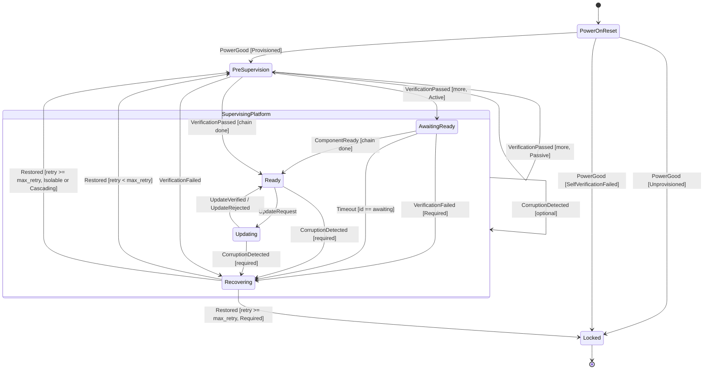

# Orchestrator State Machine

The orchestrator is the eRoT's boot-sequence controller. It walks the platform
trust chain — verifying each component's firmware and releasing it from reset in
order — and then governs the operational lifecycle (attestation, firmware update,
corruption recovery).

It lives in `services/orchestrator/sm` as a pure state machine: it never touches
hardware directly. Every action is described as an [`Effect`] value that the
surrounding shell carries out; every piece of outside information arrives as an
[`Event`]. This keeps the core testable without hardware and free of I/O.

## State Topology

The diagram below shows the reachable states and the events (with guards) that
drive transitions between them. Effects are omitted here to keep the topology
readable — see [State Machine](./orchestrator-machine.md) for the full diagram
with entry actions and effects.

## Documents

- [**Verification Model**](./orchestrator-model.md): The two-tier firmware
  verification model (eRoT gate + optional iRoT gate), the verification
  boundary, `ComponentAttrs`, and concrete sequencing examples.
- [**State Machine**](./orchestrator-machine.md): All states, shared storage, entry
  actions, transition table, and the `SupervisingPlatform` superstate.

## Design Principles

**Effects, not actions.** Handlers call `ctx.emit(Effect::…)` to describe what
should happen. The shell's `Platform::execute` carries it out. The core never
reads flash, drives a GPIO, or opens a channel.

**Reads as events.** The core never reads OTP, UFM, or any provisioning store.
Outside information (power-on result, verification verdicts, iRoT readiness
signals) arrives in event payloads.

**Feedback as data.** Internal follow-up signals (e.g. the retry-cap lockdown
`RecoveryFailed`) are emitted as `Effect::Emit(event)`. The orchestrator queues
and handles them immediately, making them visible in the effect trace rather than
hiding them as implicit state changes. See the
[`Recovering` state](./orchestrator-machine.md#recovering) for a worked example.

**Board-supplied policy.** The core hard-codes no deployment-specific values.
The shell supplies the trust chain (component ids, kinds, and required/optional
policy) and the recovery-retry cap at startup.

## Relationship to CSA Architecture

The state machine is a direct implementation of the boot sequence described in
the CSA architecture document:

| CSA concept | State machine encoding |
|---|---|
| eRoT holds component in reset until firmware verified | `PreSupervision` emits `ReleaseReset` only on `VerificationPassed` |
| Component with Caliptra iRoT requires two independent checks | `ComponentKind::Active` → `AwaitingReady` until `ComponentReady` |
| Passive component (no iRoT): eRoT check only | `ComponentKind::Passive` → advance immediately after `ReleaseReset` |
| Isolable component: failure skips, not blocks | `FailurePolicy::Isolable` → skip (held in reset); advance without `Recovering`; no cascade |
| Cascading skip: failure also holds dependents | `FailurePolicy::Cascading` + `ComponentAttrs::depends_on` → cascade-skip in `Rot.held` |
| Boot-progress watchdog: component must signal readiness in time | `Timeout(ComponentId)` event → `AwaitingReady` → `Recovering` |
| Recovery scope groups components that restore together | `ComponentAttrs::recovery_region` (`RegionId`) → shell restores full region on `RestoreGoldenImage` |

## Applicability Across Admissible Architectures

The orchestrator is **eRoT-scoped**: one instance runs per discrete eRoT chip
running OpenPRoT firmware. The same crate and binary are used at every such
tier — the only difference between deployments is the chain configuration
supplied at startup. eRoT chips not running OpenPRoT (e.g. a third-party AMC
or a legacy DC-SCM implementation) appear as opaque `ComponentId` entries in
the chain of the nearest OpenPRoT eRoT above them.

**Model 1 — Module** (single PCIe add-in card): a discrete eRoT is optional.
When present, it runs one orchestrator instance with a short chain containing
the card's SoC. When absent, the module relies on the parent node's eRoT
instance to verify and release it as a `ComponentId` in the node's chain.

**Model 2 — Single Node Compute**: the DC-SCM discrete eRoT runs one
orchestrator instance whose chain covers all critical node devices (CPU, BMC,
NIC, storage). This is the canonical single-instance deployment.

**Model 3 — Complex Heterogeneous Compute**: the three-tier hierarchy maps to
independent orchestrator instances at each tier:

- Each **AMC / EAM** (subsystem eRoT) runs one instance whose chain covers the
  GPU or AI accelerator devices it manages.
- The **DC-SCM node eRoT** runs one instance whose chain covers CPUs, BMC,
  SmartNICs, storage, and the AMC/EAM chips themselves.

The node eRoT treats each AMC/EAM as just another `ComponentId` — `Active` if
the AMC has its own integrated iRoT, `Passive` if not. It has no visibility
into the AMC's internal chain walk; it only observes the AMC's
`VerificationPassed` / `ComponentReady` signals, like any other component.

| Admissible Architecture | Orchestrator instances | Chain scope per instance |
|---|---|---|
| Module (eRoT present) | 1 | Card SoC |
| Module (no eRoT) | 0 | — (verified by parent node eRoT) |
| Single Node Compute | 1 | All node critical devices |
| Complex Heterogeneous Compute | 1 per subsystem eRoT + 1 node eRoT | Subsystem devices / all node devices including subsystem eRoTs |
