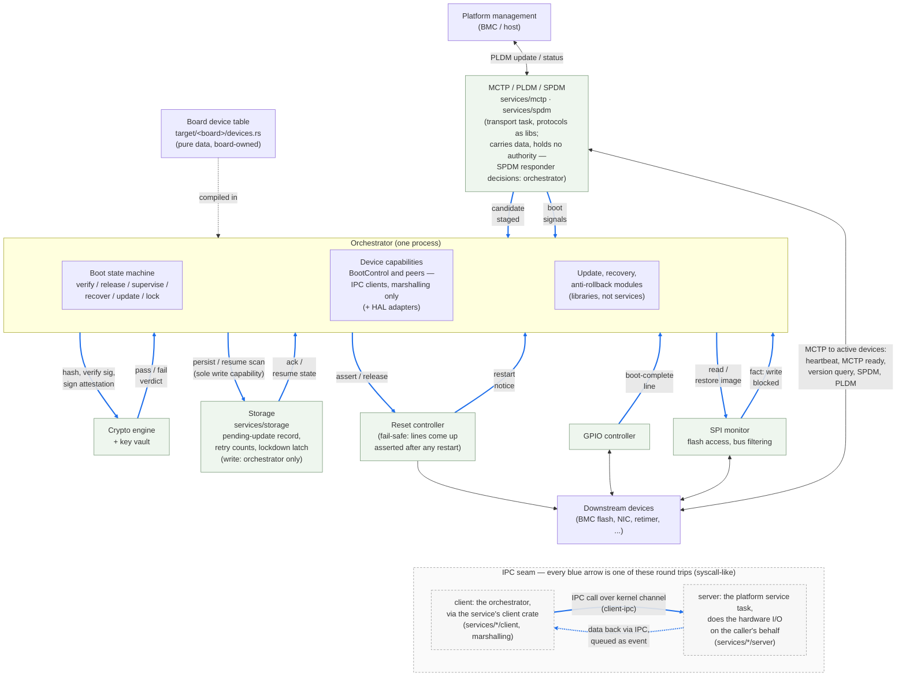

# Platform Architecture

Every decision — when a device leaves reset, which image gets verified,
whether an update activates — is made in the [state
machine](./orchestrator-machine.md); what those decisions are and how
they sequence is that page's subject, not this one's. The platform is
everything around that core: the sensors that feed it events and the
actuators that carry out its effects. This page describes that half —
the layers inside the orchestrator process, the platform services it
calls, the board device table, and the fail-safe rules at the
responsibility boundary.

## Structure

At the core sits the [state machine](./orchestrator-machine.md)
(`services/orchestrator/sm`), a pure reducer that consumes events
(verification results, boot signals, update requests, timeouts) and
emits effects (verify this image, release that reset, restore golden
image), performing no I/O itself. It is the policy half, not part of
the platform. The platform contributes two board-agnostic layers
inside the orchestrator process:

- **Device capabilities** (`services/orchestrator/capabilities`) — the narrow contracts
  the state machine's effects are executed against, e.g. `BootControl`
  (hold a device in reset / release it). HAL bindings live in
  `services/orchestrator/hal-adapters`.
- **Board device table** (`services/orchestrator/config`, schema; values in
  `target/<board>/devices.rs`) — declares the managed devices: reset signal,
  boot checkpoints and windows, commit policy. Validated at compile time, so
  a malformed table is a build error.

## Responsibility Scope

The orchestrator stops at the capability contracts.
Controllers that access signals and buses belong to the platform HAL and
drivers; crypto and transport are services it *uses* but does not own.
Two rules follow:

- **Decide *what*, never *how*.** The orchestrator says "hold device 3
  in reset" — not "drive GPIO pin 14 low." The pin-to-device mapping lives
  in the board device table; the register access lives in the HAL behind
  the capability traits. Porting to a new board means a new table and HAL,
  zero policy changes.
- **Protection survives its crash.** The SPI monitor filters flash traffic
  in hardware, on its own; the orchestrator only loads its rules at
  boot and is not in the data path, and the hardware write filter stays
  armed until the device's first fetch, closing the
  time-of-check/time-of-use window. Busy or crashed, the orchestrator
  cannot be bypassed — there is nothing to bypass.

The six green boxes outside the orchestrator box are platform services — each
one its own task, reached the way a syscall is: the orchestrator issues an IPC
call, the service performs the hardware interaction on its behalf, and the data
comes back via IPC. Each service follows the crate layering established by
[`services/i2c`](https://github.com/OpenPRoT/openprot/tree/main/services/i2c)
and
[`services/mctp`](https://github.com/OpenPRoT/openprot/tree/main/services/mctp):
`api` (wire protocol), `client` (marshalling, host-buildable), `client-ipc`
(the kernel-channel transport), `server` (dispatch onto the hardware). Boxes
name their crates where the service exists today; the rest follow the same
pattern as they land. Five rules govern how the orchestrator relies on them:

- **Facts, not verdicts.** Services report what they observed — the SPI
  monitor a blocked write, the transport a missed heartbeat — never what
  it means. "Corruption" is a verdict, and verdicts are made in one
  place only: the state machine.
- **Never block.** Commands are fire-and-forget; every reply (a crypto
  verdict, a storage ack) returns as a queued event, so a long image hash
  cannot delay the judgment of a boot window elsewhere.
- **Exclusive security state.** Only the orchestrator holds the write
  capability for the lockdown latch, retry counts, and pending-update
  record; a persist with unknown outcome counts as failed and latches the
  machine locked.
- **Fail-safe resets.** Managed reset lines default to asserted in
  hardware on every controller restart, not just cold boot — a
  controller crash resets healthy running devices. That availability
  hit is deliberate: an unsupervised release is never accepted. The
  restart notice makes the orchestrator re-run the boot walk.
- **Transport without authority.** Images and attestation are
  authenticated end-to-end (signatures via crypto, SPDM sessions), so the
  transport can drop traffic but never forge it; a dropped boot signal
  just becomes a checkpoint timeout, and the boot-complete GPIO line
  remains a transport-free liveness path.

## TODO

- Define the lockdown latch: where it lives, what "locked" gates, and
  how it is cleared. Latching on a failed persist must not itself depend
  on the storage service that just failed.
