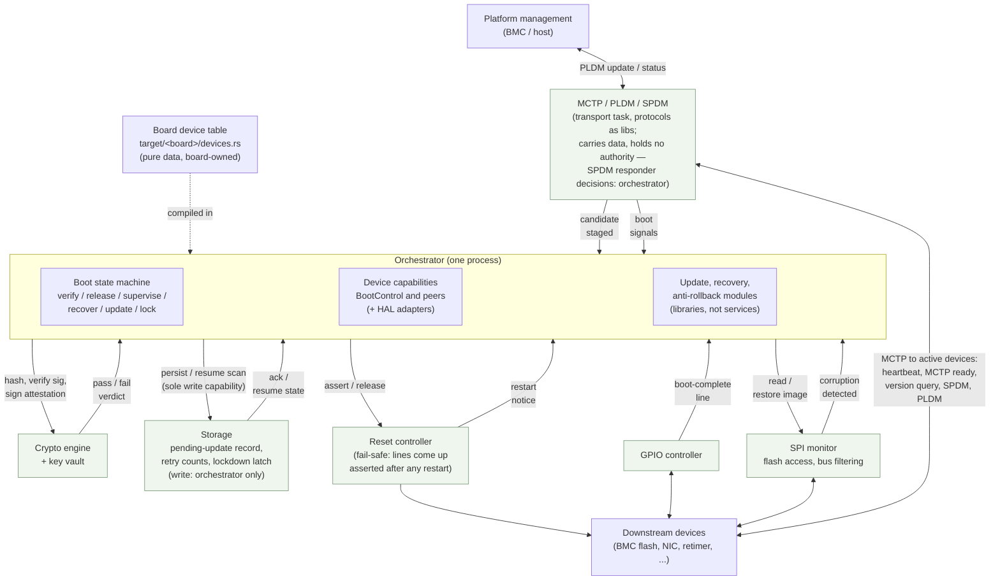

# Platform Architecture

The orchestrator decides, it never executes. It decides *when* a device leaves reset, *which* image
gets verified, *whether* an update activates — the platform's controllers
and services carry the decisions out. It never drives a wire, parses a bus
protocol, or holds a key (see [Where the responsibility
ends](#where-the-responsibility-ends)).

## Structure

The platform wraps the decision core (`services/orchestrator/sm`) — the pure
state machine that emits effects (verify this image, release that reset, recover
a corrupt component) and holds no policy or I/O of its own; see the
[Orchestrator](./orchestrator-overview.md) overview and
[State Machine](./orchestrator-machine.md). The core is *not* part of the
platform — the platform is the machinery around it: two board-agnostic layers
and the board-specific driver that runs them.

- **Device capabilities** (`services/orchestrator/capabilities`) — the narrow contracts
  the state machine's effects are executed against, e.g. `BootControl`
  (hold a device in reset / release it). HAL bindings live in
  `services/orchestrator/hal-adapters`.
- **Board device table** (`services/orchestrator/config`, schema; values in
  `target/<board>/devices.rs`) — declares the managed devices: reset signal,
  boot checkpoints and windows, commit policy. Validated at compile time, so
  a malformed table is a build error.
- **Platform driver** (board-specific shell) — the only layer that does I/O.
  It runs the event loop: feeds the state machine events, carries out each
  emitted effect through the capability contracts, and turns hardware signals
  back into events. It implements the `Platform` trait the core dispatches
  against.

## Where the responsibility ends

The orchestrator stops at the capability contracts.
Controllers that touch signals and buses belong to the platform HAL and
drivers; crypto and transport are services it *uses* but does not own.
Two rules follow:

- **Decide *what*, never *how*.** The orchestrator says "hold device 3
  in reset" — not "drive GPIO pin 14 low." The pin-to-device mapping lives
  in the board device table; the register access lives in the HAL behind
  the capability traits. Porting to a new board means a new table and HAL,
  zero policy changes.
- **Protection survives its crash.** The SPI monitor filters flash traffic
  in hardware, on its own; the orchestrator only loads its rules at
  boot and is not in the data path. Its hardware write filter stays armed
  until a device's first fetch, so flash verified while the device is held
  in reset cannot be swapped before it runs — the time-of-check/time-of-use
  window is closed. Busy or crashed, the monitor cannot be bypassed
  — there is nothing to bypass.

The six green boxes outside the orchestrator box are platform services —
each one its own task. Four rules govern how the orchestrator relies on
them:

- **Never block.** Commands are fire-and-forget; every reply (a crypto
  verdict, a storage ack) returns as a queued event, so a long image hash
  cannot delay the judgment of a boot window elsewhere.
- **Exclusive security state.** Only the orchestrator holds the write
  capability for the lockdown latch, retry counts, and pending-update
  record; a persist with unknown outcome counts as failed and latches the
  machine locked. The anti-rollback (SVN) floor is the same kind of state:
  it advances only after a new image proves it boots and runs, never on
  staging alone.
- **Fail-safe resets.** Managed reset lines default to asserted in
  hardware on every controller restart, not just cold boot — a
  controller crash resets healthy running devices. That availability
  hit is deliberate: an unsupervised release is never accepted. The
  restart notice makes the orchestrator re-run the boot walk.
- **Transport without authority.** Images and attestation are
  authenticated end-to-end (signatures via crypto, SPDM sessions), so the
  transport can drop traffic but never forge it; a dropped boot signal
  just becomes a checkpoint timeout — a hung device reports nothing, so an
  expired window is read as boot failure — and the boot-complete GPIO line
  remains a transport-free liveness path.

## TODO

- Define the lockdown latch: where it lives, what "locked" gates, and
  how it is cleared. Latching on a failed persist must not itself depend
  on the storage service that just failed.
