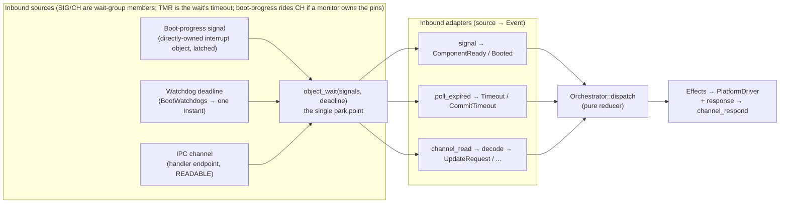
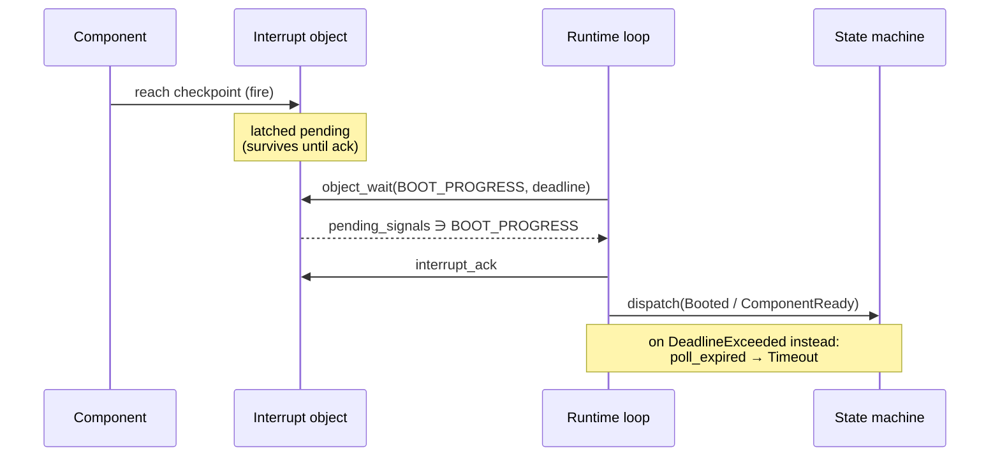
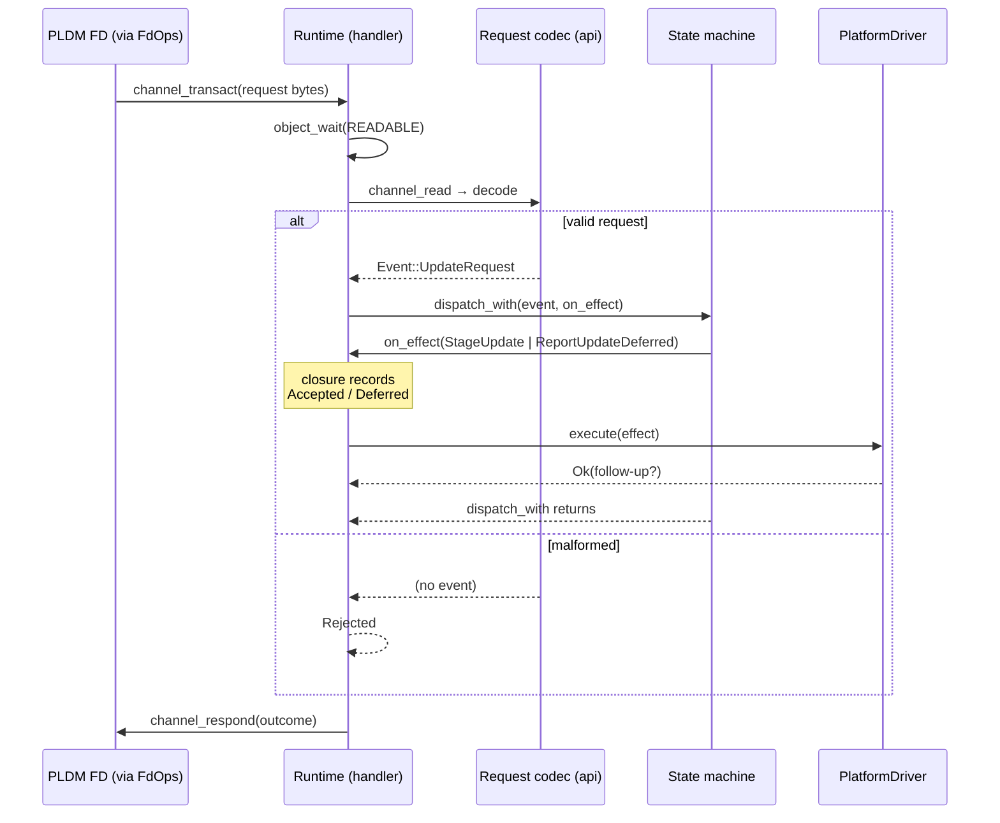

# Runtime

The **runtime** is the orchestrator's event loop: the single task that sits
between two collaborators — the pure [state machine](./orchestrator-machine.md)
(the *core*) that decides, and the `PlatformDriver` that executes — turning
outside happenings (interrupts, timeouts, IPC messages) into the `Event`s the
core consumes, and handing the `Effect`s it emits to the driver. It holds no
policy of its own — every decision stays in the core; the runtime only moves
information across the process boundary.

It gathers three possible inbound sources — **hardware interrupts**
(boot-progress lines the orchestrator owns directly), **IPC channels**, and
**watchdog deadlines** (timeouts) — into the one event stream the core
supervises, and carries the core's decision back out. Which sources are present
is a deployment choice: boot-progress is a hardware interrupt only when the
orchestrator owns the pins; otherwise a monitor forwards it as an IPC message.

The unifying idea is the kernel **wait group**: interrupts and IPC are not
separate mechanisms but interchangeable *members* of one group, and a watchdog
deadline is that same wait's *timeout* — so all three collapse into the return
of one `object_wait(handle, signal_mask, deadline)`. A *signal* here is just a
named bit on a waitable object, not a source in its own right: a latched IRQ bit
on an interrupt object, or `READABLE` / `USER` on a channel (a service raises
`Signals::USER` on a client channel to notify without a reply). The loop is
written once against "a member that signaled, or the deadline that lapsed,"
never against a specific source; what differs between sources is only the
*decoder* that turns each into an `Event`.

Two neighboring pages carry the supporting detail:
[Platform Architecture](./orchestrator-platform.md) names the services and the
responsibility boundary, and [pw_kernel IPC](../pw-kernel-ipc.md) gives the
concrete channel syscalls. The worked, compiling reference is the QEMU
integration test at `target/ast10x0/tests/orchestrator/runtime/main.rs`.

## The single wait point

The runtime is a single-threaded loop parked in one place: a kernel
`object_wait` over a **wait group**. Every inbound source is registered once as a
*member* of that group (`wait_group_add`), and the wait returns whichever member
signaled. Each member resolves to at most one `Event`:

- **Boot-progress signals** — a component reaching a checkpoint raises a
  boot-progress signal. Depending on the board's composition it arrives as an
  interrupt object the orchestrator holds directly or as a message a monitor
  forwards over a channel; either way the loop maps it to
  [`Event::ComponentReady`] (an `Active` component's iRoT-verified readiness)
  or [`Event::Booted`] (a `Passive` component's liveness).
- **Watchdog deadlines** — the timer is not a separate task. `BootWatchdogs`
  (`services/orchestrator/server`) folds all armed boot windows and the commit
  window into a *single deadline* passed straight to `object_wait`. When the
  wait returns `DeadlineExceeded`, `poll_expired()` yields the mapped
  [`Event::Timeout`] / [`Event::CommitTimeout`].
- **IPC channel messages** — an update agent, management path, peer service, or
  a boot-progress-forwarding monitor holds a channel *initiator*; the runtime
  holds the *handler*. A readable channel is another object the loop waits on;
  its message decodes to an `Event` — an [`Event::UpdateRequest`] to answer, or
  a forwarded [`Event::Booted`] / [`Event::ComponentReady`] notification.

The three share one `object_wait`, so a slow image hash on one path cannot
delay a boot window on another — this is the "never block" rule of the
[Platform Architecture](./orchestrator-platform.md#responsibility-scope) made
concrete: the loop only ever blocks at the wait, and only until the *nearest*
of any signal, any channel, or the nearest deadline.

**Members are uniform; only the decode differs.** A wait-group member is an
object watched for a signal bit — a latched IRQ bit on an *interrupt object*, or
`READABLE` / `USER` on a *channel* — and the loop treats them identically: wait,
see which member signaled, run that member's decode, dispatch the resulting
`Event`. Nothing above the decode step knows which kind a member is. That
uniformity pushes two questions *below* the runtime layer, where they belong:

- **Who owns the underlying hardware** — does the orchestrator own the GPIO bank
  and hold the boot-progress interrupt object itself, or does a monitor/GPIO
  server own the pins and forward boot-progress over a channel? — is a
  *system-composition* choice made in `system.json5`. Either shape is just one
  member of the group; the loop is byte-for-byte the same. The ownership
  tradeoff is covered in
  [Platform Architecture](./orchestrator-platform.md#boot-progress-signal-ownership).
- **What a member means** is the per-member decode.

## Decoding an interrupt-object member

When boot-progress is wired as a directly-held **interrupt object** (the
orchestrator owns the GPIO bank), the signaled member's decode leans on three
kernel properties that make it safe to consume in a single-threaded loop without
a mailbox:

- **Latched.** The signal stays pending until the loop `interrupt_ack`s it, so a
  device that reaches its checkpoint *before* the loop reaches `object_wait`
  does not lose the edge — there is no wake race.
- **Coalescing / one-deep.** Multiple fires before an ack collapse into one
  pending bit. The runtime therefore treats a signal as "this component made
  progress," not as a count — the meaning is carried by *which* component the
  runtime is currently awaiting, not by how many times the line toggled.
- **Acked exactly once per observation.** The loop pattern is
  `object_wait(BOOT_PROGRESS) → interrupt_ack → map to Event`, mirroring the
  IPC handler's `object_wait(READABLE) → channel_read → channel_respond`.

The signal-to-`Event` mapping is the one piece still hand-wired per test today
(the runtime test's `checkpoint_walk` / `confirm` build the `Event::Booted(id)`
inline). Factoring that into a small reusable **signal adapter** — "this signal
id, for the component the runtime is awaiting, becomes this `Event`" — is the
counterpart to how `BootWatchdogs` already adapts the timer. It carries no
policy; it is pure translation. When a monitor owns the pins instead, this same
translation lives in the channel codec below — same fact, different transport.

## Decoding a channel member: request in, response out

When the signaled member is a readable **channel**, the decode is a
request/response round trip. A channel has exactly one initiator and one handler;
the runtime is the handler for requests directed *at* the orchestrator (e.g. an
[`Event::UpdateRequest`] staged by the PLDM update path). Two seams stack here,
and keeping them apart is what lets the core stay pure: a transport-agnostic
request **`api`** crate — shared with the sender — owns the wire codec
(`Event` ⇄ bytes) and names no kernel, while the runtime supplies the
**transport binding** that carries those bytes. IPC (`channel_read` /
`channel_respond`) is one binding; a direct in-process call is another, used for
host tests. This mirrors the `i2c` service (`services/i2c`) layering, where the
*same* client codec runs unchanged over `IpcTransport` in production and a
`LoopbackTransport` direct call on the host. Concretely, the two directions:

- **Inbound:** the transport's `channel_read` yields bytes; the codec then
  validates length, range, and enum tag, and produces at most one `Event`. A
  malformed frame never reaches the core — it is answered with a rejection
  response directly. The request side is a different process running
  independently maintained code, so it is treated as untrusted (per
  [pw_kernel IPC](../pw-kernel-ipc.md)).
- **Outbound:** the core's decision is *not* a return value — `dispatch` returns
  `()`. It surfaces only as `Effect`s: `Ready` accepts a request and the
  `Updating` entry emits `StageUpdate`; every busy state
  ([`AwaitingReady`](./orchestrator-machine.md), `Updating`, `Recovering`)
  emits `ReportUpdateDeferred` instead of silently dropping it. The runtime
  observes those markers where the core already hands them out: `dispatch` is a
  thin wrapper over `dispatch_with(event, on_effect)`, which invokes `on_effect`
  once per effect. The loop passes a closure that forwards each effect to the
  `PlatformDriver` unchanged and records which marker fired, so it can encode
  Accepted / Deferred / Rejected into the single `channel_respond` — no wrapper
  type needed.

`channel_respond` is called exactly once per `channel_read`; skipping it leaves
the initiator blocked. That back-pressure is a feature: an update agent that
issues a second request while one is in flight simply blocks at its
`channel_transact` until the handler answers — the runtime never needs its own
request queue.

Not every channel member is a request/response transaction. When a monitor
forwards boot-progress — the ownership shape where the orchestrator does not
hold the pins — its channel message is a one-way *notification*: the codec
decodes it to [`Event::Booted`] / [`Event::ComponentReady`] exactly as the
interrupt-object decode would, and the reply is at most an ack. Same fact, same
`Event`; only the transport differs.

### Worked example: an update request

The PLDM update path exercises every part of the pattern above, so it is worth
tracing one request end to end. The remote Update Agent speaks PLDM-over-MCTP
only to the PLDM FD service (`services/pldm`) — it never touches the
orchestrator. When the UA asks to update a component, the FD drives its platform
seam, the synchronous `FdOps` trait, whose `handle_component` callback is the
"may this component be updated?" gate. That callback is the *initiator* against
the orchestrator, and the round trip runs in four steps:

1. **Request.** `handle_component` issues the request — a blocking
   `channel_transact` when the FD and orchestrator are separate processes, or a
   direct call when they share one (the transport split above).
2. **Decode.** The handler's `channel_read` yields bytes; the codec validates
   them into [`Event::UpdateRequest`]. A malformed frame is rejected without
   ever reaching the core.
3. **Decide.** `dispatch_with` runs the core to quiescence: `Ready` accepts and
   emits `StageUpdate`; any busy state emits `ReportUpdateDeferred` instead. The
   loop's closure records which marker fired.
4. **Reply.** That recorded outcome becomes the single `channel_respond`, which
   the FD maps back to a PLDM reply — `CompCanBeUpdated` for Accepted, a "retry
   later" completion code for Deferred, a rejection `ComponentResponseCode`
   otherwise.

The rest of the update lifecycle (`verify`, `apply`, `activate`) enters through
that same `FdOps` trait — each callback another request in this shape. The
sequence below is exactly this scenario.

## Adapter inventory

The runtime is deliberately thin: most of the translation already exists. The
signals/IPC work adds inbound adapters only.

| Concern | Direction | Adapter | Status |
|---|---|---|---|
| Effect → hardware | outbound | `PlatformDriver` + `capabilities` + `hal-adapters` | exists |
| Watchdog deadline → `Event` | inbound | `BootWatchdogs` / `TimerManager` | exists |
| Boot-progress signal → `Event` | inbound | signal mapper (owned pins) or channel codec (forwarded) | hand-wired; to factor out |
| Request `Event` ⇄ bytes (codec) | inbound + reply | shared request `api` crate (`zerocopy`), transport-agnostic | to build |
| Codec ⇄ kernel channel (transport) | inbound + reply | IPC binding (`channel_read` / `channel_respond`); direct/loopback call for host tests | to build |
| `dispatch` outcome → response | outbound | `dispatch_with` closure records the marker | to build |
| `ReleaseReset` → arm boot watchdog | internal | driver ↔ watchdog composition | not yet composed |

The last row is the one internal seam the driver flags itself: executing
`ReleaseReset(id)` is what should arm that component's boot watchdog, joining the
outbound driver to the inbound timer in one place rather than arming by hand.

## Fan-in and fail-safe

- **Fan-in is more channel pairs.** A channel is one-initiator-one-handler. To
  accept requests from several senders, declare several channel pairs all
  handled by the orchestrator and `object_wait` each in turn — there is no
  shared broker and no dynamic allocation.
- **Bounded deadlines only when armed.** `object_wait` takes a finite `Instant`
  only when a watchdog is armed; otherwise the deadline is `Instant::MAX` and the
  loop waits purely on signals and channels. `BootWatchdogs` saturates its
  deadline arithmetic, so an overflow degrades to "wait indefinitely," never to
  a spurious immediate timeout.
- **Facts in, decisions inside.** Every inbound adapter delivers a *fact* — a
  checkpoint was reported, a window lapsed, a request arrived. The meaning
  ("corruption," "accept the update," "lock down") is decided only in the state
  machine. Adapters never synthesize a decision, drop, or reorder events: the
  core's invariants rest entirely on an honest event stream.
- **Fail-closed.** An effect the driver cannot perform is reported as
  [`Event::EffectFailed`], which latches [`State::Locked`] from any state; a
  failed `LatchLockdown` is terminal for the driver (halt/reset), never a
  recoverable error.

## Open questions

- **Wire contract owner.** Whether the orchestrator defines the update
  request/response frame or conforms to one the PLDM update path already
  publishes determines whether the request `api` crate is new or
  shared-existing.
- **Channel topology.** Which processes hold initiators against the
  orchestrator (update agent only, or also management/telemetry) fixes how many
  handler endpoints the `system.json5` declares and how many the loop fans in.
- **Signal adapter surface.** The exact `signals::` bits and `handle::`
  constants a real board exposes (versus the test's single `BOOT_SIGNAL` /
  `BOOT_PROGRESS`) shape the reusable signal mapper.

[`Event`]: ./orchestrator-machine.md#events
[`Effect`]: ./orchestrator-machine.md#effects
[`Event::ComponentReady`]: ./orchestrator-machine.md
[`Event::Booted`]: ./orchestrator-machine.md
[`Event::Timeout`]: ./orchestrator-machine.md
[`Event::CommitTimeout`]: ./orchestrator-machine.md
[`Event::UpdateRequest`]: ./orchestrator-machine.md
[`Event::EffectFailed`]: ./orchestrator-machine.md
[`State::Locked`]: ./orchestrator-machine.md
