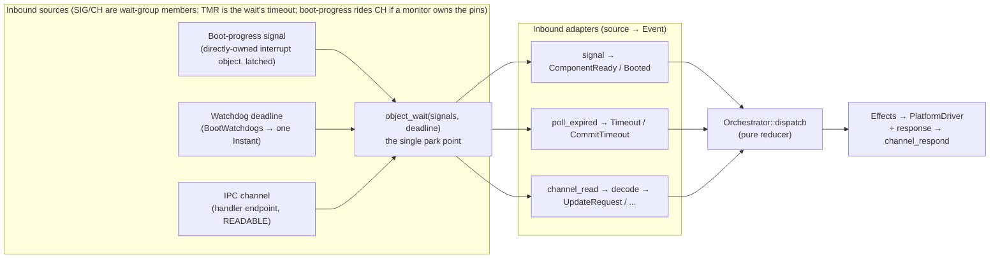

# Runtime

The **runtime** is the orchestrator's event loop: the single task that sits
between two collaborators — the pure [state machine](./orchestrator-machine.md)
(the *core*) that decides, and the `PlatformDriver` that executes — turning
outside happenings (interrupts, timeouts, IPC messages) into the `Event`s the
core consumes, and handing the `Effect`s it emits to the driver. It holds no
policy of its own — every decision stays in the core; the runtime only moves
information across the process boundary.

It gathers three possible inbound sources — **hardware interrupts**
(boot-progress lines the orchestrator owns directly), **IPC channels**, and
**watchdog deadlines** (timeouts) — into the one event stream the core
supervises, and carries the core's decision back out. Which sources are present
is a [board-composition](./orchestrator-overview.md#board-composition) choice:
boot-progress is a hardware interrupt only when the orchestrator owns the pins;
otherwise a monitor forwards it as an IPC message.

The unifying idea is the kernel **wait group**: interrupts and IPC are not
separate mechanisms but interchangeable *members* of one group, and a watchdog
deadline is that same wait's *timeout* — so all three collapse into the return
of one `object_wait(handle, signal_mask, deadline)`. A *signal* here is just a
named bit on a waitable object, not a source in its own right: a latched IRQ bit
on an interrupt object, or `READABLE` / `USER` on a channel (a service raises
`Signals::USER` on a client channel to notify without a reply). The loop is
written once against "a member that signaled, or the deadline that lapsed,"
never against a specific source; what differs between sources is only the
*decoder* that turns each into an `Event`.

Two neighboring pages carry the supporting detail:
[Platform Architecture](./orchestrator-platform.md) names the services and the
responsibility boundary, and [pw_kernel IPC](../pw-kernel-ipc.md) gives the
concrete channel syscalls. The worked, compiling reference is the QEMU
integration test at `target/ast10x0/tests/orchestrator/runtime/main.rs`.

## The single wait point

The runtime is a single-threaded loop parked in one place: a kernel
`object_wait` over a **wait group**. Every inbound source is registered once as a
*member* of that group (`wait_group_add`), and the wait returns whichever member
signaled. Each member resolves to at most one `Event`:

- **Boot-progress signals** — a component reaching a checkpoint raises a
  boot-progress signal. Depending on the board's composition it arrives as an
  interrupt object the orchestrator holds directly or as a message a monitor
  forwards over a channel; either way the loop maps it to
  [`Event::ComponentReady`] (an `Active` component's iRoT-verified readiness)
  or [`Event::Booted`] (a `Passive` component's liveness).
- **Watchdog deadlines** — the timer is not a separate task. `BootWatchdogs`
  (`services/orchestrator/server`) folds all armed boot windows and the commit
  window into a *single deadline* passed straight to `object_wait`. When the
  wait returns `DeadlineExceeded`, `poll_expired()` yields the mapped
  [`Event::Timeout`] / [`Event::CommitTimeout`].
- **IPC channel messages** — an update agent, management path, peer service, or
  a boot-progress-forwarding monitor holds a channel *initiator*; the runtime
  holds the *handler*. A readable channel is another object the loop waits on;
  its message decodes to an `Event` — an [`Event::UpdateRequest`] to answer, or
  a forwarded [`Event::Booted`] / [`Event::ComponentReady`] notification.

The three share one `object_wait`, so a slow image hash on one path cannot
delay a boot window on another — this is the "never block" rule of the
[Platform Architecture](./orchestrator-platform.md#responsibility-scope) made
concrete: the loop only ever blocks at the wait, and only until the *nearest*
of any signal, any channel, or the nearest deadline.

**Members are uniform; only the decode differs.** A wait-group member is an
object watched for a signal bit — a latched IRQ bit on an *interrupt object*, or
`READABLE` / `USER` on a *channel* — and the loop treats them identically: wait,
see which member signaled, run that member's decode, dispatch the resulting
`Event`. Nothing above the decode step knows which kind a member is. That
uniformity pushes two questions *below* the runtime layer, where they belong:

- **Who owns the underlying hardware** — does the orchestrator own the GPIO bank
  and hold the boot-progress interrupt object itself, or does a monitor/GPIO
  server own the pins and forward boot-progress over a channel? — is a
  [board-composition](./orchestrator-overview.md#board-composition) choice made
  in `system.json5`. Either shape is just one member of the group; the loop is
  byte-for-byte the same.
- **What a member means** is the per-member decode.

[`Event::ComponentReady`]: ./orchestrator-machine.md
[`Event::Booted`]: ./orchestrator-machine.md
[`Event::Timeout`]: ./orchestrator-machine.md
[`Event::CommitTimeout`]: ./orchestrator-machine.md
[`Event::UpdateRequest`]: ./orchestrator-machine.md
