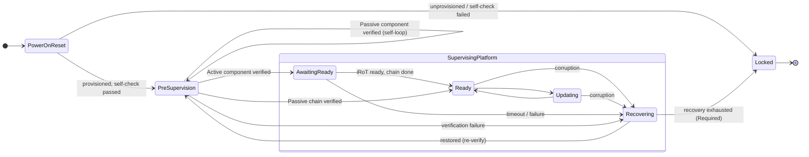

# State Machine Walkthrough

This document is a narrative tour of the orchestrator state machine. Where the
[State Machine](./orchestrator-machine.md) reference gives the precise states,
guards, and transition tables, this walkthrough reads the machine as a story —
following the platform from cold power through steady-state operation, recovery,
and lockdown — and ties each step back to the **CSA Boot Sequence** chapter it
implements.

Throughout, *CSA* refers to the Composable Security Architecture *Boot Sequence*
chapter (the "Single Node Compute" flow and its Key Principles, Recovery Policy,
and Example Mechanisms sections). The orchestrator is the concrete state-machine
encoding of that flow for a discrete eRoT running OpenPRoT.

> **How to read this alongside the reference.** Every state named here
> (`PowerOnReset`, `PreSupervision`, …) has a full entry in
> [State Machine](./orchestrator-machine.md) with its entry action and transition
> table. This document explains *why* the transitions are shaped the way they are
> and *which CSA guarantee* each one upholds. When a claim needs the exact guard,
> follow the link.

---

## The shape of the journey

At the highest level the machine has two operating modes, a provisioning gate,
and a terminal exit:

**Two operating modes, never simultaneous.** `PreSupervision` and
`SupervisingPlatform` are mutually exclusive. The distinction is not about which
activities are happening — `AwaitingReady` sits inside `SupervisingPlatform` and
continues the chain walk — but about whether the **supervision contract is active**.
In `PreSupervision`, attestation challenges are not answered and corruption
events are not acted on. The moment `PreSupervision` exits, the supervision
contract switches on and stays on: attestation is always answered and corruption
is always acted on, regardless of whether the chain walk is still in progress.

The threshold *for an `Active` component* is one firmware verification result —
passed or failed — not all components having passed verification: the next
`VerificationPassed` moves the machine into `AwaitingReady`, which is linked to
`SupervisingPlatform`, so supervision switches on at that point.

For an all-`Passive` chain, no such threshold exists before `Ready`: the
machine self-loops inside `PreSupervision`, which is *not* linked to
`SupervisingPlatform`, for the entire walk. A corruption on an
already-released `Passive` component reported during that self-loop is
currently discarded (see
`corruption_during_presupervision_selfloop_is_dropped` in `lib.rs`).

**Decision: `PreSupervision` stays out of `SupervisingPlatform` for now.** It
is tempting to argue that CSA implies supervision must hold continuously from
each component's own release — a remote verifier could plausibly challenge as
soon as the first component's measurements exist, and corruption could
plausibly be detected the moment a component is running — but CSA does not
actually say this anywhere. CSA's Resiliency chapter defines only two
corruption-detection points (at-boot and at-rest/NVM-polling); neither is a
monitor of an already-released component's *live, executing* state. NVM
polling in particular re-checks the stored flash image, not what a component
is currently executing, so it cannot stand in for that missing mechanism.
Since CSA never defines a runtime-execution integrity monitor, or assigns
responsibility for one, there is no confirmed CSA requirement forcing
continuous coverage during the `PreSupervision` self-loop. Until CSA states
otherwise, `PreSupervision` remains architecturally isolated from
`SupervisingPlatform` and this gap is accepted as current, documented
behavior rather than something to patch around. Revisit only if CSA is
amended to define such a mechanism and assign it to the eRoT/PRoT.

During recovery the machine temporarily exits supervision
(`SupervisingPlatform::Recovering` → `PreSupervision`), gating all components
back into reset. `SupervisingPlatform` is re-entered on the first transition
back out of `PreSupervision`.

- **`PowerOnReset`** is the provisioning gate: the eRoT checks its own integrity
  before it vouches for anything else.
- **`PreSupervision`** is mode one — supervision contract off: the eRoT walks
  the trust chain, verifying and releasing components without yet answering
  attestation challenges or acting on corruption.
- **`SupervisingPlatform`** is mode two — supervision contract on: attestation,
  firmware updates, iRoT gating (`AwaitingReady`), and active recovery
  (`SupervisingPlatform::Recovering`) all run under one shared superstate.
  `PreSupervision` drives into it; `SupervisingPlatform::Recovering` drives
  back out to re-walk the chain.
- **`Locked`** is the terminal exit: the platform stops and holds every component
  in reset when provisioning is absent, the self-check fails, or recovery is
  exhausted.

The rest of this document walks each state.

---

## Phase 1 — Power-on and the provisioning gate

**State: `PowerOnReset`.**

> **CSA:** *"The eRoT is the first component to execute after standby power is
> applied. It is the trust anchor for the entire boot sequence."*

The machine starts in `PowerOnReset` and does nothing until `PowerGood` is
received, carrying the result of the eRoT's own power-on self-check. That single event fans out three ways:

- `PowerGood(Provisioned)` — the eRoT is provisioned and self-verified, so it is
  entitled to vouch for others. The machine advances to `PreSupervision` and
  begins the chain walk.
- `PowerGood(Unprovisioned)` — there is nothing to verify against, so the machine
  goes straight to `Locked`.
- `PowerGood(SelfVerificationFailed)` — the trust anchor cannot trust *itself*,
  so it must not vouch for anything else; straight to `Locked`.

The two failing branches encode the CSA premise directly: everything downstream
hangs off the eRoT's own integrity, so if that is in doubt the platform never
leaves the gate.

---

## Phase 2 — Walking the trust chain

**State: `PreSupervision`.**

> **CSA:** *"No downstream component boots until the eRoT has verified its
> firmware. The eRoT holds each downstream component in reset until verification
> is complete and then releases it."* and *"The eRoT's boot orchestration is
> device-agnostic: it walks an ordered list of managed devices … For each device
> in turn, the eRoT verifies (and measures, where applicable) its firmware,
> releases it from reset, then waits for that device's boot-progress signal
> before proceeding."*

`PreSupervision` is the phase before the supervision contract is active:
attestation challenges are not answered and corruption events are not acted on.
The eRoT processes firmware verification results here — one component at a time,
advancing the cursor and releasing each verified component — but it may exit after
a single result (on the first Active component or the first failure) or only after
walking the entire Passive chain. How much of the chain it covers depends on the
platform topology. On entry it points the cursor at the first component not
already skipped and emits `ReadFirmware` and `VerifyFirmware` for that
component. From then on it reacts to incoming firmware verification results.

The machine is **device-agnostic**, exactly as CSA requires: the chain is a list
of opaque `ComponentId`s with per-component `ComponentAttrs`. The core never
learns what a component *is* — only its boot order, whether it has its own root
of trust, and what to do if it fails.

### Two kinds of component: symbiont vs. self-verifying

> **CSA:** *"Each SoC with an integrated iRoT independently measures and verifies
> its own firmware before executing it."* and *"Devices without their own root of
> trust are symbiont devices"* (NIST SP 800-193 §3.4).

A component's `ComponentKind` decides what "verified" means:

- **`Passive`** — a *symbiont device* (e.g. a NIC): no root of trust of its own.
  The eRoT's signature/SVN check is the only gate. On `VerificationPassed` the
  machine releases it (`ReleaseReset`), immediately starts the next component's
  read, advances the cursor, and stays in `PreSupervision`. This is the
  self-loop: the walk rolls forward through symbiont devices.
- **`Active`** — a *SoC with an integrated iRoT* (e.g. a BMC or CPU with
  Caliptra): it must clear **two independent gates**. When it passes the eRoT
  check the machine releases it, speculatively starts the *next* component's
  read, and moves to `AwaitingReady` to wait for the component's own root of
  trust to report in.

This is the CSA "complementary guarantees" principle made concrete:

> **CSA:** *"the eRoT controls whether a component is released from reset; the
> iRoT controls whether the component's own firmware executes."*

`ReleaseReset` is the eRoT gate; `ComponentReady` (below) is the iRoT gate.

### Reaching the end

When the component that just passed is the last one in the chain, the walk is
done: the machine releases it and transitions to `Ready`. The platform is up and
every verified component has been released — the trust chain is established.

### What happens on failure

> **CSA:** *"No component executes unverified firmware; failed devices are
> recovered before they are released."*

Any `VerificationFailed` — regardless of the component's recovery-failure policy
— sends the machine to `Recovering`. **Recovery is always attempted first.** The
component is *not* skipped on the spot; it is held in reset (never released, so it
never runs unverified code) and handed to the recovery phase. The decision about
whether to eventually *skip* it or *halt* is deferred until recovery has actually
been tried and failed — see [Phase 5](#phase-5--two-stage-recovery). This is the
crux of CSA compliance: the classification (`Isolable`/`Cascading`/`Required`)
is a *recovery-failure* policy, not a first-failure policy.

---

## Phase 3 — Waiting for the iRoT

**State: `AwaitingReady`.**

> **CSA:** *"the eRoT … releases it from reset, then waits for that device's
> boot-progress signal before proceeding to the next device."* and, on the
> watchdog: *"the device's own firmware must report each expected boot-progress
> signal within its window, or the eRoT treats the device as failed and initiates
> recovery."*

`AwaitingReady` exists because an `Active` component has two gates that resolve
independently and in either order:

- The **iRoT gate** — `ComponentReady`, meaning the component's own root of trust
  finished its local self-verification and the component is operational (e.g. its
  MCTP channel is up).
- The **next eRoT check** — the speculative `VerificationPassed` for the following
  component, which the `PreSupervision` handler kicked off on the way in.

The `awaiting` field remembers which component's readiness is still outstanding;
the state itself remembers whether the next component's firmware verification
result is still pending. Both must resolve before the walk moves on, which is why
the machine can loop back into `AwaitingReady` several times:

- `ComponentReady` from the awaited component clears the readiness gate. If there
  is still chain left it stays here (now waiting only on the next firmware
  verification result);
  if the chain is already complete it advances to `Ready`.
- `ComponentReady` for any *other* id is stale or spurious and is ignored — a
  guard so a late or duplicated signal cannot push the walk forward incorrectly.
- `VerificationPassed` for the next component advances the walk the same way
  `PreSupervision` does.

### The boot-progress watchdog

CSA's *boot-progress checkpointing* mechanism — arm a watchdog when releasing a
device, treat a missed checkpoint as failure — maps to the `Timeout` event. If
`Timeout(id)` arrives for the component the machine is awaiting, it is treated as
a verification failure and sent to `Recovering` (dropping the readiness wait). A
`Timeout` for any other id is stale and ignored. A `VerificationFailed` during
this window behaves identically to the boot-time case: recovery first.

> **Simplification worth noting.** CSA allows *multiple* boot-progress checkpoints
> per device ("how many checkpoints are expected"). The orchestrator models a
> single readiness signal (`ComponentReady`) plus a single `Timeout` per
> `Active` component. A platform that needs multi-checkpoint progress reporting
> would extend this.

---

## Phase 4 — The `SupervisingPlatform` superstate

**States: `Ready`, `Updating`, `Recovering`, `AwaitingReady`, and the `SupervisingPlatform` superstate.**

Once the whole chain is verified and released, the machine settles in `Ready`.
On entry it clears the recovery bookkeeping (`retry_count`, `held`, `failed`) —
reaching `Ready` means the platform booted clean, so any prior recovery episode
is over.

`Ready` itself does only one state-changing thing: on `UpdateRequest` it moves to
`Updating`, which issues a request to authenticate and stage the new image, then
waits for a result — `UpdateVerified` activates the staged image and returns to
`Ready`; `UpdateRejected` discards it and returns to `Ready`. A rejected update is
explicitly **not** treated as corruption: the platform simply keeps running the
image it already had.

### The supervision contract

`Ready`, `Updating`, `Recovering`, and `AwaitingReady` all sit under one shared
parent, `SupervisingPlatform`, which handles the two events that must behave identically
no matter which of those states is active:

- **`AttestationChallenge`** → the machine signs an attestation response and stays
  put. This realizes the CSA attestation relationship:

  > **CSA:** *"Firmware measurements taken by each iRoT during this sequence form
  > the basis of the platform's attestation evidence … the eRoT has collected or
  > can collect measurements from all managed devices and can present aggregated
  > attestation evidence to a remote verifier."*

- **`CorruptionDetected`** → if the affected component is required, the machine
  records it and drops into `Recovering`; if it is not required, the component is
  gated (`AssertReset`) and the machine stays put. This is the runtime arm of the
  CSA Protection/Recovery principle: corruption of a trusted-critical component
  re-enters the recovery flow rather than being ignored.

Because these live in the parent, they apply during boot-time waiting
(`AwaitingReady`) and during recovery (`SupervisingPlatform::Recovering`) just
as much as in `Ready`.
They do **not** apply in `PowerOnReset` or `PreSupervision`, which sit outside
`SupervisingPlatform`: the eRoT does not answer attestation challenges or act on
corruption reports while it is still establishing the chain.

---

## Phase 5 — Two-stage recovery

**State: `Recovering`.**

This is where the orchestrator implements the CSA **Recovery Policy** verbatim,
and it is deliberately a *two-stage* process.

> **CSA (stage 1 — recover):** *"When a device requires recovery (its firmware
> fails verification), the scope of that recovery operation is determined by its
> configured recovery region … all devices within the same region must be updated
> and/or recovered together."*
>
> **CSA (stage 2 — classify on recovery failure):** *"When a recovery attempt
> itself fails (the alternate/recovery image also fails verification), the
> platform applies one of the following policies … Isolable … Cascading …
> Platform halt."*

### Stage 1 — always recover first

On entry, `Recovering` emits `RestoreGoldenImage(failed)`. Per CSA this targets
the failed component's **recovery region**: all components sharing the same
`RegionId` are restored together, not just the one component and not the whole
platform. Then, on `Restored`, the machine re-verifies by re-walking the chain.

> **Why re-walk from the top?** After a restore the machine re-verifies the whole
> chain rather than resuming at the failed component. A corruption may indicate a
> broader integrity problem, and the CSA/NIST SP 800-193 core principle — *no
> component executes unverified firmware* — is best served by re-establishing
> trust end-to-end. Components already in `held` (exhausted under a prior
> `Isolable`/`Cascading` decision) are skipped during the re-walk; everything else
> is re-verified, and any fresh failure restarts recovery for that component.

If the restored image now passes, recovery succeeded and the walk continues.

### Stage 2 — classify only when recovery is exhausted

Recovery gets `max_retry` attempts. Only when those are exhausted (the recovery
image *keeps* failing) does the failed component's **recovery-failure policy**
decide the outcome — this is the CSA stage-2 classification:

| Recovery-failure policy | Behaviour | CSA policy |
|---|---|---|
| `Isolable` | Skip just this component: hold it in reset (`held`), continue booting the rest. | *Isolable — skip the failed device and continue.* |
| `Cascading` | Skip this component **and** its `depends_on` dependents, then continue. | *Cascading — skip the failed device and any device configured as dependent on it.* |
| `Required` | Stop entirely: self-emit `RecoveryFailed`, which drives the machine to `Locked`. | *Platform halt — stop the boot sequence entirely and enter manual/out-of-band recovery.* |

The essential point — and the reason this matches CSA — is the ordering:
**recovery is attempted for every failed component first**, and `Isolable` /
`Cascading` / `Required` are consulted **only after** a recovery attempt
itself fails. A component is never skipped without first being given a chance to
recover.

### Lockdown as visible data

When a `Required` component exhausts recovery, the machine does not silently
jump to `Locked`. It emits `RecoveryFailed` as an *effect* — a follow-up event —
which the orchestrator re-dispatches immediately, and *that* event drives the
transition to `Locked`. The give-up decision therefore appears in the effect
trace at the exact moment the cap was reached, and `Locked` is only ever entered
by handling that one event, no matter where lockdown was triggered from. (This is
the "feedback as data" principle; see the
[`Recovering` state](./orchestrator-machine.md#recovering) for the full argument.)

---

## Phase 6 — The dead end

**State: `Locked`.**

> **CSA:** *"Platform halt — stop the boot sequence entirely and enter a manual or
> out-of-band recovery mode."*

`Locked` is terminal. On entry `LatchLockdown` is emitted, holding every
component in reset permanently, and from then on every event is ignored. The
machine reaches here from exactly three places, all meaning "no trustworthy state
could be established, so refuse to run one":

1. Power-on with an unprovisioned eRoT.
2. Power-on with a failed eRoT self-check.
3. A `Required` component whose recovery was exhausted.

---

## CSA compliance at a glance

| CSA principle / policy | Where the machine upholds it |
|---|---|
| eRoT is the trust anchor, first to execute | `PowerOnReset` + `PowerGood` self-check gate |
| No downstream boots until eRoT verifies it; held in reset until release | `PreSupervision` emits `ReleaseReset` only on `VerificationPassed` |
| iRoT independently verifies; complementary eRoT/iRoT gates | `Active` → `AwaitingReady` on `ComponentReady`; `Passive` → immediate |
| Device-agnostic ordered walk | Opaque `ComponentId` chain with `ComponentAttrs` |
| Symbiont devices (NIST SP 800-193 §3.4) | `ComponentKind::Passive` |
| Boot-progress watchdog → treat as failed, recover | `Timeout(id)` → `Recovering` |
| Recovery scope = recovery region (restore together) | `RegionId`; `RestoreGoldenImage` restores the whole region |
| Recover first for every failed device | Any `VerificationFailed` → `Recovering` |
| Classify only after recovery fails (Isolable/Cascading/halt) | `Recovering` applies the policy when `retry_count` reaches `max_retry` |
| Platform halt on unrecoverable failure | `Required` → `RecoveryFailed` → `Locked` |
| Measurements form attestation evidence | `AttestationChallenge` → `SignAttestation` in `SupervisingPlatform` |

---

## See also

- [State Machine](./orchestrator-machine.md) — the authoritative states, guards,
  and transition tables this walkthrough narrates.
- [Verification Model](./orchestrator-model.md) — `ComponentKind`,
  `FailurePolicy`, `RegionId`, `ComponentAttrs`, and the verification boundary.
- [Orchestrator Overview](./orchestrator-overview.md) — design principles and
  applicability across the admissible architectures.
