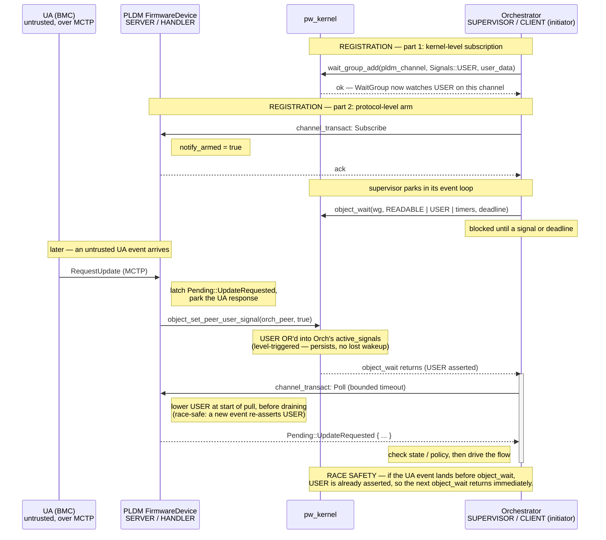

# PLDM/Orchestrator IPC — supervisor-as-initiator (alternative to PR #458)

This proposes the inverse channel-role assignment to PR #458. Here **PLDM is the
server/handler** (consistent with the i2c/mctp/usart services) and the
**Orchestrator is the supervisor/client (initiator)** that subscribes to
notifications and drives the update.

## Trust boundary

- **UA (Update Agent)** — runs in the **BMC**, a separate SoC. Fully untrusted,
  off-chip, reached over MCTP (I2C/I3C). Source of all update traffic.
- **PLDM FirmwareDevice** — inside the RoT, but the edge component that parses
  untrusted wire input from the BMC. Largest attack surface. Modeled as a
  **server/handler**, like the other bus-facing services.
- **Orchestrator** — the trusted supervisor: owns staging authority, the SMC
  write filter, and the irreversible OTP/SVN bump. Must never be stalled by the
  untrusted edge. Modeled as the **client/initiator** on its `object_wait` loop.

## Role assignment

| Edge | PLDM | Orchestrator |
|------|------|--------------|
| PLDM ↔ Orchestrator | server / handler | client / initiator (subscribes, drives) |
| PLDM ↔ UA (MCTP) | responder + initiator | — |
| Orchestrator ↔ Flash | — | initiator (`PayloadSource::read_at`) |

Blocking direction is **Orchestrator → PLDM** using **bounded** `channel_transact`
deadlines (never `Instant::MAX`). The reverse direction is only a dataless
`object_set_peer_user_signal` nudge, which never blocks the supervisor.

> Note: bounded deadlines are not a special cost this design introduces. The
> orchestrator was never an `Instant::MAX` handler to begin with — it already
> runs a timed `object_wait` loop to service its watchdogs (see *Why the
> supervisor must own time* below). The PLDM poll deadline is just one more
> timer folded into machinery that already exists; the untrusted-peer timeout
> path (mark PLDM unhealthy, abort, release staging) reuses that same loop.

## Why the supervisor must own time

The orchestrator's correctness obligations are **temporal and self-originated**.
It already runs a single timed event loop —
[`services/orchestrator/server/src/runtime.rs`](../../../../services/orchestrator/server/src/runtime.rs)
uses `BootWatchdogs::wait_deadline() -> Instant` as the `object_wait` deadline
and drains fired timers with `poll_expired() -> Option<Event>`. Two of those
deadlines are load-bearing:

- boot-progress watchdog → `Event::Timeout(ComponentId)`
- anti-rollback commit window → `Event::CommitTimeout`

These fire on the orchestrator's **own clock**, whether or not PLDM ever sends a
byte. Three consequences follow:

1. **The orchestrator is never a pure `Instant::MAX` handler.** Unlike the i2c
   server-runtime (which has no deadlines of its own and parks on
   `Instant::MAX`), the orchestrator must wake on `wait_deadline()` to service
   its watchdogs. So it already departs from the i2c-handler template — bounded
   waits are its baseline, not a deviation.
2. **The poll deadline is free.** `wait_deadline()` already blends multiple
   expiries into one wake time. Folding a PLDM-poll/liveness deadline into the
   same `TimerManager` adds no new mechanism.
3. **A deadline-enforcer must act on its own schedule — that is an initiator.**
   The guarantee "if activation isn't confirmed within *T*, roll back" cannot be
   gated on an untrusted-edge-facing peer choosing to initiate. If PLDM never
   speaks, the commit window must **still** expire and trigger rollback. Only a
   loop that owns time and *polls* PLDM on its own cadence can promise that;
   making the orchestrator a handler subordinates its watchdogs to PLDM's
   schedule — the one thing a watchdog must never depend on.

This is the structural core of the argument: the component's job is defined in
terms of deadlines it originates, and enforcing self-originated deadlines *is*
an initiator's job.

## Full flow

```mermaid
sequenceDiagram
    participant UA as UA (BMC)<br/>untrusted, over MCTP
    participant PLDM as PLDM FirmwareDevice<br/>SERVER / HANDLER<br/>run_terminus
    participant Orch as Orchestrator<br/>SUPERVISOR / CLIENT (initiator)<br/>object_wait loop
    participant Flash as Shared Storage<br/>ext. SPI flash

    Note over PLDM, Orch: SETUP — supervisor subscribes to PLDM notifications
    Orch->>PLDM: channel_transact: Subscribe (arm USER-signal nudges)
    PLDM-->>Orch: ack
    Note over Orch: waits on USER signal in its object_wait loop

    Note over UA, Orch: PRE-TRANSFER VETO
    UA->>PLDM: RequestUpdate (MCTP)
    Note right of PLDM: latch UpdateRequested,<br/>park the UA response
    PLDM-->>Orch: object_set_peer_user_signal (dataless nudge)
    activate Orch
    Orch->>PLDM: channel_transact: Poll (bounded timeout)
    PLDM-->>Orch: Pending::UpdateRequested { ... }
    Note left of Orch: check state, policy
    Orch->>PLDM: channel_transact: Decision::Accepted | Rejected
    PLDM-->>Orch: ack
    deactivate Orch
    PLDM-->>UA: RequestUpdate response (accept/reject)

    Note over UA, Orch: INTAKE (if Accepted)
    UA->>PLDM: proceeds → Offer params
    PLDM-->>Orch: nudge
    activate Orch
    Orch->>PLDM: channel_transact: Poll
    PLDM-->>Orch: Pending::Offer { target, total }
    Note left of Orch: validate target+length,<br/>reserve staging,<br/>open SMC write filter
    Orch->>PLDM: channel_transact: Receiving { base, total }
    PLDM-->>Orch: ack
    deactivate Orch

    loop transfer (ZERO-IPC)
        PLDM->>UA: RequestFirmwareData (MCTP)
        UA-->>PLDM: firmware chunk
        PLDM-->>Flash: write bytes (direct, no IPC)
    end

    Note over UA, Orch: COMPLETE
    PLDM-->>Orch: nudge
    activate Orch
    Orch->>PLDM: channel_transact: Poll
    PLDM-->>Orch: Pending::Complete { written }
    Note left of Orch: coverage check,<br/>queue pending update
    Orch->>PLDM: channel_transact: Authenticating
    PLDM-->>Orch: ack
    deactivate Orch
    PLDM->>UA: TransferComplete (MCTP)
    Note over PLDM: PLDM free — services UA on MCTP

    Note over Orch, Flash: EFFECT CHAIN (supervisor-driven, async, one step at a time)<br/>poll_pending → SM step → poll_stage → return to object_wait
    Orch->>Flash: PayloadSource::read_at
    Flash-->>Orch: payload bytes

    loop until phase done — supervisor pushes status
        Orch->>PLDM: channel_transact: Verifying | Staging | Staged | Failed
        PLDM-->>Orch: ack
        Note over PLDM, UA: on phase done
        PLDM->>UA: VerifyComplete / ApplyComplete (MCTP)
    end

    Note over UA, Orch: ACTIVATE (explicit)
    UA->>PLDM: ActivateFirmware (MCTP)
    PLDM-->>Orch: nudge
    activate Orch
    Orch->>PLDM: channel_transact: Poll
    PLDM-->>Orch: Pending::Activate
    Orch->>PLDM: channel_transact: Activating
    PLDM-->>Orch: ack
    deactivate Orch
    PLDM-->>UA: ActivateFirmware response (accepted, not done)
    Note left of Orch: async effect — bump SVN in OTP (irreversible)
    UA->>PLDM: GetStatus (MCTP, until it lands)
    PLDM-->>UA: current state + AuxState

    Note over UA, Orch: CANCEL (between Offer and Activate)
    UA->>PLDM: CancelUpdate (MCTP)
    PLDM-->>Orch: nudge
    activate Orch
    Orch->>PLDM: channel_transact: Poll
    PLDM-->>Orch: Pending::Abort
    Note left of Orch: in-flight flash step completes, discarded
    Orch->>PLDM: channel_transact: Idle
    PLDM-->>Orch: ack
    deactivate Orch
    PLDM-->>UA: CancelUpdate response

    Note over Orch, PLDM: LIVENESS — supervisor heartbeat-probes PLDM via bounded<br/>channel_transact; timeout ⇒ PLDM unhealthy ⇒ release staging.
    Note over UA, Flash: Blocking direction: Orchestrator → PLDM (initiator, bounded timeouts).<br/>Reverse is only a dataless USER-signal nudge — never blocks the supervisor.<br/>PLDM = server/handler (like i2c/mctp). Orchestrator = supervisor/client on its object_wait loop.
```

## Subscribe / registration handshake

Registration is two steps: a kernel-level subscription (`wait_group_add` for
`Signals::USER`) so the supervisor's loop can wake on the nudge, and a
protocol-level arm (`Subscribe`) so PLDM knows to raise the signal. The USER
signal is level-triggered, so an event landing before `object_wait` is not lost.



## Stall-risk mitigation (summary)

The risk of the supervisor blocking forever comes from **unbounded** waits
(`Instant::MAX`), not from being the initiator. Mitigation:

1. Every Orchestrator→PLDM `channel_transact` uses a **bounded** deadline.
2. On timeout the Orchestrator treats PLDM as **unhealthy**: abort, release
   staging, stop retrying a dead peer.
3. The Orchestrator's `object_wait` already carries its watchdog deadline, so
   even the idle-park path is time-bounded.

Residual risk: a BMC that wedges PLDM can make each poll burn its timeout,
degrading update throughput — but it can never indefinitely stall the RoT core.
