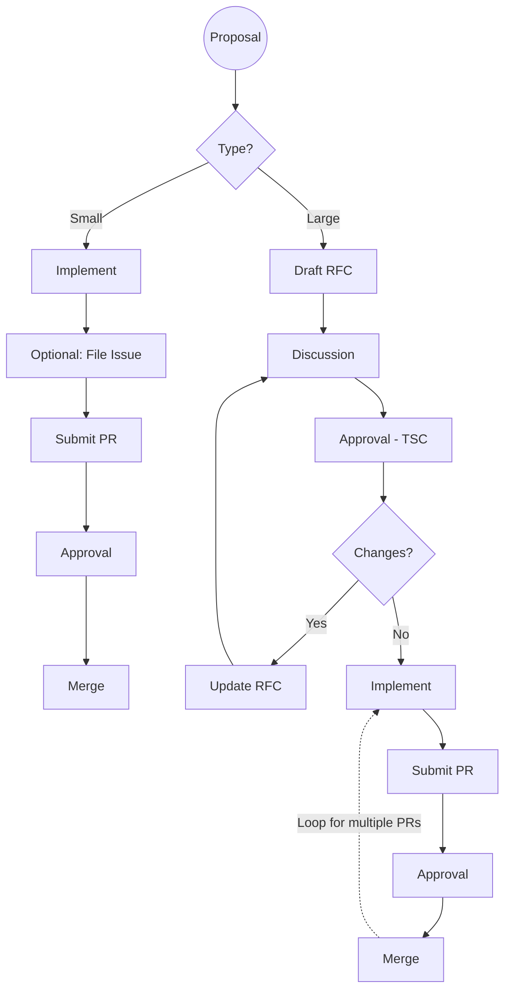

# Development Process

This document describes the formal process for contributing changes to the OpenPRoT Project.

## Types of Changes

There are two types of changes contributors may make:

1.  **Small Change**: Standard bug fixes, minor improvements, or documentation updates.
    *   [Optional] File a lightweight GitHub issue.
    *   Submit a pull request (PR) with the change.
    *   Wait for project maintainers to approve and merge.
2.  **Large Change**: Substantial changes that require a Request for Comment (RFC).
    *   Draft an RFC (a GitHub issue titled "[RFC] …") describing the proposed change.
    *   Seek commentary from project contributors.
    *   Seek approval from the OpenPRoT Technical Steering Committee (TSC).
    *   Update the RFC based on feedback.
    *   Submit one or more pull requests to implement the approved RFC.

## Process Flow

### What constitutes a "Large" change?

A large change is loosely defined as any change that substantially impacts:

*   **Architecture**: Adding a new component, module, or drastically changing an existing one.
*   **Boot process**: Changes to the firmware initialization or secure boot sequence.
*   **API**: Command sets, register layout changes (as defined in firmware drivers), or I/O interface changes.
*   **Security Posture**: Changes to the threat model, attestation mechanisms, or cryptographic implementations.
*   **Maintenance**: Significant tool changes or environment updates.

If a contributor is unclear whether a change is "small" or "large," they should start by filing a GitHub issue for guidance.

### Structure of an RFC

To streamline the review of large changes, all RFCs must be submitted as a GitHub Issue with a title prefixed by "[RFC]". The body must detail:

*   **Scope**: What parts of the project will be affected.
*   **Rationale**: The motivation and justification for the change.
*   **Implementation Tradeoffs**: Details of various implementations being considered.
*   **Implementation Timeline**: A realistic estimate for completion.
*   **Test Plan**: Required for any security-critical or architectural changes to ensure quality and maintainability.
*   **Maintenance**: The individual or team responsible for the feature's future maintenance.

### RFC Approval Authority

Final approval authority for all RFCs rests with the **OpenPRoT TSC**. Once the TSC approves an RFC, corresponding PRs can be submitted for review. Implementation may begin on a fork for experimentation, but PRs should not be submitted to the upstream repository until approval is granted.

## Implementation

### Additional Requirements for Contribution

To ensure quality and maintainability, all contributions must adhere to these rules:

*   **Documentation**: Updates must describe new functionality and usage.
*   **Cryptographic Hardening**: Changes to cryptographic modules must include a thorough test plan.
*   **Tool Compatibility**: All validation plans and features must be compatible with existing supported tools and versions.

### Submission of Pull Requests

All contributions must follow the standard GitHub **fork-and-PR methodology**. Large features should be submitted via multiple, smaller PRs (ideally fewer than 500 lines of code) to reduce the burden of review.

## References

This process is adapted from the [Caliptra Contributing Process](https://github.com/chipsalliance/Caliptra/blob/main/doc/CaliptraContributingProcess.md).
