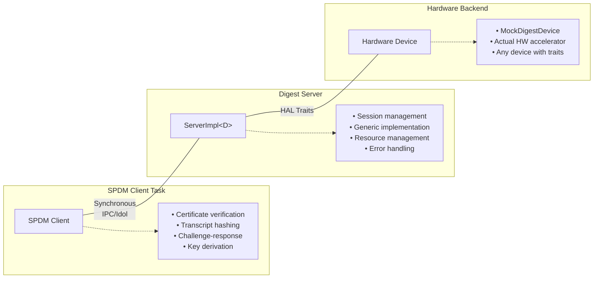
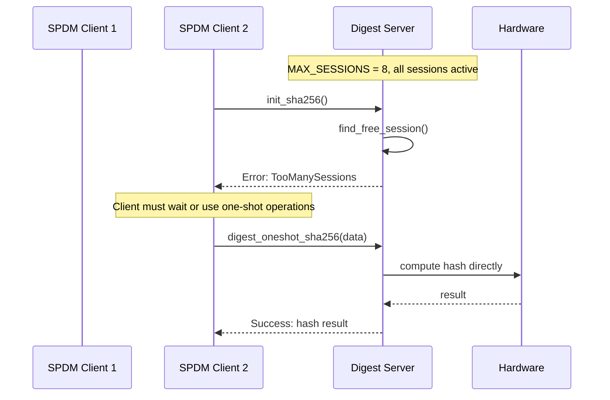
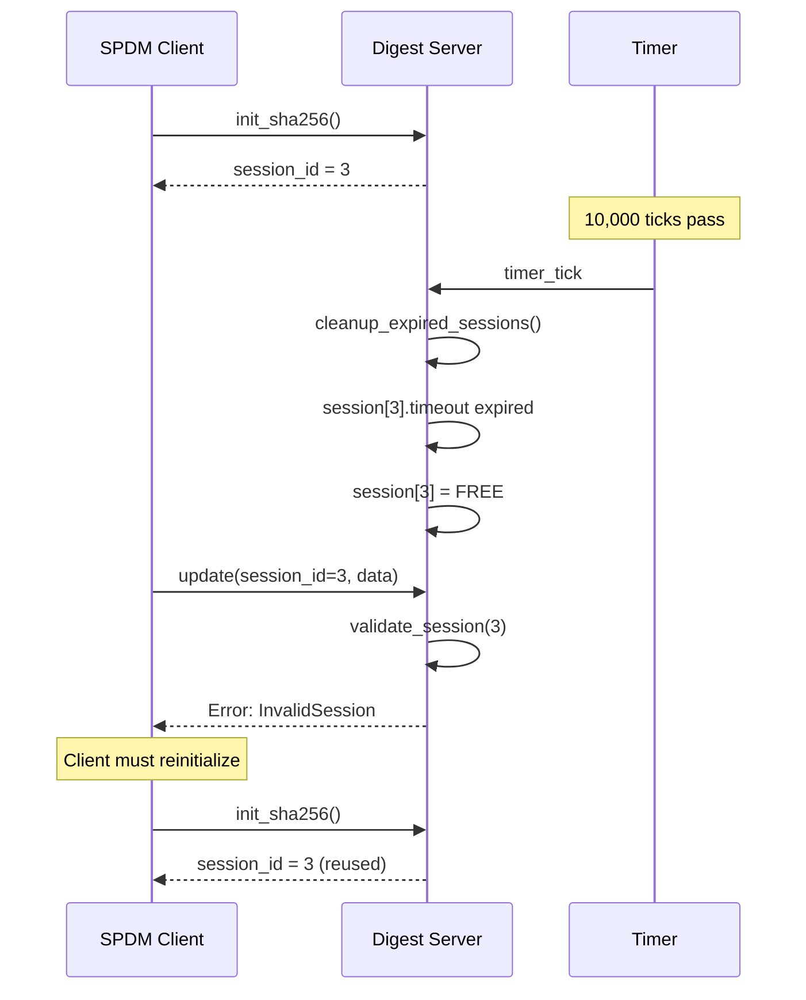
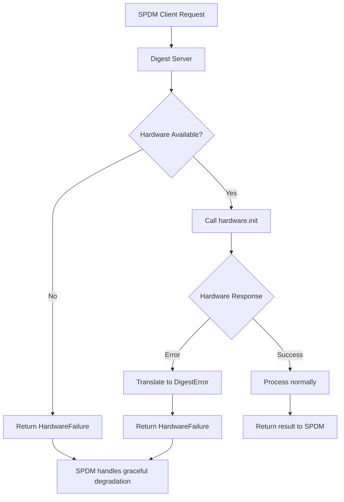
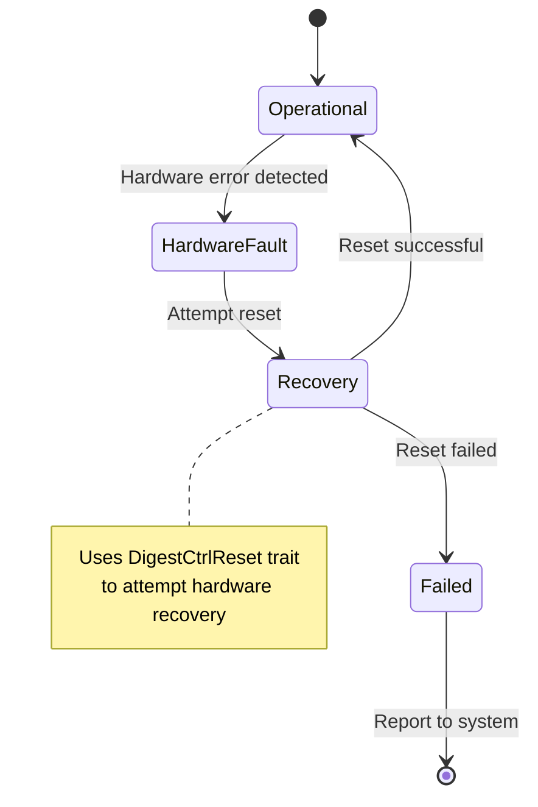
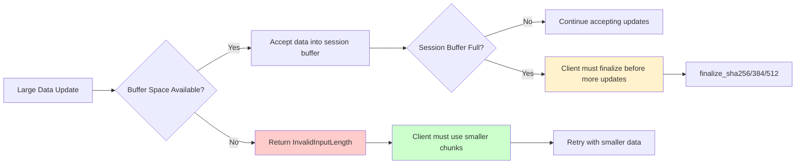
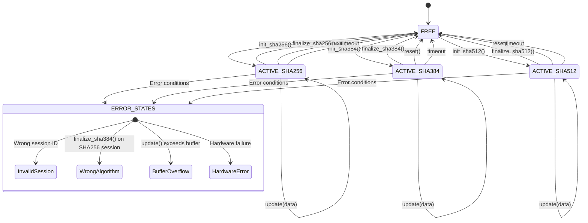
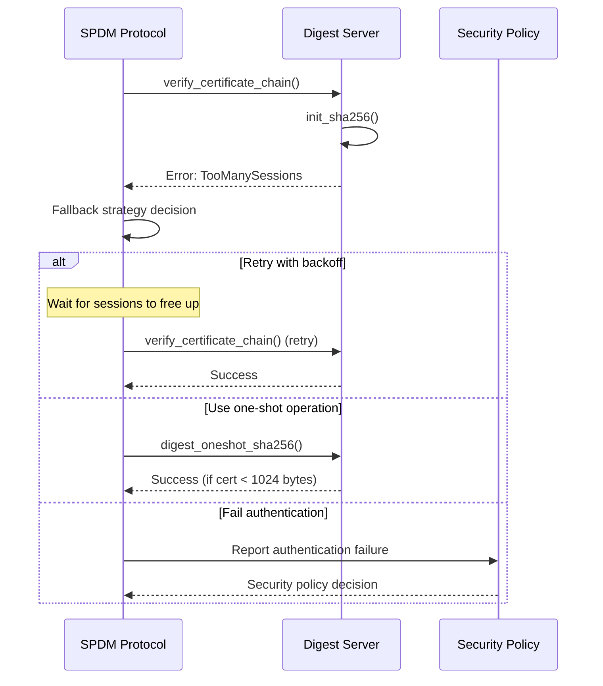
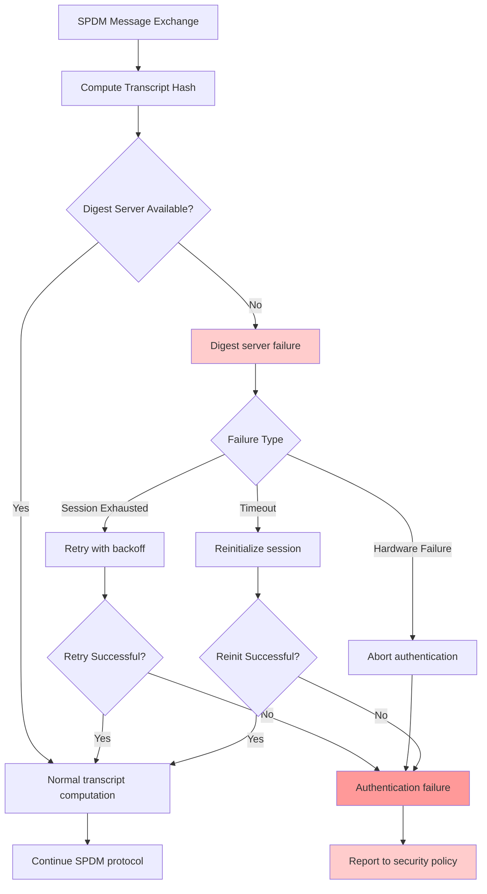
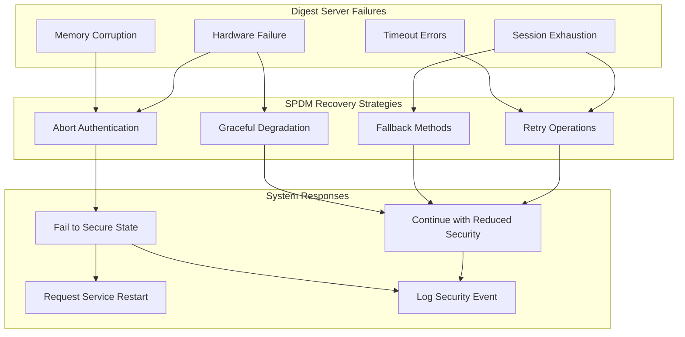

# Generic Digest Server Design Document

## Requirements

### Primary Requirement

**Enable SPDM (Security Protocol and Data Model) Protocol Support**: The digest server must provide cryptographic hash services to support SPDM protocol implementation in Hubris OS.

### Derived Requirements

#### R1: Algorithm Support
- **R1.1**: Support SHA-256 for basic SPDM operations
- **R1.2**: Support SHA-384 for enhanced security profiles  
- **R1.3**: Support SHA-512 for maximum security assurance
- **R1.4**: Reject unsupported algorithms (SHA-3) with clear error codes

#### R2: Session Management
- **R2.1**: Support incremental hash computation for large certificate chains
- **R2.2**: Support multiple concurrent digest sessions (≥8 concurrent operations)
- **R2.3**: Provide session isolation between different SPDM protocol flows
- **R2.4**: Automatic session cleanup to prevent resource exhaustion
- **R2.5**: Session timeout mechanism for abandoned operations

#### R3: SPDM-Specific Use Cases
- **R3.1**: Certificate chain verification (hash large X.509 certificate data)
- **R3.2**: Measurement verification (hash firmware measurement data)
- **R3.3**: Challenge-response authentication (compute transcript hashes)
- **R3.4**: Session key derivation (hash key exchange material)
- **R3.5**: Message authentication (hash SPDM message sequences)

#### R4: Performance and Resource Constraints
- **R4.1**: Memory-efficient operation suitable for embedded systems
- **R4.2**: Zero-copy data processing using Hubris leased memory
- **R4.3**: Deterministic resource allocation (no dynamic allocation)
- **R4.4**: Bounded execution time for real-time guarantees

#### R5: Hardware Abstraction
- **R5.1**: Generic interface supporting any hardware digest accelerator
- **R5.2**: Mock implementation for testing and development
- **R5.3**: Type-safe hardware abstraction with compile-time verification
- **R5.4**: Consistent API regardless of underlying hardware

#### R6: Error Handling and Reliability
- **R6.1**: Comprehensive error reporting for SPDM protocol diagnostics
- **R6.2**: Graceful handling of hardware failures
- **R6.3**: Session state validation and corruption detection
- **R6.4**: Clear error propagation to SPDM layer

#### R7: Integration Requirements
- **R7.1**: Synchronous IPC interface compatible with Hubris task model
- **R7.2**: Idol-generated API stubs for type-safe inter-process communication
- **R7.3**: Integration with Hubris memory management and scheduling
- **R7.4**: No dependency on async runtime or futures

## Implementation Overview

This digest server has been successfully converted to a generic implementation that can work with any device implementing the required digest traits from `openprot-hal-blocking`.

## Architecture

### System Context



### Component Architecture

```
ServerImpl<D>
├── Generic Type Parameter D
│   └── Trait Bounds: DigestInit<Sha2_256/384/512> + DigestCtrlReset
├── Session Management
│   ├── Static session storage (MAX_SESSIONS = 8)
│   ├── Session lifecycle (init → update → finalize)
│   └── Automatic timeout and cleanup
└── Hardware Abstraction
    ├── Static dispatch (no runtime polymorphism)
    ├── Algorithm-specific methods
    └── Error translation layer
```

### Data Flow

```
SPDM Client Request
        ↓
   Idol-generated stub
        ↓
   ServerImpl<D> method
        ↓
   Session validation/allocation
        ↓
   Hardware abstraction call
        ↓
   Result processing
        ↓
   Response to client
```

## Detailed Design

### Session Model

#### Session Lifecycle
```
┌─────────┐    init_sha256/384/512()    ┌─────────┐
│  FREE   │ ────────────────────────→   │ ACTIVE  │
│         │                             │         │
└─────────┘                             └─────────┘
     ↑                                       │
     │ finalize_sha256/384/512()             │ update(data)
     │ reset()                               │ (accumulate)
     │ timeout_cleanup()                     │
     └───────────────────────────────────────┘
```

#### Session Data Structure
```rust
pub struct SessionData {
    algorithm: SessionAlgorithm,      // Algorithm type (Free/Sha256/Sha384/Sha512)
    buffer: [u8; SESSION_BUFFER_SIZE], // Accumulated data buffer (512 bytes)
    length: usize,                     // Current data length
    timeout: Option<u64>,              // Expiration timestamp
}
```

### Generic Hardware Abstraction

#### Trait Requirements
The server is generic over type `D` where:
```rust
D: DigestInit<Sha2_256, Output = Digest<8>> 
 + DigestInit<Sha2_384, Output = Digest<12>> 
 + DigestInit<Sha2_512, Output = Digest<16>> 
 + DigestCtrlReset
```

#### Static Dispatch Pattern
- **Compile-time algorithm selection**: No runtime algorithm switching
- **Type safety**: Associated type constraints ensure output size compatibility
- **Zero-cost abstraction**: No virtual function calls or dynamic dispatch
- **Hardware flexibility**: Any device implementing the traits can be used

### Memory Management

#### Static Allocation Strategy
```rust
static mut SESSION_STORAGE: [SessionData; MAX_SESSIONS] = [...];
```
- **Deterministic memory usage**: No dynamic allocation
- **Stack overflow prevention**: Large session data not on stack
- **Real-time guarantees**: Bounded memory access patterns
- **Resource limits**: Fixed maximum number of concurrent sessions

#### Data Flow Optimization
- **Zero-copy IPC**: Uses Hubris leased memory system
- **Bounded updates**: Maximum 1024 bytes per update call
- **Incremental processing**: Large data processed in chunks
- **Memory safety**: All buffer accesses bounds-checked

### Error Handling Strategy

#### Layered Error Model
```
Hardware Layer Error → DigestError → RequestError<DigestError> → SPDM Client
```

#### Error Categories
- **Hardware failures**: `DigestError::HardwareFailure`
- **Session management**: `DigestError::InvalidSession`, `DigestError::TooManySessions`
- **Input validation**: `DigestError::InvalidInputLength`
- **Algorithm support**: `DigestError::UnsupportedAlgorithm`

### Concurrency Model

#### Session Isolation
- Each session operates independently
- No shared mutable state between sessions
- Session IDs provide access control
- Timeout mechanism prevents resource leaks

#### SPDM Integration Points
1. **Certificate Verification**: Hash certificate chains incrementally
2. **Transcript Computation**: Hash sequences of SPDM messages
3. **Challenge Processing**: Compute authentication hashes
4. **Key Derivation**: Hash key exchange material

## Failure Scenarios

### Session Management Failures

#### Session Exhaustion Scenario


#### Session Timeout Recovery


### Hardware Failure Scenarios

#### Hardware Device Failure

```

#### Hardware Recovery Pattern


### Resource Exhaustion Scenarios

#### Memory Pressure Handling


#### Session Lifecycle Error States


### SPDM Protocol Impact Analysis

#### Certificate Verification Failure Recovery


#### Transcript Hash Failure Impact


### Failure Recovery Strategies

#### Error Propagation Chain
```mermaid
flowchart LR
    HW[Hardware Layer] -->|Error| DS[Digest Server]
    DS -->|DigestError| RE[RequestError wrapper]
    RE -->|IPC| SPDM[SPDM Client]
    SPDM -->|Security Decision| POL[Security Policy]
    
    subgraph Error Types
        E1[HardwareFailure]
        E2[InvalidSession]
        E3[TooManySessions]
        E4[InvalidInputLength]
    end
    
    DS -.-> Error Types
    
    subgraph Recovery Actions
        R1[Hardware Reset]
        R2[Session Cleanup]
        R3[Retry with Backoff]
        R4[Fallback to One-shot]
        R5[Authentication Failure]
    end
    
    SPDM -.-> Recovery Actions
```

#### System-Level Failure Handling


## SPDM Integration Examples

### Certificate Chain Verification (Requirement R3.1)
```rust
// SPDM task verifying a certificate chain
fn verify_certificate_chain(&mut self, cert_chain: &[u8]) -> Result<bool, SpdmError> {
    let digest = Digest::from(DIGEST_SERVER_TASK_ID);
    
    // Create session for certificate hash (R2.1: incremental computation)
    let session_id = digest.init_sha256()?;  // R1.1: SHA-256 support
    
    // Process certificate data incrementally (R4.2: zero-copy processing)
    for chunk in cert_chain.chunks(512) {
        digest.update(session_id, chunk.len() as u32, chunk)?;
    }
    
    // Get final certificate hash
    let mut cert_hash = [0u32; 8];
    digest.finalize_sha256(session_id, &mut cert_hash)?;
    
    // Verify against policy
    self.verify_hash_against_policy(&cert_hash)
}
```

### SPDM Transcript Hash Computation (Requirement R3.3)
```rust
// Computing hash of SPDM message sequence for authentication
fn compute_transcript_hash(&mut self, messages: &[SpdmMessage]) -> Result<[u32; 8], SpdmError> {
    let digest = Digest::from(DIGEST_SERVER_TASK_ID);
    let session_id = digest.init_sha256()?;  // R2.3: session isolation
    
    // Hash all messages in the SPDM transcript (R3.5: message authentication)
    for msg in messages {
        let msg_bytes = msg.serialize()?;
        digest.update(session_id, msg_bytes.len() as u32, &msg_bytes)?;
    }
    
    let mut transcript_hash = [0u32; 8];
    digest.finalize_sha256(session_id, &mut transcript_hash)?;  // R7.1: synchronous IPC
    Ok(transcript_hash)
}
```

### Concurrent SPDM Operations (Requirement R2.2)
```rust
// Multiple SPDM operations running simultaneously
impl SpdmResponder {
    fn handle_multiple_requests(&mut self) -> Result<(), SpdmError> {
        let digest = Digest::from(DIGEST_SERVER_TASK_ID);
        
        // Session 1: Certificate verification
        let cert_session = digest.init_sha256()?;
        
        // Session 2: Measurement hashing  
        let measure_session = digest.init_sha384()?;  // R1.2: SHA-384 support
        
        // Session 3: Key derivation
        let key_session = digest.init_sha512()?;      // R1.3: SHA-512 support
        
        // Process all three concurrently (up to 8 sessions total - R2.2)
        // Each session maintains independent state (R2.3: isolation)
        
        // ... process data in each session ...
        
        Ok(())
    }
}
```

## Requirements Validation

### ✅ Requirements Satisfied

| Requirement | Status | Implementation |
|-------------|--------|----------------|
| **R1.1** SHA-256 support | ✅ | `init_sha256()`, `finalize_sha256()` |
| **R1.2** SHA-384 support | ✅ | `init_sha384()`, `finalize_sha384()` |  
| **R1.3** SHA-512 support | ✅ | `init_sha512()`, `finalize_sha512()` |
| **R1.4** Reject unsupported algorithms | ✅ | SHA-3 functions return `UnsupportedAlgorithm` |
| **R2.1** Incremental hash computation | ✅ | `update()` method for chunk processing |
| **R2.2** Multiple concurrent sessions | ✅ | `MAX_SESSIONS = 8` concurrent operations |
| **R2.3** Session isolation | ✅ | Independent session state and IDs |
| **R2.4** Automatic cleanup | ✅ | `cleanup_expired_sessions()` |
| **R2.5** Session timeout | ✅ | `SESSION_TIMEOUT_TICKS` mechanism |
| **R3.1-R3.5** SPDM use cases | ✅ | All supported via session-based API |
| **R4.1** Memory efficient | ✅ | Static allocation, fixed buffers |
| **R4.2** Zero-copy processing | ✅ | Hubris leased memory system |
| **R4.3** Deterministic allocation | ✅ | No dynamic memory allocation |
| **R4.4** Bounded execution | ✅ | Fixed session limits, timeouts |
| **R5.1** Generic hardware interface | ✅ | `ServerImpl<D>` with trait bounds |
| **R5.2** Mock implementation | ✅ | `MockDigestDevice` available |
| **R5.3** Type-safe abstraction | ✅ | Associated type constraints |
| **R5.4** Consistent API | ✅ | Same interface regardless of hardware |
| **R6.1** Comprehensive errors | ✅ | Full `DigestError` enumeration |
| **R6.2** Hardware failure handling | ✅ | `HardwareFailure` error propagation |
| **R6.3** Session state validation | ✅ | `validate_session()` checks |
| **R6.4** Clear error propagation | ✅ | `RequestError<DigestError>` wrapper |
| **R7.1** Synchronous IPC | ✅ | No async/futures dependencies |
| **R7.2** Idol-generated stubs | ✅ | Type-safe IPC interface |
| **R7.3** Hubris integration | ✅ | Uses userlib, leased memory |
| **R7.4** No async runtime | ✅ | Pure synchronous implementation |

## Generic Design Summary

The `ServerImpl<D>` struct is now generic over any device `D` that implements:

## Key Features

1. **Hardware Agnostic**: Can work with any compatible digest hardware device
2. **Type Safety**: Associated type constraints ensure digest output sizes match expectations
3. **Zero Runtime Cost**: Uses static dispatch for optimal performance
4. **Memory Efficient**: Static session storage allocated at compile time

## Usage Example

To use with a custom hardware device:

```rust
// Your hardware device must implement the required traits
struct MyDigestDevice {
    // Your hardware-specific fields
}

impl DigestInit<Sha2_256> for MyDigestDevice {
    type Output = Digest<8>;
    // Implementation...
}

impl DigestInit<Sha2_384> for MyDigestDevice {
    type Output = Digest<12>;
    // Implementation...
}

impl DigestInit<Sha2_512> for MyDigestDevice {
    type Output = Digest<16>;
    // Implementation...
}

impl DigestCtrlReset for MyDigestDevice {
    // Implementation...
}

// Then use it with the server
let server = ServerImpl::new(MyDigestDevice::new());
```
