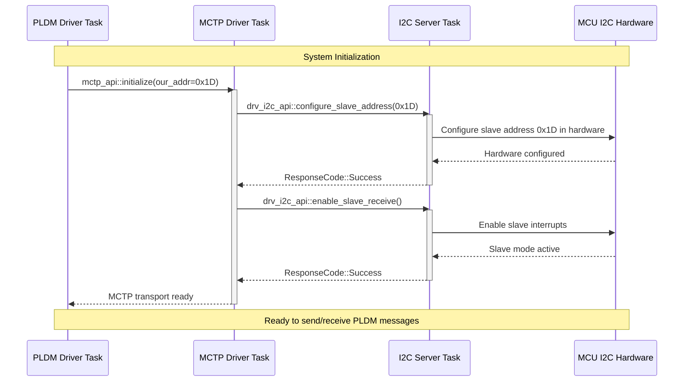
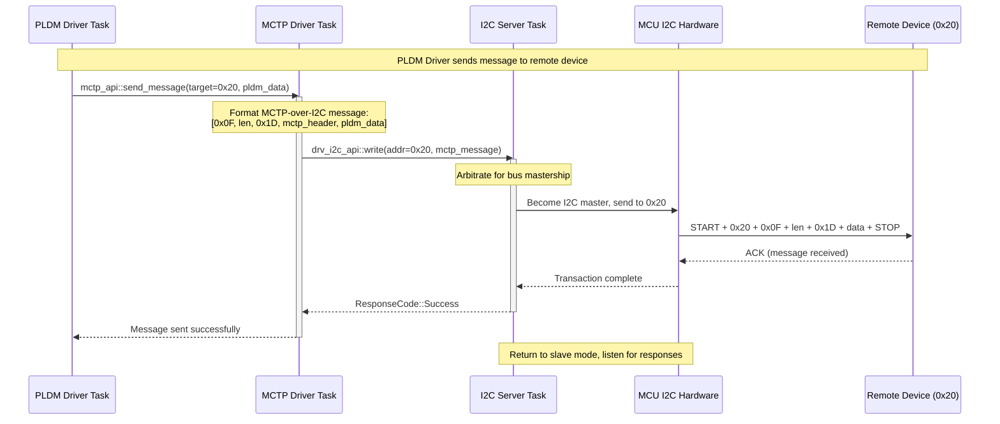
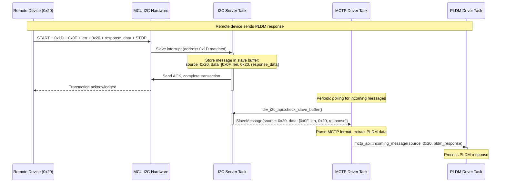
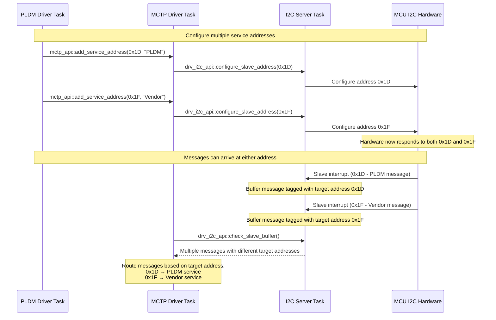
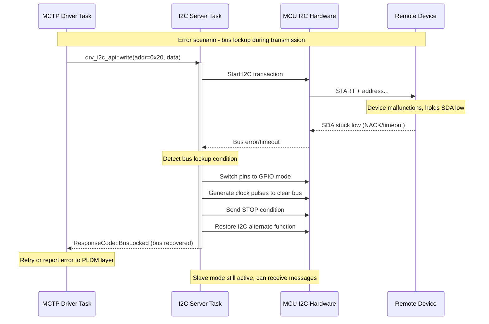

# I2C IPC Protocol Extensions for MCTP Support

This document describes the extensions made to the I2C server IPC protocol to support slave mode operations, enabling MCTP and other peer-to-peer communication protocols.

## Architecture Context

The I2C server provides transport services to multiple client tasks in the Hubris system:

```
┌─────────────────┐    ┌─────────────────┐    ┌─────────────────┐    ┌─────────────────┐
│  Sensor Manager │    │  Power Manager  │    │   PLDM Driver   │    │   Other Client  │
│      Task       │    │      Task       │    │      Task       │    │      Tasks      │
└─────────┬───────┘    └─────────┬───────┘    └─────────┬───────┘    └─────────┬───────┘
          │                      │                      │                      │
          │ drv-i2c-api          │ drv-i2c-api          │ mctp-api             │ drv-i2c-api
          │ (IPC)                │ (IPC)                │ (IPC)                │ (IPC)
          │                      │                      │                      │
          │                      │              ┌───────┴───────┐              │
          │                      │              │               │              │
          │                      │              │ MCTP Driver   │              │
          │                      │              │     Task      │              │
          │                      │              │               │              │
          │                      │              └───────┬───────┘              │
          │                      │                      │                      │
          │                      │                      │ drv-i2c-api          │
          │                      │                      │ (IPC)                │
          │              ┌───────┴──────────────────────┴──────────────────────┘
          │              │
          └──────────────┤
                         │ 
                 ┌───────┴───────┐
                 │  I2C Server   │ ◄── THE server task
                 │     Task      │     (i2c-server)
                 │               │     Implements both master & slave ops
                 └───────┬───────┘
                         │ Hardware Access
                 ┌───────┴───────┐
                 │  MCU I2C HW   │
                 │ Controllers   │
                 └───────────────┘

External I2C Bus:
═══════════════════════════════════════════════════════════
     │                           │                     │
┌────┴────┐                 ┌────┴────┐           ┌────┴────┐
│ Sensors │                 │ Power   │           │ Remote  │
│ EEPROMs │                 │ Rails   │           │ BMC/CPU │
│ Devices │                 │ Devices │           │ (MCTP)  │
│         │                 │         │           │ (0x20)  │
└─────────┘                 └─────────┘           └─────────┘
```

**Usage Patterns**:

- **Sensor Manager**: Uses I2C **master** operations directly to read sensors, configure devices
- **Power Manager**: Uses I2C **master** operations directly to control power rails, read telemetry  
- **PLDM Driver**: Uses `mctp-api` to send/receive PLDM messages via MCTP protocol layer
- **MCTP Driver**: Uses both I2C **master** operations (to send) and new **slave** operations (to receive MCTP messages)
- **Other Clients**: Any task can use I2C master operations directly for device communication

**Key Benefits**:
- Direct I2C access for simple device communication (sensors, power management)
- Protocol layering for complex management protocols (PLDM → MCTP → I2C)
- Clean separation: I2C server handles transport, protocol drivers handle their specific logic

## New Operations Added

### 1. `ConfigureSlaveAddress` (Op = 3)

**Purpose**: Configure an I2C controller to act as a slave device with a specific address.

**Payload Format**:
- `[0]`: Slave address (7-bit)
- `[1]`: Controller index  
- `[2]`: Port index
- `[3]`: Reserved (must be 0)

**Response**: Standard error code or success

**Usage Example**:
```rust
let device = I2cDevice::new(task, Controller::I2C1, PortIndex(0), None, 0x00);
device.configure_slave_address(0x10)?; // Configure as slave at address 0x10
```

### 2. `EnableSlaveReceive` (Op = 4)

**Purpose**: Enable slave receive mode to start buffering incoming messages.

**Payload Format**: Standard 4-byte device identifier (address field unused)

**Response**: Standard error code or success

**Usage Example**:
```rust
device.enable_slave_receive()?; // Start listening for slave messages
```

### 3. `DisableSlaveReceive` (Op = 5)

**Purpose**: Disable slave receive mode and stop buffering messages.

**Payload Format**: Standard 4-byte device identifier (address field unused)

**Response**: Standard error code or success

**Usage Example**:
```rust
device.disable_slave_receive()?; // Stop listening for slave messages
```

### 4. `CheckSlaveBuffer` (Op = 6)

**Purpose**: Retrieve buffered slave messages from the I2C server.

**Payload Format**: Standard 4-byte device identifier (address field unused)

**Lease**: Single lease providing buffer for message data

**Response**: Number of bytes written to buffer (usize)

**Message Format in Buffer**:
Each message is formatted as:
- `[0]`: Source address (7-bit address of sender)
- `[1]`: Message length (N bytes)
- `[2..N+1]`: Message data

Multiple messages may be returned in sequence.

**Usage Example**:
```rust
let mut buffer = [0u8; 512];
let bytes_received = device.check_slave_buffer(&mut buffer)?;

// Or use the convenience method:
let mut messages = [SlaveMessage::default(); 10];
let msg_count = device.get_slave_messages(&mut messages)?;
```

## New Response Codes

| Code | Name | Description |
|------|------|-------------|
| `SlaveAddressInUse` | Slave address is already configured for another device |
| `SlaveNotSupported` | Slave mode not supported on this controller/port |
| `SlaveNotEnabled` | Slave receive not enabled (must call `EnableSlaveReceive` first) |
| `SlaveBufferFull` | Internal slave buffer is full, messages may be dropped |
| `BadSlaveAddress` | Invalid slave address (reserved or > 0x7F) |
| `SlaveConfigurationFailed` | Hardware failed to configure slave mode |
| `MessageTooLarge` | Message data exceeds maximum I2C message size |

## New Data Types

### `SlaveMessage`
```rust
pub struct SlaveMessage {
    pub source_address: u8,    // Address of the master that sent this
    pub data_length: u8,       // Length of valid data
    pub data: [u8; 255],       // Message payload
}
```

### `SlaveConfig`
```rust
pub struct SlaveConfig {
    pub controller: Controller,
    pub port: PortIndex,
    pub address: u8,           // 7-bit slave address
}
```

### `MctpMessage`
```rust
#[derive(Clone, Copy)]
pub struct MctpMessage {
    pub source: u8,            // Address of the source device
    pub data: [u8; 255],       // Fixed-size buffer for message payload
    pub data_len: usize,       // Actual length of valid data
}

impl MctpMessage {
    pub fn data(&self) -> &[u8] {
        &self.data[..self.data_len]
    }
}

impl Default for MctpMessage {
    fn default() -> Self {
        Self {
            source: 0,
            data: [0; 255],
            data_len: 0,
        }
    }
}
```

## MCTP Integration Example

```rust
// MCTP driver task - this is a CLIENT of the I2C server, not the server itself
struct MctpDriver {
    i2c_device: I2cDevice,    // Uses I2C API to talk to I2C server via IPC
    our_address: u8,
}

impl MctpDriver {
    fn initialize(&self) -> Result<(), ResponseCode> {
        // Send IPC request to I2C server to configure slave mode
        self.i2c_device.configure_slave_address(self.our_address)?;
        self.i2c_device.enable_slave_receive()?;
        Ok(())
    }
    
    fn send_mctp_message(&self, target: u8, mctp_data: &[u8]) -> Result<(), ResponseCode> {
        // Format MCTP-over-I2C message - use fixed-size buffer
        const MAX_MCTP_MESSAGE_SIZE: usize = 255; // I2C max message size
        let mut message = [0u8; MAX_MCTP_MESSAGE_SIZE];
        
        if mctp_data.len() > MAX_MCTP_MESSAGE_SIZE - 3 {
            return Err(ResponseCode::MessageTooLarge);
        }
        
        message[0] = 0x0F;                    // MCTP command code
        message[1] = mctp_data.len() as u8;   // Byte count  
        message[2] = self.our_address;        // Source address
        message[3..3 + mctp_data.len()].copy_from_slice(mctp_data);
        
        let message_len = 3 + mctp_data.len();
        let message_len = 3 + mctp_data.len();
        
        // Send IPC request to I2C server to perform I2C master transaction
        let target_device = I2cDevice::new(
            self.i2c_device.task,    // TaskId of I2C server task
            self.i2c_device.controller,
            self.i2c_device.port,
            self.i2c_device.segment,
            target,
        );
        target_device.write(&message[..message_len])  // IPC call to I2C server with exact size
    }
    
    fn check_incoming_messages(&self, mctp_messages: &mut [MctpMessage]) -> Result<usize, ResponseCode> {
        let mut messages = [SlaveMessage::default(); 10];
        // Send IPC request to I2C server to check its slave message buffer
        let count = self.i2c_device.get_slave_messages(&mut messages)?;
        
        let mut mctp_count = 0;
        
        for i in 0..count {
            if mctp_count >= mctp_messages.len() {
                break; // Buffer full
            }
            
            let msg = &messages[i];
            let data = msg.data();
            
            // Parse MCTP-over-I2C format
            if data.len() >= 3 && data[0] == 0x0F {
                let mctp_data = &data[2..]; // Skip command code and byte count
                
                // Copy data to fixed-size buffer instead of heap allocation
                let data_len = mctp_data.len().min(255);
                let mut mctp_data_buf = [0u8; 255];
                mctp_data_buf[..data_len].copy_from_slice(&mctp_data[..data_len]);
                
                mctp_messages[mctp_count] = MctpMessage {
                    source: msg.source_address,
                    data: mctp_data_buf,
                    data_len,
                };
                mctp_count += 1;
            }
        }
        
        Ok(mctp_count)
    }
}

// MCTP driver main loop - this runs in its own task
#[export_name = "main"]
fn main() -> ! {
    let mctp_driver = MctpDriver::new();
    mctp_driver.initialize().unwrap();
    
    loop {
        // Handle IPC requests from application tasks
        hl::recv_without_notification(&mut buffer, |op, msg| {
            match op {
                MctpOp::SendMessage => mctp_driver.handle_send_request(msg),
                MctpOp::GetMessages => mctp_driver.handle_receive_request(msg),
            }
        });
        
        // Periodically check for incoming MCTP messages from I2C server
        let mut mctp_message_buffer = [MctpMessage::default(); 10];
        if let Ok(msg_count) = mctp_driver.check_incoming_messages(&mut mctp_message_buffer) {
            for i in 0..msg_count {
                mctp_driver.route_incoming_message(&mctp_message_buffer[i]);
            }
        }
    }
}
```

## Design Principles

1. **Minimal Extensions**: Only added essential slave operations, not MCTP-specific logic
2. **Consistent API**: Slave operations follow same patterns as existing master operations  
3. **Hardware Agnostic**: Extensions work with any I2C hardware backend
4. **Non-Breaking**: Existing code continues to work unchanged
5. **Buffer Management**: Server handles message buffering to avoid losing data
6. **Error Handling**: Comprehensive error codes for robust error handling

## Implementation Notes

- The I2C server implementation will need to handle slave interrupts and buffer management

- **Multiple slave addresses per controller/port may be supported**: This means a single I2C controller can simultaneously respond to multiple slave addresses. For example:
  ```rust
  // Configure the same I2C1 controller to respond to multiple addresses
  device.configure_slave_address(0x10)?; // MCTP endpoint address
  device.configure_slave_address(0x12)?; // Secondary management address  
  device.configure_slave_address(0x14)?; // Backup/redundant address
  ```
  
  **Why this is useful**:
  - **Protocol flexibility**: MCTP allows devices to have multiple addresses for different roles (primary BMC, backup BMC, etc.)
  - **Service separation**: Different management services (PLDM, SPDM, vendor-specific) can use different addresses
  - **Address aliases**: Devices can respond to both their primary address and a well-known service address
  - **Compatibility**: Support legacy systems that expect devices at specific addresses
  
  **Hardware considerations**: 
  - MCU I2C peripherals typically support multiple slave addresses through address mask registers
  - Each configured address would trigger the same slave interrupt, with software determining which address was matched
  - Message buffering needs to track which address each incoming message was sent to

- Message buffering should be configurable based on available memory
- Slave operations are independent of master operations on the same controller
- Bus arbitration is handled automatically by I2C hardware when switching between master/slave modes

This extension enables the clean separation where:

1. **I2C Server Task** (`i2c-server`):
   - Owns the I2C hardware
   - Handles slave interrupts and message buffering
   - Provides transport-level I2C operations via IPC
   - Implements the new slave operations (`ConfigureSlaveAddress`, etc.)

2. **MCTP Driver Task** (separate task):
   - **Client** of the I2C server (uses `drv-i2c-api`)
   - Handles MCTP protocol logic and message routing
   - Provides MCTP API to application tasks
   - Uses IPC to communicate with I2C server for transport

3. **Application Tasks**:
   - **Clients** of the MCTP driver (use `mctp-api`)
   - Send/receive MCTP messages without knowing about I2C details

The I2C server focuses purely on hardware abstraction and transport, while protocol logic stays in dedicated driver tasks.

## Glossary

### **I2C Terms**

**Controller** - The I2C peripheral hardware on the microcontroller (e.g., I2C1, I2C2). Each controller can operate on one bus at a time but may support multiple ports.

**Port** - A specific pin configuration for an I2C controller. Some controllers can use different GPIO pins (ports) for SDA/SCL, but only one port can be active at a time.

**Master** - The device that initiates I2C transactions by generating START conditions, clock signals, and addressing slaves.

**Slave** - A device that responds to I2C transactions initiated by masters. Has a 7-bit address and responds when addressed.

**Multiplexer (Mux)** - Hardware device that allows one I2C controller to communicate with multiple I2C buses. Examples: PCA9548, PCA9546.

**Segment** - A specific output channel of an I2C multiplexer. Each segment connects to a different I2C bus.

**Reserved Address** - I2C addresses that have special meanings and cannot be used for normal devices (e.g., 0x00 for General Call).

### **Hubris Architecture Terms**

**Task** - An independent software component in Hubris that runs in its own memory space and communicates via IPC.

**IPC (Inter-Process Communication)** - The mechanism tasks use to communicate with each other in Hubris. Uses message passing with type safety.

**Server Task** - A task that provides services to other tasks via IPC. Typically owns hardware resources.

**Client Task** - A task that uses services provided by server tasks. Sends IPC requests to servers.

**Lease** - A memory region that one task temporarily grants access to another task during IPC operations.

**Operation (Op)** - A specific function or service that a server task can perform, identified by a numeric code.

**Response Code** - An error or success code returned by server tasks to indicate the result of an operation.

### **Protocol Terms**

**MCTP (Management Component Transport Protocol)** - A standard protocol for management communication between system components. Can use various transports including I2C.

**PLDM (Platform Level Data Model)** - A standard protocol that often runs over MCTP for platform management and monitoring.

**Peer-to-peer Communication** - Communication model where any device can initiate transactions with any other device, as opposed to traditional master-slave hierarchies.

**Command Code** - In MCTP-over-I2C, the first byte of a message (0x0F) that identifies it as an MCTP message.

**Source Address** - The I2C address of the device that sent a message.

**Slave Buffer** - Memory in the I2C server where incoming slave messages are temporarily stored until retrieved by client tasks.

### **Implementation Terms**

**drv-i2c-api** - The client library that tasks use to communicate with the I2C server via IPC.

**drv-i2c-types** - Common data types and enums shared between I2C server and clients.

**i2c-server** - The server task that owns MCU I2C hardware and provides I2C services.

**Marshal/Unmarshal** - Converting data structures to/from the byte arrays used in IPC messages.

**Device Identifier** - A 5-tuple (task, controller, port, mux/segment, address) that uniquely identifies an I2C device.

**Notification** - An asynchronous signal mechanism in Hubris for events like hardware interrupts.

**Ring Buffer** - A circular buffer data structure used for storing sequences of messages or events.

### **Hardware Terms**

**SDA** - Serial Data line in I2C bus. Carries bidirectional data.

**SCL** - Serial Clock line in I2C bus. Driven by the current master.

**START/STOP Conditions** - Special I2C bus conditions that mark the beginning and end of transactions.

**ACK/NACK** - Acknowledgment signals that indicate successful or failed byte transmission.

**Bus Arbitration** - The process by which multiple masters coordinate access to a shared I2C bus.

**Pull-up Resistors** - External resistors required on I2C buses to ensure proper signal levels.

**GPIO (General Purpose Input/Output)** - Configurable pins on microcontrollers that can be used for various functions including I2C.

**Alternate Function** - A special mode where GPIO pins are controlled by peripheral hardware (like I2C) instead of software.

## Protocol Flow Examples

The following sequence diagrams demonstrate how the extended IPC operations enable PLDM and MCTP communication through the I2C server.

### Flow 1: PLDM Driver Initialization



### Flow 2: Outgoing PLDM Message (PLDM → Remote Device)



### Flow 3: Incoming PLDM Response (Remote Device → PLDM)



### Flow 4: Multiple Slave Addresses (Service Separation)



### Flow 5: Error Handling and Bus Recovery



## Key Protocol Insights

1. **Asynchronous Operation**: Outgoing (master) and incoming (slave) operations are independent
2. **Bus Arbitration**: Hardware automatically handles master/slave transitions
3. **Message Buffering**: I2C server buffers slave messages until clients retrieve them
4. **Address Multiplexing**: Single controller can serve multiple protocol endpoints
5. **Error Isolation**: Bus errors in master mode don't affect slave reception
6. **Protocol Layering**: MCTP handles transport details, PLDM focuses on message content

These flows demonstrate how the IPC extensions enable sophisticated management protocols while maintaining clean separation between transport (I2C) and protocol (MCTP/PLDM) layers.

## MCTP Response Handling: Polling vs. Alternatives

The protocol flows above show the MCTP driver using **polling** to check for incoming slave messages. This design choice has important trade-offs:

### **Polling Approach (Current Design)**

**Pros:**
- **Simple Implementation**: No complex notification routing between I2C server and MCTP driver
- **Predictable Latency**: Polling interval determines maximum response delay
- **Robust**: Won't lose messages due to notification delivery failures
- **Stateless**: I2C server doesn't need to track which tasks want notifications
- **Low IPC Overhead**: Single `check_slave_buffer()` call retrieves multiple messages
- **Flexible Timing**: MCTP driver can adjust polling frequency based on expected traffic

**Cons:**
- **Increased CPU Usage**: Periodic polling even when no messages are pending
- **Response Latency**: Messages wait until next poll cycle (up to poll interval)
- **Power Consumption**: Regular wakeups prevent deep sleep modes
- **Scalability**: Multiple MCTP endpoints polling independently waste cycles

### **Notification-Based Alternative**

**How it would work:**
```rust
// I2C server sends notification when slave message arrives
sys_post_notification(mctp_task_id, SLAVE_MESSAGE_NOTIFICATION);

// MCTP driver waits for notifications
let notification = sys_recv_notification(SLAVE_MESSAGE_NOTIFICATION);
if notification & SLAVE_MESSAGE_NOTIFICATION != 0 {
    let messages = i2c_device.check_slave_buffer()?;
    // Process messages immediately
}
```

**Pros:**
- **Lower Latency**: Immediate notification when messages arrive
- **Lower CPU Usage**: No unnecessary polling cycles
- **Better Power Efficiency**: CPU can sleep until messages arrive
- **Event-Driven**: More responsive to bursty traffic patterns

**Cons:**
- **Complex Setup**: I2C server needs to track notification targets
- **IPC Coupling**: Tighter coupling between I2C server and MCTP driver
- **Notification Loss**: If notification delivery fails, messages might be missed
- **Resource Usage**: Each MCTP endpoint needs dedicated notification bits
- **Race Conditions**: Messages could arrive between notification and buffer check

### **Hybrid Approach**

**Combining notifications with polling backup:**
```rust
// Use notifications for immediate response, polling as backup
loop {
    // Wait for notification OR timeout
    let notification = sys_recv_notification_timeout(
        SLAVE_MESSAGE_NOTIFICATION,
        POLL_TIMEOUT_MS
    );
    
    // Check for messages regardless of notification reason
    let messages = i2c_device.check_slave_buffer()?;
    if !messages.is_empty() {
        process_messages(messages);
    }
}
```

**Benefits:**
- **Low latency** when notifications work properly
- **Guaranteed delivery** via polling backup
- **Robust** against notification failures

**Drawbacks:**
- **Complexity**: Implements both approaches, getting downsides of each
- **Still polls**: Doesn't eliminate polling overhead, just reduces frequency
- **Resource usage**: Needs notification infrastructure AND timing logic
- **Debugging complexity**: Two potential failure modes to diagnose
- **Questionable value**: For low-frequency management protocols, pure polling is often simpler and sufficient

**Reality check**: The hybrid approach adds significant complexity while only marginally improving the pure polling approach for typical MCTP use cases. It's often better to pick one approach and optimize it well rather than trying to combine both.

### **Recommendation for MCTP**

For **MCTP/PLDM protocols**, **polling is likely the better choice** because:

1. **Management Traffic Patterns**: MCTP is typically used for infrequent management operations, not high-throughput data transfer
2. **Acceptable Latency**: Management operations can tolerate 10-100ms response delays
3. **Simplicity**: Reduces system complexity and potential failure modes
4. **Predictability**: Easier to reason about timing and debug issues
5. **Resource Constraints**: Management protocols need to be lightweight

**Typical MCTP Polling Strategy:**
```rust
const MCTP_POLL_INTERVAL_MS: u32 = 50; // 50ms polling = max 50ms latency

loop {
    // Handle outgoing PLDM requests
    handle_pldm_requests();
    
    // Check for incoming MCTP responses
    if let Ok(messages) = i2c_device.get_slave_messages(&mut buffer) {
        for msg in messages {
            route_mctp_message(msg);
        }
    }
    
    // Sleep until next poll cycle
    sys_sleep(MCTP_POLL_INTERVAL_MS);
}
```

For **high-frequency protocols** or **real-time requirements**, the notification-based approach would be more appropriate.