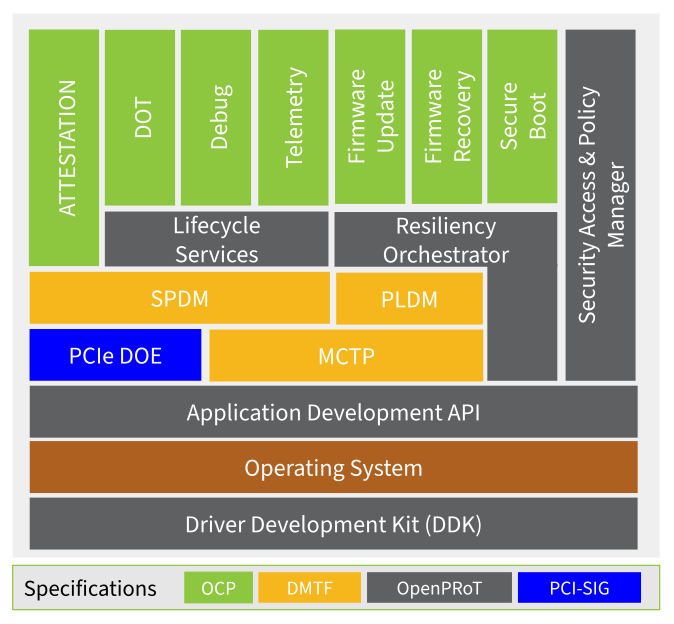

# OpenPRoT Specification

Version: v0.5 - Work in Progress

## Introduction

The concept of a Platform Root of Trust (PRoT) is central to establishing a
secure computing environment. A PRoT is a trusted component within a system that
serves as the foundation for all security operations. It is responsible for
ensuring that the system boots securely, verifying the integrity of the firmware
and software, and performing critical cryptographic functions. By acting as a
trust anchor, the PRoT provides a secure starting point from which the rest of
the system's security measures can be built. This is particularly important in
an era where cyber threats are becoming increasingly sophisticated, targeting
the lower layers of the computing stack, such as firmware, to gain persistent
access to systems.

OpenPRoT is a project intended to enhance the security and transparency of PRoTs
by defining and building an open source firmware stack that can be run on a
variety of hardware implementations. Open source firmware offers several
benefits that can enhance the effectiveness and trustworthiness of a PRoT.
Firstly, open source firmware allows for greater transparency, as the source
code is publicly available for review and audit. This transparency helps
identify and mitigate vulnerabilities more quickly, as a global community of
developers and security experts can scrutinize the code. It also reduces the
risk of hidden backdoors or malicious code, which can be a concern with
proprietary firmware.

Moreover, an open source firmware stack can foster innovation and collaboration
within the industry. By providing a common platform that is accessible to all,
developers can contribute improvements, share best practices, and develop new
security features that benefit the entire ecosystem. This collaborative approach
can lead to more robust and resilient firmware solutions, as it leverages the
collective expertise of a diverse community. Additionally, open source firmware
can enhance interoperability and reduce vendor lock-in, giving organizations
more flexibility in choosing hardware and software components that best meet
their security needs.

Incorporating an open source firmware stack into a PRoT not only strengthens the
security posture of a system but also aligns with broader industry trends
towards openness and collaboration. As organizations increasingly recognize the
importance of securing the foundational layers of their computing environments,
the combination of a PRoT with open source firmware represents a powerful
strategy for building trust and resilience in the face of evolving cyber
threats.

## Background

Today's Platform Root of Trust (PRoT) solutions are often specifically designed
for their target platform, relying on custom interfaces or protocols. This leads
to slower time-to-market due to the integration effort required. Customers can
become locked into a single solution, making it costly and time-consuming to
change suppliers, which in turn introduces supply chain risks.

The Open Platform Root-of-Trust (OpenPRoT) stack is an open and extensible
standards-compliant root-of-trust firmware stack for use in root-of-trust
elements. The project was initiated to create an OCP specification for a
Platform Root of Trust software stack, along with an open-source implementation
of that specification. The OpenPRoT stack provides base root-of-trust services
in an open architecture that allows hardware vendors to provide both standard
and value-added services.

## Goals

The vision of the OpenPRoT project is to enable implementation consistency,
transparency, openness, reusability, and interoperability. The primary goals of
the project are to:

*   **Create an OCP specification** for a Platform Root of Trust (PRoT) firmware
    stack.
*   **Create an open-source implementation** of the specification.
*   **Target new and existing PRoT hardware implementations**, with a preference
    for Open Silicon.
*   **Enable optionality** for integrators through stable interfaces while
    maintaining a high security bar.
*   **Standardize PRoT hardware interfaces**, such as an add-in card connector
    on the DC-SCM board.
*   **Promote reusability** through collaboration with standards bodies and
    hardware RoT projects to create robust, modular firmware.

## Industry standards and specifications

OpenPRoT is designed to be a standards-based and interoperable Platform Root of
Trust (PRoT) solution. This ensures that OpenPRoT can be integrated into a wide
range of platforms and that it leverages proven and well-defined security and
management protocols.

### Distributed Management Task Force (DMTF)

- **DSP0274**: Security Protocol and Data Model (SPDM) Version 1.3 or later
- **DSP0277**: Secured Messages using SPDM over MCTP Binding
- **DSP0236**: Management Component Transport Protocol (MCTP) Base Specification
- **DSP0240**: Platform Level Data Model (PLDM) Base Specification
- **DSP0248**: Platform Level Data Model (PLDM) for Platform Monitoring and Control Specification
- **DSP0267**: Platform Level Data Model (PLDM) for Firmware Update Specification

### Trusted Computing Group (TCG)

- **DICE Layering Architecture**: Device Identity Composition Engine
- **DICE Attestation Architecture**: Certificate-based attestation
- **DICE Protection Environment (DPE)**: Runtime attestation service
- **TCG DICE Concise Evidence Binding for SPDM**: Evidence format specification

### National Institute of Standards and Technology (NIST)

- **NIST SP 800-193**: Platform Firmware Resiliency Guidelines
- **NIST FIPS 186-5**: Digital Signature Standard (DSS)
- **NIST SP 800-90A**: Recommendation for Random Number Generation
- **NIST SP 800-108**: Recommendation for Key Derivation Functions

## High Level Architecture

The OpenPRoT architecture is designed to be a flexible and extensible platform
Root of Trust (PRoT) solution. It is built upon a layered approach that
abstracts hardware-specific implementations, providing standardized interfaces
for higher-level applications. This architecture promotes reusability,
interoperability, and a consistent security posture across different platforms.

### Block Diagram

The following block diagram illustrates the high-level architecture of OpenPRoT.

### Architectural Layers

The OpenPRoT architecture can be broken down into the following layers:

1.  **Hardware Abstraction Layer (HAL):** At the lowest level, the
    [Driver Development Kit](./device_abstraction/README.md) (DDK) provides
    hardware abstractions. This layer is responsible for interfacing with the
    specific RoT silicon and platform hardware.
2.  **Operating System:** Above the DDK sits the operating system, which
    provides the foundational services for the upper layers.
3.  **Middleware:** This layer consists of standardized communication protocols
    that enable secure and reliable communication between different components
    of the system. Key protocols include:
    *   [MCTP](./middleware/mctp.md) (Management Component Transport Protocol):
        Provides a transport layer that is compatible with various hardware
        interfaces.
    *   [SPDM](./middleware/spdm.md) (Security Protocol and Data Model): Used
        for establishing secure channels and for attestation.
    *   [PLDM](./middleware/pldm.md) (Platform Level Data Model): Provides
        interfaces for firmware updates and telemetry retrieval.
4.  **Services:** This layer provides a minimal set of standardized services
    that align with the OpenPRoT specification. These services include:
    *   **Lifecycle Services:** Manages the lifecycle state of the device,
        including secure debug enablement.
    *   **Attestation:** Aggregates attestation reports from platform
        components.
    *   [Firmware Update & Recovery](./services/fwupdate.md): Orchestrates the
        secure update and recovery of firmware for platform components.
    *   **Telemetry:** Collects and extracts telemetry data.
5.  **Applications:** At the highest level are the applications that implement
    the core logic of the PRoT. These applications have room for differentiation
    while being built upon standardized interfaces. Key applications include:
    *   **Secure Boot:** Orchestrates the secure boot process for platform
        components.
    *   **Policy Manager:** Manages the security policies of the platform.
