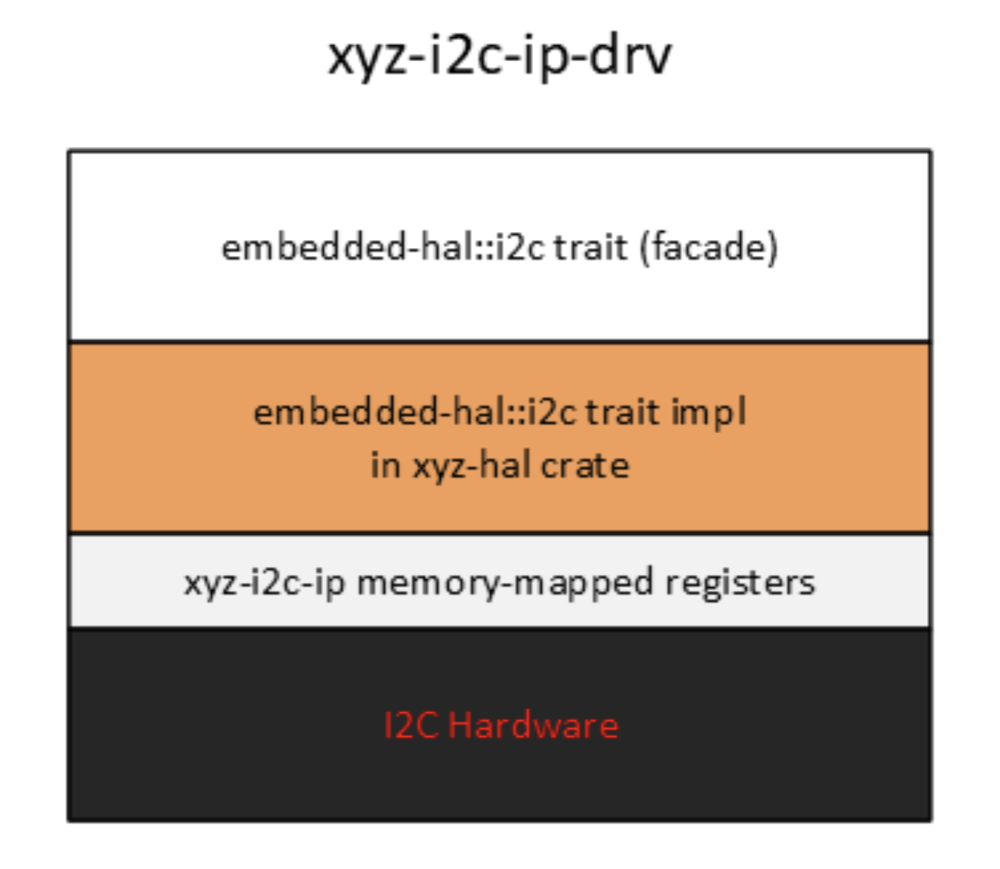
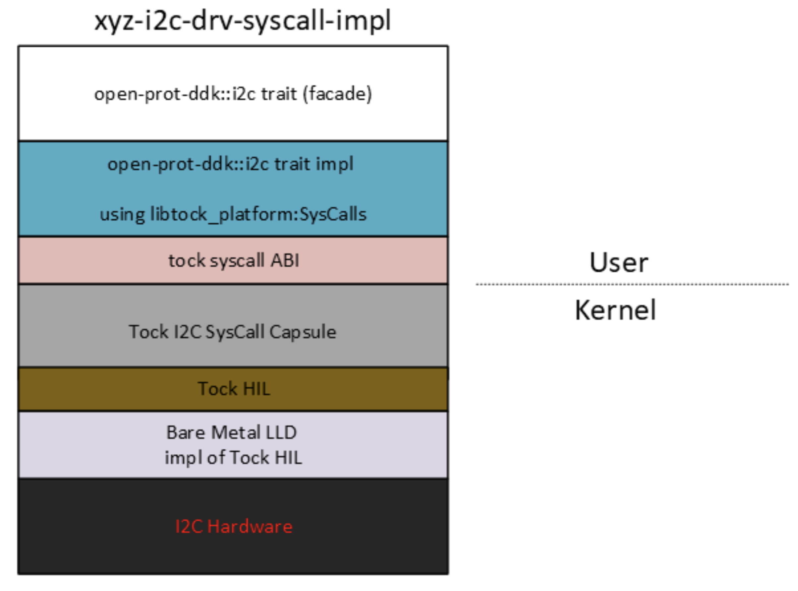
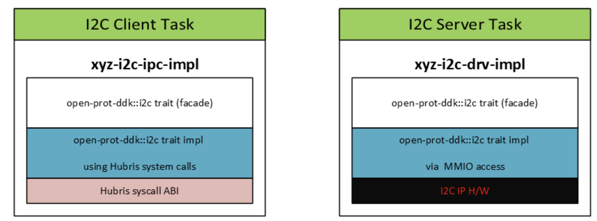
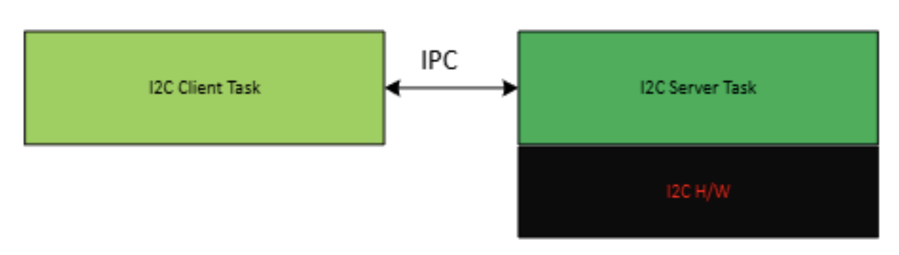

# Device Abstraction

Status: Draft

The OpenPRoT Driver Development Kit (Device Development Kit) provides a set of
generic Rust traits and types for interacting with I/O peripherals and
cryptographic algorithm accelerators encountered in the class of devices that
perform Root of Trust (RoT) functions.

The DDK isolates the OpenPRoT developer from the underlying embedded processor
and operating system.

## Scope

This section provides a non-exhaustive list of peripherals that fall within the
scope of the Device Driver Kit (DDK).

### I/O Peripherals

| Device                       | Description                                |
| :--------------------------- | :----------------------------------------- |
| **SMBus/I2C Monitor/Filter** |                                            |
| **Delay**                    | Delay execution for specified durations in microseconds or milliseconds. |

### Cryptographic Functions

Cryptographic Algorithm | Description
:---------------------- | :----------------------------------
**AES**                 | Symmetric encryption and decryption
**ECC**                 | ECDSA signature and verification
**digest**              | Cryptographic hash functions
**RSA**                 | RSA signature and verification

We will refer to the collection of I/O peripherals and cryptographic algorithm
accelerators as peripherals from now on.

## Design Goals

### Platform Agnostic

The goal of the DDK is to provide a consistent and flexible interface for
applications to invoke peripheral functionality, regardless of whether the
interaction with the underlying peripheral driver is through system calls to a
kernel mode device driver, inter-task communication or direct access to
memory-mapped peripheral registers.

### Execution Model Agnostic

The DDK should be agnostic of the execution model and provide flexibility for
its users.

The collection of traits in the DDK is to be segregated in different crates
according to the APIs it exposes. i.e. synchronous, asynchronous, and
non-blocking APIs.

These crates ensure that DDK can cater to various execution models, making it
versatile for different application requirements.

*   Synchronous APIs: The main open-prot-ddk crate contains blocking traits
    where operations are performed synchronously before returning.
*   Asynchronous APIs: The open-prot-ddk-async crate provides traits for
    asynchronous operations using Rust's async/await model.
*   Non-blocking APIs: The open-prot-ddk-nb crate offers traits for non-blocking
    operations which allows for polling-based execution.

## Design Principles

### Minimalism

The design of the DDK prioritizes simplicity, making it straightforward for
developers to implement. By avoiding unnecessary complexity, it ensures that the
core traits and functionalities remain clear and easy to understand.

### Zero Cost

This principle ensures that using the DDK introduces no additional overhead. In
other words, the abstraction layer should neither slow down the system nor
consume more resources than direct hardware access.

### Composability

The HAL shall be designed to be modular and flexible, allowing developers to
easily combine different components. This composability means that various
drivers and peripherals can work together seamlessly, making it easier to build
complex systems from simple, reusable parts.

### Robust Error Handling

Trait methods must be designed to handle potential failures, as hardware
interactions can be unpredictable. This means **that methods invoking hardware
should return a Result type to account for various failure scenarios,**
including misconfiguration, power issues, or disabled hardware.

```rust
pub trait SpiRead<W> { type Error;


fn read(&mut self, words: &mut [W]) -> Result<(), Self::Error>;

}
```

While the default approach should be to use fallible methods, HAL
implementations can also provide infallible versions if the hardware guarantees
no failure. This ensures that generic code can rely on robust error handling,
while platform-specific code can avoid unnecessary boilerplate when appropriate.

```rust
use core::convert::Infallible;

pub struct MyInfallibleSpi;

impl SpiRead<u8> for MyInfallibleSpi {
    type Error = Infallible;

    fn read(&mut self, words: &mut [u8]) -> Result<(), Self::Error> {
        // Perform the read operation
        Ok(())
    }
}
```

### Separate Control and Data Path Operations {#separate-control-and-data-path-operations}

*   Clarity: By separating configuration (control path) from data transfer (data
    path), each part of the code has a clear responsibility. This makes the code
    easier to understand and maintain.
*   Modularity: It allows for more modular design, where control and data
    handling can be developed and tested independently.

Example

This example is extracted from Tock's TRD3 design document. Uart functionality
is decomposed into fine grained traits defined for control path (Configure) and
data path operations (Transmit and Receive).

```rust
pub trait Configure {
  fn configure(&self, params: Parameters) -> ReturnCode;
}
pub trait Transmit<'a> {
  fn set_transmit_client(&self, client: &'a dyn TransmitClient);
  fn transmit_buffer(
    &self,
    tx_buffer: &'static mut [u8],
    tx_len: usize,
  ) -> (ReturnCode, Option<&'static mut [u8]>);
  fn transmit_word(&self, word: u32) -> ReturnCode;
  fn transmit_abort(&self) -> ReturnCode;
}
pub trait Receive<'a> {
  fn set_receive_client(&self, client: &'a dyn ReceiveClient);
  fn receive_buffer(
    &self,
    rx_buffer: &'static mut [u8],
    rx_len: usize,
  ) -> (ReturnCode, Option<&'static mut [u8]>);
  fn receive_word(&self) -> ReturnCode;
  fn receive_abort(&self) -> ReturnCode;
}
pub trait Uart<'a>: Configure + Transmit<'a> + Receive<'a> {}
pub trait UartData<'a>: Transmit<'a> + Receive<'a> {}
```

#### Use Case : Device Sharing

*   **Peripheral Client Task**: This task is only exposed to data path
    operations, such as reading from or writing to the peripheral. It interacts
    with the peripheral server to perform these operations without having direct
    access to the configuration settings.
*   **Peripheral Server Task**: This task is responsible for managing and
    sharing the peripheral functionality across multiple client tasks. It has
    the exclusive role of configuring the peripheral for data transfer
    operations, ensuring that all configuration changes are centralized and
    controlled. This separation allows for robust access control and simplifies
    the management of peripheral settings.

## Methodology

In order to accomplish this goal in an efficient fashion the DDK should not try
to reinvent the wheel but leverage existing work in the Rust community such as
the Embedded Rust Workgroup's embedded-hal or the RustCrypto projects.

As much as possible, the OpenPRoT workgroup should evaluate, curate, and
recommend existing abstractions that have already gained wide adoption.

By leveraging well-established and widely accepted abstractions, the DDK can
ensure compatibility, reliability, and ease of integration across various
platforms and applications. This approach not only saves development time and
resources but also promotes standardization and interoperability within the
ecosystem.

When abstractions need to be invented, as is the case for the I3C protocol, for
instance the OpenPRot workgroup will design it according to the community
guidelines for the project it is curating from and make contributions upstream.

## Use Cases

This section illustrates the contexts where the DDK can be used.

### Low Level Driver

A low level driver implements a peripheral (or a cryptographic algorithm) driver
trait by accessing memory mapped registers directly and it is distributed as a
`no_std` crate.

A `no_std` crate like the one depicted below would be linked directly into a
user mode task with exclusive peripheral ownership. This use case is encountered
in microkernel-based embedded O/S such as Oxide HUBRIS where drivers run in
unprivileged mode.



### Proxy for a Kernel Mode Device Driver

In this section, we explore how a trait from the Device Development Kit (DDK)
can enhance portability by decoupling the application writer from the underlying
embedded stack.

The user of the peripheral is an application that is interacting with a kernel
mode device driver via system calls, but is completely isolated from the
underlying implementation.

This is applicable to any O/S with device drivers living in the kernel, like the
Tock O/S.



### Proxy for a Peripheral Server Task

In this section, we will explore once more how traits from the Device
Development Kit (DDK) can enhance portability by decoupling the application
writer from the underlying Operating System architecture. This scenario is
applicable to any microkernel-based O/S

The xyz-i2c-ipc-impl depicted below is distributed as a `no_std` driver crate
and is linked to a I2C client task. The I2C client task is an application that
is interacting with a user mode device driver, named the I2C server task via
message passing.

The I2C Server task owns the actual peripheral and is linked to a
xyz-i2c-drv-imp driver crate, which is a low-level driver. .



The I2C client task sends requests to the I2C peripheral owned by the server
task via message passing, completely oblivious to the underlying implementation.


