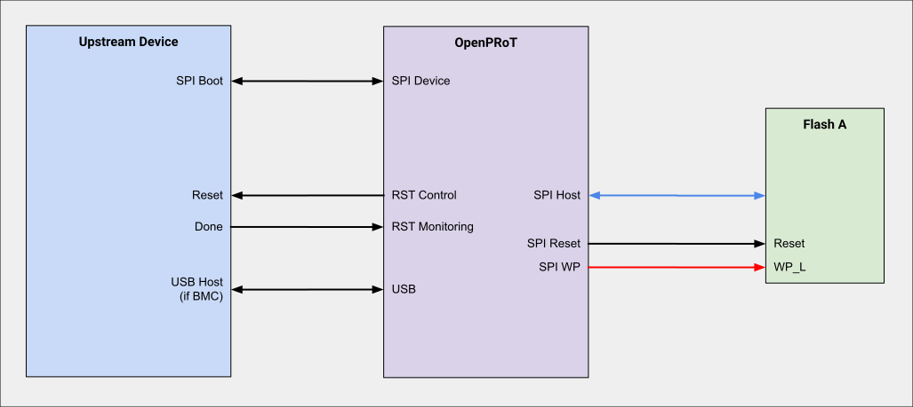
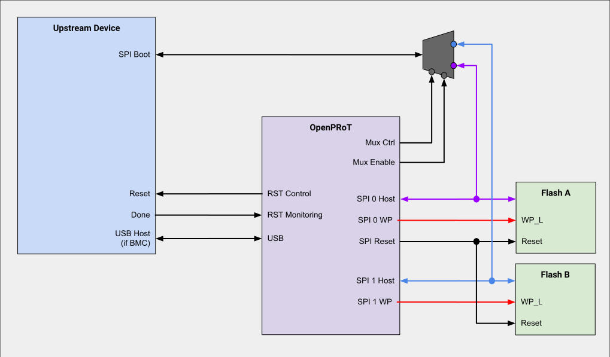
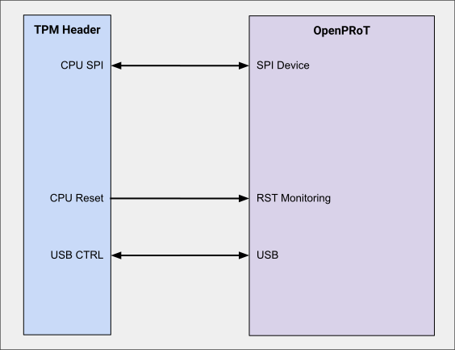

## Use Cases

Use cases are divided into two general groups:

*   **Legacy Admissible Architectures**: Where the upstream device, that is, the
    device attached to the Root of Trust (RoT), boots from SPI NOR Flash EEPROM.
*   **Modern Admissible Architectures**: Where the upstream device supports
    flash-less boot (i.e., stream boot). Support for modern architectures will
    be added in a future version of this specification.

### Legacy Admissible Architectures

There are three legacy admissible architectures supported by the OpenPRoT
implementation:

| Architecture                | Common Usages                       | SPI NOR Flash EEPROM                                |
| :-------------------------- | :---------------------------------- | :-------------------------------------------------- |
| **Dual-Flash Side-by-side** | (Preferred) Most integrations       | Two parts, one partition per part (i.e., A + B).    |
| **Direct-Connect**          | Add-in devices; board-constrained   | One part, double-sized to support A/B updates.      |
| **TPM**                     | TPM Daughtercard, Onboard TPM       | None                                                |

### Direct-Connect

In the **Direct-Connect** architecture, OpenPRoT acts as an SPI interposer
between the upstream device and the SPI NOR Flash EEPROM. OpenPRoT examines the
opcode of each transaction and decides whether the operation should pass through
to the backing SPI Flash or be intercepted and handled by its hardware filtering
logic. This policy is controlled by both hardware and firmware. Typically:

*   **Control operations** are handled by the RoT hardware directly.
*   **Read operations** are passed through to the backing SPI Flash.
*   **Write operations** are intercepted by OpenPRoT firmware and may be
    replayed to the backing SPI flash based on security policy.

OpenPRoT supports atomic A/B updates by diverting read operations to either the
lower or upper half of the SPI Flash while hiding the opposing half. This
requires the SPI Flash to be double the size needed by the upstream device
(e.g., a 512Mbit Flash for a 256Mbit requirement).

**Note**: Direct-Connect has a hardware limitation on the maximum supported SPI
frequency due to board capacitance, layout, and the PRoT silicon. The
integration designer must verify that the expected SPI frequency range is
compatible with the upstream device. If this architecture is infeasible,
consider the **Dual-Flash Side-by-Side** architecture instead.

### Dual-Flash Side-by-Side

In the **Dual-Flash Side-by-Side** architecture, the upstream device has direct
access to one of two physical SPI NOR Flash EEPROM chips, selected by an
OpenPRoT-controlled mux. This arrangement supports atomic A/B updates. OpenPRoT
can also directly access each flash chip. The layout should use the smallest
possible nets to avoid signal integrity issues from stubs.

Both SPI Flash chips **must be the same part**. The OpenPRoT firmware
coordinates the mux control and its two SPI host interfaces to ensure the nets
are not double-driven.

**Note**: If using quad-SPI, the flash requires a password protection feature,
as the Write Protect (WP) pin is not available.

### TPM

The **TPM Admissible Architecture** is designed for a direct connection to a
standard TPM-SPI interface. In this configuration, OpenPRoT can be soldered onto
the main board or placed on a separate daughtercard.

TPM integrations do not require a backing SPI NOR Flash EEPROM and generally
only support single-mode SPI. Where possible, these integrations should adhere
to a standard TPM connector design.

