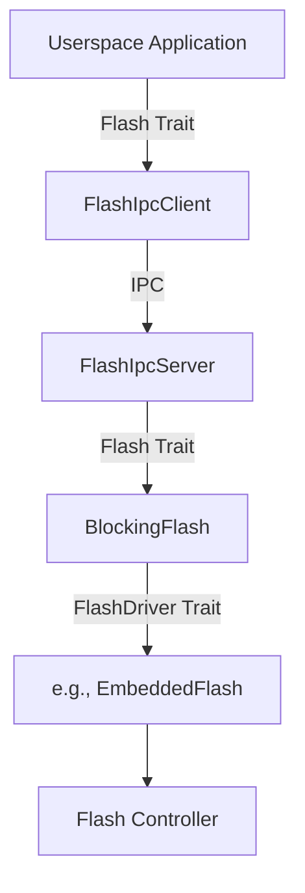

# Flash Service

The Flash Service provides a centralized interface for userspace applications to interact with on-chip and external flash memory. This is achieved via an IPC-based client-server architecture.

## Overview

Applications interact with flash through the `Flash` trait, typically using the `FlashIpcClient` implementation. All operations are blocking from the perspective of the caller.

### Key Features
- **Partition Support**: Access to both primary Data partitions and auxiliary Info partitions.
- **Flexible Erase**: Support for multiple erase granularities (e.g., page vs. block) as reported by the hardware.
- **Unified Addressing**: A logical `FlashAddress` system that abstracts hardware-specific bank and page layouts.

## Usage

To use the flash service, initialize a `FlashIpcClient` with a handle to the flash service:

```rust
use hal_flash::{Flash, FlashAddress};
use services_flash_client::FlashIpcClient;
use util_ipc::IpcChannel;

// 1. Connect to the flash service
let mut flash = FlashIpcClient::new(IpcChannel::new(FLASH_SERVICE_HANDLE))?;

// 2. Retrieve device geometry
let (total_size, page_size, erasable_bitmap) = flash.geometry();

// 3. Erase a block (using the default page size)
let addr = FlashAddress::new(0, 0x1000);
flash.erase(addr, page_size)?;

// 4. Program data
flash.program(addr, b"Hello, Flash!")?;

// 5. Read data back
let mut buf = [0u8; 13];
flash.read(addr, &mut buf)?;
```

## The `Flash` Trait

The primary interface for flash operations:

- `geometry() -> (NonZero<usize>, PowerOf2Usize, u32)`: Returns the total capacity, the default/smallest page size, and a bitmap of all supported erase block sizes.
- `read(addr, buf)`: Reads data from the specified address.
- `erase(addr, size)`: Erases a block of the specified size. The size must be one of the values supported in the `erasable_bitmap`.
- `program(addr, data)`: Writes data to the specified address. Flash must be erased before programming.

### Understanding `erasable_bitmap`
The `erasable_bitmap` is a `u32` where each set bit `i` indicates that an erase block size of `2^i` bytes is supported.
- Bit 11 set (`0x800`) -> 2048-byte erase supported.
- Bit 16 set (`0x10000`) -> 64KB erase supported.

## Addressing

Flash memory is addressed using the `FlashAddress` type, which consists of:
- **Device ID / Partition**: Represents different address spaces (e.g., Data vs. Info).
- **Offset**: The byte offset within that partition.

On platforms like Earlgrey, helper methods are provided to construct addresses:
- `FlashAddress::data(offset)`: Accesses the main data partition.
- `FlashAddress::info(bank, page, offset)`: Accesses specific info pages.

## Implementation Details

The service is built on several layers of abstraction:

### IPC Layer
- **`FlashIpcServer`**: Wraps a hardware-backed `Flash` implementation and dispatches IPC requests.
- **`FlashIpcClient`**: Implements the `Flash` trait by proxying calls to the server.

### Hardware Abstraction
- **`FlashDriver` Trait**: Defines the low-level, often asynchronous, interface for hardware drivers.
- **`BlockingFlash`**: A wrapper that converts a `FlashDriver` into a synchronous `Flash` implementation using a provided blocking mechanism.

### Component Diagram


