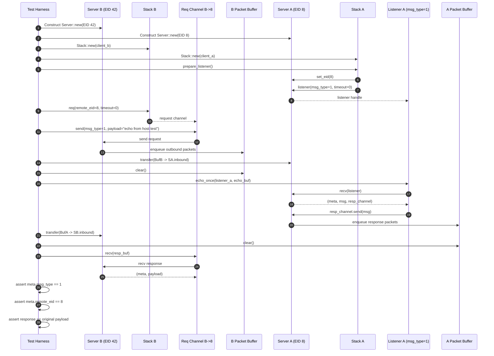

# MCTP Echo Host Test Sequence

Source test: `echo_host.rs` (`echo_path_roundtrip_via_stack_and_echo_helper`)

## Notes

- `prepare_listener()` configures responder identity (`EID=8`) and opens a listener for `ECHO_MSG_TYPE=1`.
- Packet movement between endpoints is explicit in this host test via `transfer(...)` and in-memory buffers (`buf_b`, `buf_a`).
- `echo_once(...)` is one receive/send cycle: `listener.recv(...)` followed by `resp.send(msg)`.
