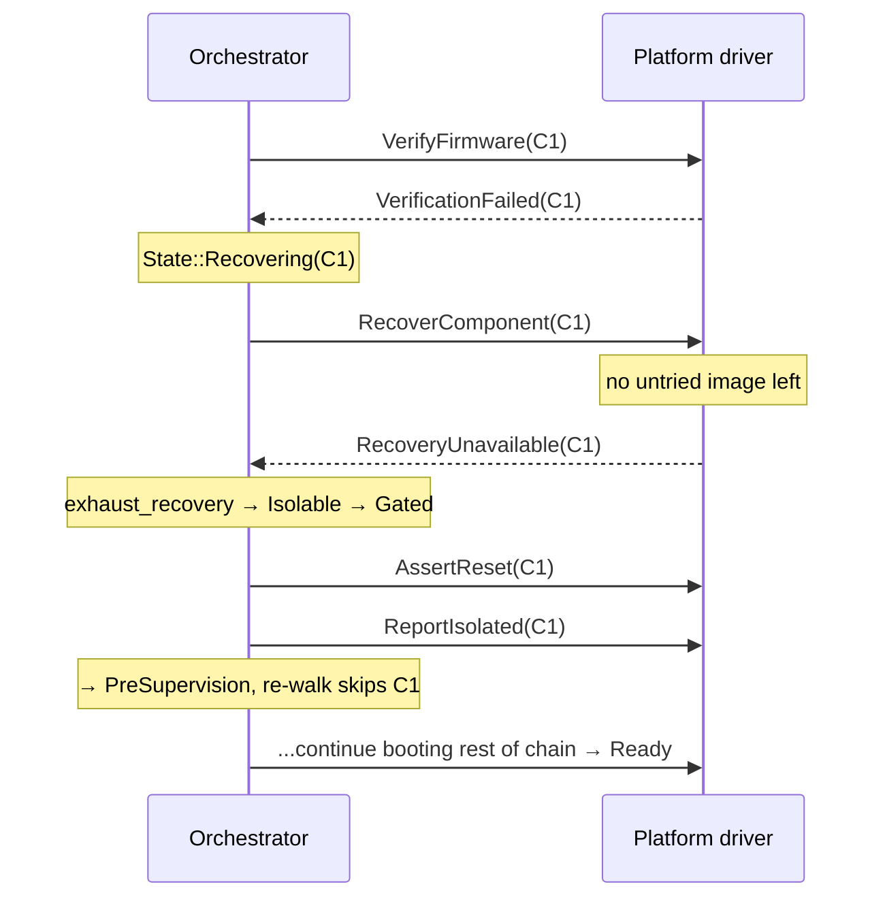
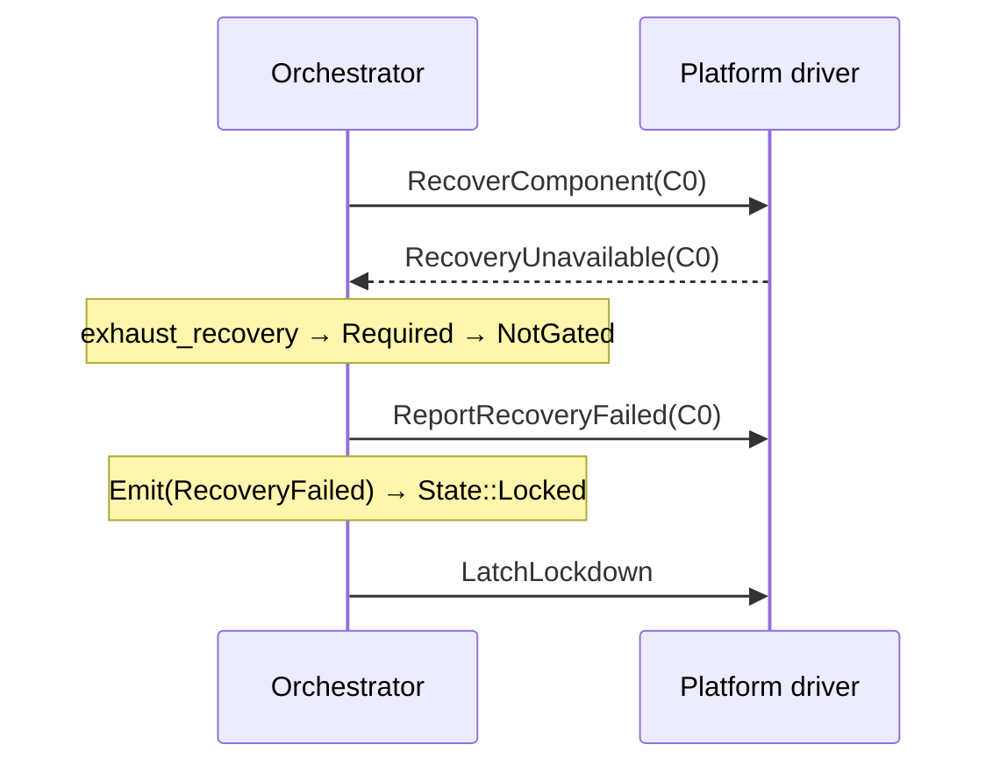
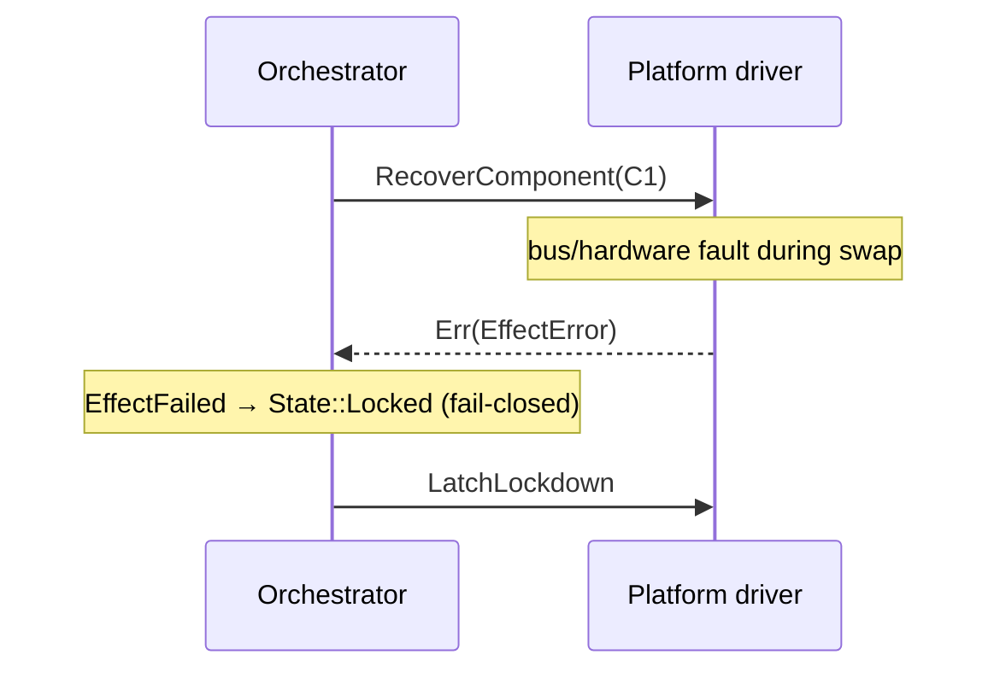

# Design Spec: Platform-Signaled Recovery Exhaustion (`RecoveryUnavailable`)

**Component:** `services/orchestrator/sm`
**Status:** Implemented
**Scope:** Orchestrator state-machine core + `Platform` contract

---

## 1. Problem Statement

The orchestrator drives per-component recovery by emitting
`Effect::RecoverComponent(ComponentId)` and awaiting the platform's verdict. The
platform driver owns the actual recovery mechanism (golden image, A/B slot,
streamed image, vendor scheme) and the set of recovery images available for a
component.

Today the recovery result channel has **only a success event**,
`Event::Restored(id)`. There is no event by which the platform can report *"I
have no remaining recovery source for this component."* The platform's only
available signal for that condition is to return `EffectError` from
`Platform::execute(RecoverComponent(id))`.

Returning `EffectError` injects `Event::EffectFailed`, which transitions the
machine to `State::Locked` **unconditionally, from any state**
(`services/orchestrator/sm/src/lib.rs`). This produces an incorrect outcome:

> An **`Isolable`** (or **`Cascading`**) component that the platform simply has
> no image left to restore **locks down the entire platform**, instead of being
> gracefully gated and skipped so the rest of the platform can boot degraded.

This is an asymmetry in the machine's own exhaustion model:

- **Count-driven exhaustion** (retry cap reached) routes through
  `gate_by_policy` — `Isolable` skips, `Cascading` cascades, `Required` locks.
- **Platform-driven exhaustion** (out of images) routes through `EffectFailed`
  — everything locks, regardless of `FailurePolicy`.

The two paths disagree about what "recovery gave up" means, which violates the
degraded-mode intent (CSA: an isolable failure should be contained and reported,
not escalated to a full platform halt).

## 2. Background: Current Behavior

### 2.1 The recovery loop

For a component `C` found corrupt or failing verification:

1. `PreSupervision` emits `VerifyFirmware(C)`; platform reports
   `VerificationFailed(C)`.
2. Machine transitions to `State::Recovering(C)`; entry emits
   `RecoverComponent(C)`.
3. Platform selects an image, swaps it, reports `Restored(C)`.
4. `Recovering` handles `Restored(C)`: `bump_retry(C)`; if
   `attempts < max_retry` → re-verify (`PreSupervision`); else → exhausted,
   `gate_by_policy(C)`.

(`services/orchestrator/sm/src/lib.rs`, `State::Recovering` handler.)

### 2.2 The retry cap

`max_retry` is a board-supplied ceiling; each component keeps its own
consecutive-failure counter (`ComponentStatus::retry`). The counter increments
on each `Restored` cycle that fails re-verification and resets on any
`VerificationOk` (`clear_retry`). It is a **liveness bound** — "how many
consecutive failed restore cycles before we give up on this component" — and is
deliberately **decoupled** from the number of recovery images the platform
holds. The orchestrator counts *events*, not *images*, and never asks the
platform how many sources remain.

### 2.3 The exhaustion arm

When the count is reached, the machine runs (`services/orchestrator/sm/src/lib.rs`):

```rust
match self.gate_by_policy(ctx, failed) {
    Gating::Gated => { self.clear_retry(failed); Outcome::Transition(State::PreSupervision) }
    Gating::NotGated => {                 // Required, or unknown id
        ctx.emit(Effect::ReportRecoveryFailed(failed));
        ctx.emit(Effect::Emit(Event::RecoveryFailed));
        Outcome::Handled
    }
}
```

`Isolable`/`Cascading` → `Gated` → skip on the re-walk. `Required` → report and
latch `Locked`. **This is the behavior platform-driven exhaustion should also
get**, and today does not.

## 3. Goals / Non-Goals

### Goals

- Let the platform authoritatively signal "no remaining recovery source for this
  component" and have it route through `FailurePolicy`, identical to
  count-driven exhaustion.
- Keep `EffectError` reserved for genuine actuation faults (bus error, hardware
  fault), which correctly fail closed to `Locked`.
- Preserve the orchestrator's slot-blindness: `RecoverComponent` stays a bare
  `ComponentId`; the platform still owns image selection and counting.
- Introduce no new worst case for the effect-buffer or pending-event bounds.

### Non-Goals

- Making the orchestrator aware of image/slot counts or coupling `max_retry` to
  them (that is item #1 / #5, tracked separately).
- Changing the retry cap semantics for the count-driven path.
- Changing `RecoverComponent` to carry a slot/region.

## 4. Design Overview

Recovery is inherently two-phase: `RecoverComponent` starts it, and the platform
later reports a verdict. Today the verdict channel has a success event
(`Restored`) but no failure event. **Add the failure event.**

```
                         ┌── Restored(id) ──────────► re-verify / retry-cap logic
RecoverComponent(id) ────┤
                         └── RecoveryUnavailable(id) ► gate_by_policy (skip | lock)

  EffectError from execute(...) ─────────────────────► EffectFailed ► Locked
     (reserved for genuine actuation faults only)
```

`RecoveryUnavailable(id)` short-circuits the retry cap and runs the **exact same**
exhaustion arm as count-exhaustion, so the two paths can never diverge.

## 5. Detailed Design

### 5.1 New event (`services/orchestrator/sm/src/model.rs`)

```rust
/// The platform has no remaining recovery source for `id` (its configured
/// images/slots are exhausted). Routed through failure policy — NOT the
/// fail-closed `EffectFailed` lockdown — so an Isolable/Cascading component is
/// gracefully gated while a Required one latches Locked. Reported by the driver
/// in place of `Restored(id)`.
RecoveryUnavailable(ComponentId),
```

Add it to the id-carrying arm of `Event::component_id()` so the chain-membership
check at the dispatch boundary covers it (an off-chain id is dropped before any
handler runs).

### 5.2 Extract the shared exhaustion arm (`services/orchestrator/sm/src/lib.rs`)

Factor the current `Restored` `else` branch into a helper so both paths share
one implementation:

```rust
/// Recovery is over for `failed` without success: gate per policy
/// (Isolable/Cascading skip; Required reports + latches Locked). Shared by the
/// retry-cap path and the platform's `RecoveryUnavailable` path so the two can
/// never diverge.
fn exhaust_recovery(&mut self, ctx: &mut Sink<E>, failed: ComponentId) -> Outcome {
    match self.gate_by_policy(ctx, failed) {
        Gating::Gated => {
            self.clear_retry(failed);
            Outcome::Transition(State::PreSupervision)
        }
        Gating::NotGated => {
            ctx.emit(Effect::ReportRecoveryFailed(failed));
            ctx.emit(Effect::Emit(Event::RecoveryFailed));
            Outcome::Handled
        }
    }
}
```

`Restored` becomes:

```rust
let attempts = self.bump_retry(failed);
if attempts < self.max_retry {
    Outcome::Transition(State::PreSupervision)
} else {
    self.exhaust_recovery(ctx, failed)
}
```

### 5.3 Handle the new event in `State::Recovering`

```rust
Event::RecoveryUnavailable(id) => {
    if *id != failed {
        return Outcome::Handled;   // same guard as Restored
    }
    self.exhaust_recovery(ctx, failed)   // authoritative: short-circuits the cap
}
```

It does **not** call `bump_retry`: the platform is authoritative about being out
of sources, so the machine does not wait for the count to run out on
non-progress.

### 5.4 Contract changes

- **`Effect::RecoverComponent` doc:** the platform reports **either**
  `Restored(id)` on success **or** `RecoveryUnavailable(id)` when its configured
  recovery sources are exhausted. It must **not** return `EffectError` for "out
  of images."
- **`Platform::execute` doc / `platform-recovery-handling.md`:** the
  `RecoverComponent` handler swaps to the next untried image and returns `Ok`;
  when no untried image remains, the driver feeds `RecoveryUnavailable(failed)`
  on its next `dispatch`. `EffectError` is reserved for a genuine swap fault.

## 6. Sequence Diagrams

### 6.1 Isolable component, platform out of images (new graceful path)



### 6.2 Required component, platform out of images



### 6.3 Contrast: genuine actuation fault (unchanged)



## 7. Interaction with the Retry Cap

`RecoveryUnavailable` is authoritative and immediate — it exhausts regardless of
the current `retry` count. This makes `max_retry` a pure **liveness backstop**
(bounding loops when the platform keeps reporting `Restored` on
non-progressing images) rather than the primary exhaustion signal. When the
platform knows it is out of sources, the machine no longer burns cycles
re-verifying identical bad bits until the count runs out — partially mitigating
the "count bounds iterations, not image coverage" observation.

## 8. Alternatives Considered

1. **Richer `EffectError` (reason code) routed differently in `dispatch_with`.**
   Rejected: mixes actuation failure with recovery-policy verdict, complicates
   the fail-closed effect loop, and breaks the "verdicts are events" pattern
   that `Restored`/`VerificationFailed` already establish.
2. **Configure `max_retry` = image count and keep the status quo.** Rejected as
   the sole fix: it is an unguarded convention (item #1), and it still cannot
   express "out of images *now*, before the count" — the platform would keep
   reporting `Restored` on a repeated last image until the count expires.
3. **New effect instead of a new event** (`ReportRecoveryUnavailable`).
   Rejected: this is inbound information *from* the platform, which is an event,
   not an outbound request.

## 9. Testing

New tests in `services/orchestrator/sm/src/tests.rs`, mirroring the existing
exhaustion tests with the platform-signaled trigger:

| Test | Mirrors | Asserts |
| --- | --- | --- |
| `isolable_recovery_unavailable_skips` | `isolable_component_exhausts_recovery_then_skips` | `AssertReset` + `ReportIsolated`; walk continues to `Ready` |
| `cascading_recovery_unavailable_cascades` | `cascading_exhaustion_reports_each_isolated` | root + transitive dependents gated |
| `required_recovery_unavailable_locks` | `required_exhaustion_reports_before_lockdown` | `ReportRecoveryFailed` + `RecoveryFailed`; latches `Locked` |
| `recovery_unavailable_short_circuits_retry_budget` | — | high `max_retry`; one event exhausts immediately, count untouched |
| `recovery_unavailable_other_component_dropped` | `Restored` target guard | event for a non-target id is dropped |
| `recovery_unavailable_off_chain_dropped` | membership tests | id outside the chain dropped at the dispatch boundary |

The existing `EffectError → Locked` fail-closed test remains unchanged, proving
that path still hard-locks for real actuation faults.

### 9.1 TDD Implementation Order

The change is built test-first. The test harness drives events directly through
`drive(chain, &[events])`, and a platform verdict is just an event pushed into
the script — so `RecoveryUnavailable` needs **no special platform mock**; it is
injected exactly like `Restored`/`VerificationFailed`.

Test target:

```console
bazelisk test //services/orchestrator/sm:orchestrator_sm_test
```

**Cycle 0 — compile-red.** Write `isolable_recovery_unavailable_skips`
referencing `Event::RecoveryUnavailable(C1)`. It fails to compile (unknown
variant). In Rust the first "red" is often the compile error.

```rust
#[test]
fn isolable_recovery_unavailable_skips() {
    let (effects, state) = drive(
        chain(&[
            (C0, ComponentAttrs::passive_required()),
            (C1, ComponentAttrs::passive_isolable()),
        ]),
        &[
            BOOT,
            Event::VerificationPassed(C0),
            Event::VerificationFailed(C1),   // → Recovering(C1)
            Event::RecoveryUnavailable(C1),  // platform: no image left
            Event::VerificationPassed(C0),   // re-walk from top
        ],
    );
    assert_eq!(state, State::Ready);
    assert!(effects.contains(&Effect::RecoverComponent(C1)));
    assert!(effects.contains(&Effect::AssertReset(C1)));
    assert!(effects.contains(&Effect::ReportIsolated(C1)));
    assert!(!effects.contains(&Effect::ReleaseReset(C1))); // never released
    assert!(!effects.contains(&Effect::LatchLockdown));    // NOT a lockdown
}
```

**Cycle 1 — behavior-red.** Add the variant (Step 5.1) — the enum entry plus its
`component_id()` arm, nothing else. It now compiles, but the test fails on
assertion: with no handler the event falls through `Super` in `Recovering` and
is dropped, so the machine never reaches `Ready`.

**Cycle 2 — green (inline).** Add the `RecoveryUnavailable` arm to
`State::Recovering`, inlining the `gate_by_policy` match (do not extract yet —
make it pass first). `isolable_recovery_unavailable_skips` passes.

**Cycle 3 — Required regression guard.** Add `required_recovery_unavailable_locks`.
It is already green from Cycle 2's `NotGated` branch and locks in the
Required-latches-`Locked` behavior.

**Cycle 4 — refactor (the "R").** Now that both policies are green, extract
`exhaust_recovery` (Step 5.2) and route both the new arm and the existing
`Restored` `else` branch through it. Re-run the **whole suite**: every existing
exhaustion test must stay green, proving the refactor preserved the count path.

**Cycle 5 — edge/guard tests, one at a time (red → green).**

- `cascading_recovery_unavailable_cascades` — root + dependents gated.
- `recovery_unavailable_short_circuits_retry_budget` — build an orchestrator
  with a high `max_retry` inline (as `custom_retry_cap_latches_sooner` does),
  inject one `RecoveryUnavailable`, assert exactly one `RecoverComponent` then
  gated (the count was not consulted).
- `recovery_unavailable_other_component_dropped` — in `Recovering(C1)`, inject
  `RecoveryUnavailable(C2)`; assert dropped (exercises `if *id != failed`).
- `recovery_unavailable_off_chain_dropped` — inject for an id absent from the
  chain; assert dropped at the dispatch boundary (exercises the `component_id()`
  arm).

**Cycle 6 — regression + docs.** Confirm the `EffectError → Locked` fail-closed
test is untouched and green, then update the contract docs (Step 5.4).

Net loop: **compile-red → behavior-red → green inline → Required guard →
refactor to shared helper → guard tests → regression**. Each behavior is
introduced by a failing test first, and the refactor is protected by the
pre-existing exhaustion suite.

## 10. Invariants & Risks

- **Effect-buffer bound (`E >= 2*N + 2`):** the new event reuses the existing
  Gated-cascade → `PreSupervision` path that count-exhaustion already exercises,
  so it introduces no new worst case. Confirm `EFFECT_CAP_OK` reasoning still
  holds and annotate.
- **`PENDING_CAP`:** the `NotGated` arm emits one `Emit(RecoveryFailed)`, the
  same as today — within cap.
- **Exhaustive matches:** adding an `Event` variant forces the compiler to flag
  `component_id()` and the reducer, so no silent bypass of the membership check.

## 11. Migration / Compatibility

- Internal crate; adding an `Event` variant is a source change confined to the
  reducer, `component_id()`, and tests. No external ABI.
- Platform drivers that never run out of images are unaffected. A driver that
  previously returned `EffectError` for "out of images" should switch to
  reporting `RecoveryUnavailable` to obtain the graceful (policy-respecting)
  behavior; leaving it as `EffectError` preserves today's lock-down behavior.

## 12. Open Questions

- **Event name:** `RecoveryUnavailable` vs. `RecoveryExhausted` vs.
  `NoRecoverySource`. Avoid `RestoreFailed` (confusable with verification
  failure of a restored image).
- **Should `RecoveryUnavailable` also carry a reason/diagnostic code** for
  degraded-mode reporting (distinguishing "out of images" from other
  platform-side give-ups)? Deferred to the observability work (item #3) unless
  wanted now.
