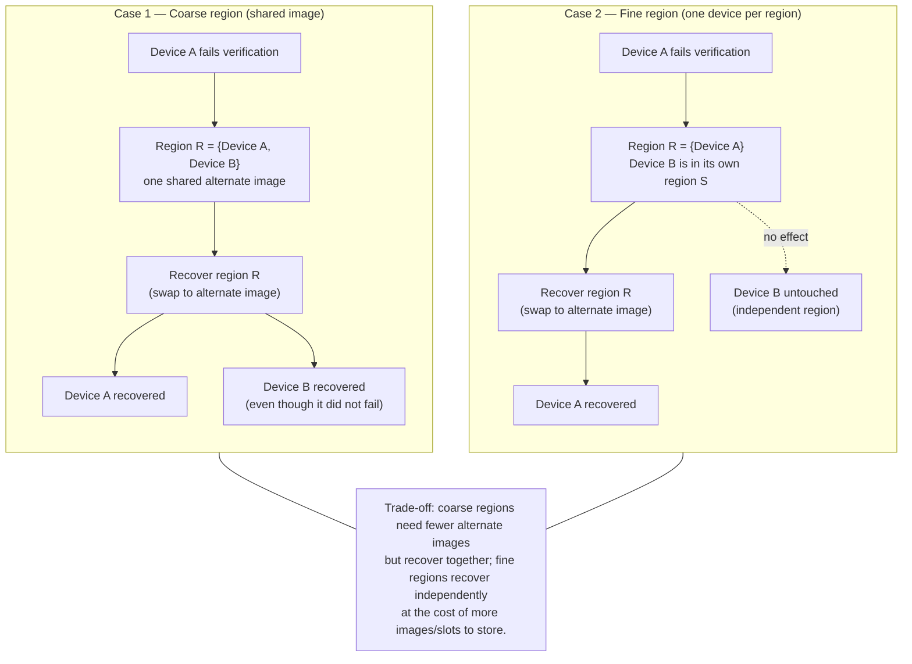

# Recovery-region membership is platform-side, not an SM concern

## Summary

The orchestrator state machine (SM) does **not** carry, read, or reason about
recovery-region membership when sequencing. It names only the failed component
(`RecoverComponent(ComponentId)`); the platform driver owns the
component-to-region mapping and performs the joint restore. This document
records *why* that split is correct, so the SM can stay region-blind.

The `RegionId` type and the `ComponentAttrs::recovery_region` field were removed
from the SM core for this reason — the reducer never consulted them.

## What a recovery region is (per CSA)

From the CSA boot sequence, *Recovery Policy* section
(`RoT_architecture/docs/composable_security_architecture/src/boot_sequence/boot_sequence.md`):

> the scope of that recovery operation is determined by its configured recovery
> region … all devices within the same region must be updated and/or recovered
> together, since recovery requires swapping to an alternate image for that
> region.

So a recovery region is defined as the **scope of an alternate-image swap** — a
physical platform mechanism. The CSA assigns this "how" to the platform, not to
the control logic.

### Region granularity: coarse vs fine

How components are grouped into regions is a platform packaging choice, not an
SM concern. The trade-off is between coarse regions (fewer alternate images,
recover together) and fine regions (recover independently, more images to
store):



Either grouping is transparent to the SM: it always names only the failed
component and re-verifies the whole chain, so it stays correct regardless of how
the platform draws region boundaries.

## The worry region-awareness appears to address

Suppose C0 and C1 share a recovery region and C0 fails verification:

1. SM enters `Recovering(C0)` and emits `RecoverComponent(C0)`.
2. The platform actuates it by swapping the region's alternate image — which
   physically overwrites **both** C0's and C1's on-device firmware.
3. If the SM kept trusting C1 on its *pre-swap* verification, that would be
   stale trust: C1's image just changed underneath a verdict that no longer
   describes it.

Preventing that stale trust is the only thing region-awareness could buy the
SM. The claim is that the SM already prevents it without knowing the region.

## Why the SM does not need the region: a subset argument

Recovery is modeled as a **full platform re-boot**. Two mechanisms already do
more than any region swap can touch:

1. **`quiesce_all` re-holds every live component.** On the recovery re-walk,
   every released component gets `AssertReset` and its `released` /
   `awaiting_boot` flags cleared — not just the failed one, not just its region
   siblings.
2. **The re-walk re-verifies the whole chain from the top.** Each component is
   re-read and re-verified before it may be released again.

The invariant that closes the argument is **verify-before-release (INV8)**: a
component starts held; `AssertReset` and `RecoverComponent` re-hold it; only a
`VerifyFirmware` *since its last hold* permits `ReleaseReset`. No component can
be released on a verification that predates its last hold.

Therefore, whatever set of components a region swap physically rewrites is
necessarily a subset of the whole chain:

```
components touched by a region swap  ⊆  whole chain  =  what the SM re-verifies
```

The SM re-holds and re-verifies the **whole chain** on every recovery,
unconditionally. Region membership is a strict subset of that. Knowing the
region could only let the SM re-verify *less* (an optimization: re-check just
the region instead of the whole chain) — never more. Since correctness needs
the superset, region membership is never *needed* for correct sequencing. It can
only narrow the platform's physical restore.

## Boundary condition

If a region swap ever touched a component **not** in the chain, the SM would not
re-verify it — but the SM never releases or trusts non-chain components in the
first place (the `*_out_of_chain_id_is_dropped` tests). Such a component is
outside the SM's trust surface by construction, so it is irrelevant to SM
correctness.

## Where this is enforced in code

- `quiesce_all` and the re-walk — `services/orchestrator/sm/src/lib.rs`
  (`Recovering` entry action and the `PreSupervision` re-walk).
- Verify-before-release across every ordering —
  `property_verify_before_release_holds_under_random_sequences` in
  `services/orchestrator/sm/src/tests.rs`.
- Every live sibling is held before any re-verify —
  `recovery_rewalk_quiesces_all_live_siblings`.
- A live sibling is not trusted across a recovery on its old pass; it is
  re-verified at rest — `recovery_rewalk_reverifies_live_sibling_at_rest`.
- Non-chain ids are dropped — the `*_out_of_chain_id_is_dropped` cases.

## Consequence for configuration

Because the reducer never consumes it, recovery-region membership does not
belong in `ComponentAttrs` (which holds only fields the core reads: `kind`,
`failure_policy`, `depends_on`). It lives in platform-side config, keyed by
`ComponentId`, and is dereferenced only when the platform actuates
`RecoverComponent`.
