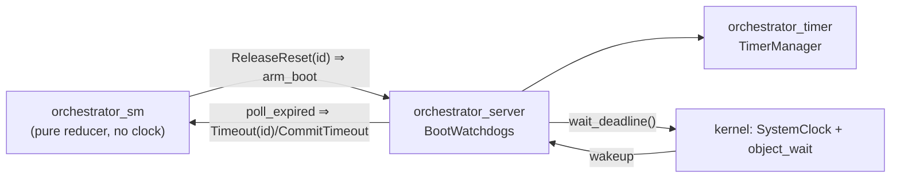

# Orchestrator server

The runtime layer that binds the clockless orchestrator state machine to the
kernel clock. Small but pivotal — just two source files.

## What it is

- `#![no_std]`, `#![forbid(unsafe_code)]`, **kernel-only**
  (`target_compatible_with = TARGET_COMPATIBLE_WITH`, `tags = ["kernel"]`). It
  cannot build on host because it calls the kernel clock.
- Depends on exactly three things: the pure state machine
  ([`orchestrator_sm`](../sm/src/lib.rs)), the timer keeper
  ([`orchestrator_timer`](../timer/src/lib.rs)), and the kernel `userspace`
  crate.
- [`lib.rs`](src/lib.rs) is the crate doc plus re-exports: `pub mod runtime;`,
  `pub use openprot_orchestrator_timer::{Full, TimerManager};`, and
  `pub use runtime::BootWatchdogs;`.

## The problem it solves

The state machine ([`orchestrator_sm`](../sm/src/lib.rs)) is a pure reducer that
owns no clock. It *names* timeouts as events (`Event::Timeout(id)`,
`Event::CommitTimeout`) but has no way to produce them — something has to measure
time and feed those events in. This crate is that something: `TimerManager` lives
here, in the same process as the reducer.

## The one real type: `BootWatchdogs`

[`runtime.rs`](src/runtime.rs) wraps the generic `TimerManager` and pins it to the
kernel's concrete clock:

```rust
pub struct BootWatchdogs<const N: usize> {
    timers: TimerManager<Instant, ComponentId, N>,
}
```

It does three jobs the generic keeper deliberately leaves out:

1. **Relative → absolute time.** The run loop thinks in "fire N ms from now";
   `BootWatchdogs` converts that to the absolute `Instant` the keeper stores, via
   `SystemClock::now()` (`deadline_in`, saturating to `Instant::MAX` on overflow
   so a huge window means "wait forever," not "fire immediately").
2. **Feeds `object_wait`.** `wait_deadline()` returns the nearest armed deadline
   (or `Instant::MAX` when nothing is armed) — exactly the argument the run loop
   hands to the kernel's blocking wait.
3. **Translates keeper output into state-machine events.** After each wakeup,
   `poll_expired()` drains the keeper and maps `Expired::Boot(id) →
   Event::Timeout(id)` and `Expired::Commit → Event::CommitTimeout` — the point
   where "a timer fired" becomes "this attempt failed" for the state machine.

The arm/cancel surface (`arm_boot`, `cancel_boot`, `arm_commit`, `cancel_commit`)
forwards to the keeper after the time conversion.

## Where it sits



The design intent is *no separate timer task, no IPC on the arm/cancel path* — the
watchdogs live in the same process as the reducer, so arming/cancelling is a plain
function call, and the whole thing rides the single `object_wait` deadline the
runtime already blocks on.

## Status

The crate compiles, but `BootWatchdogs` is **not yet wired into an actual run
loop** — nothing in the tree calls `wait_deadline`/`poll_expired` in a loop yet.
The end-to-end behavior it is built for is currently demonstrated by the
`boot_walk` QEMU prototype (which inlines its own shell). So today this crate is
the building block for the runtime, not the running runtime itself.
