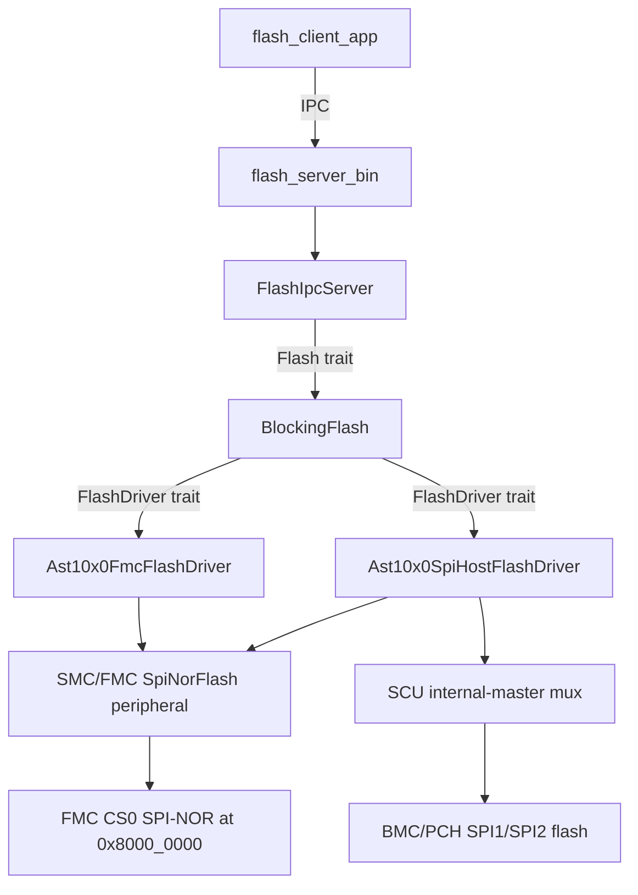

# AST10x0 Flash Backend

How the AST10x0 target integrates the generic flash service.

## Overview

The flash service is designed in layers so hardware-specific code is confined to
a single backend crate. AST10x0 plugs into it by implementing the low-level
`FlashDriver` trait on top of its existing SMC/FMC SPI-NOR peripheral driver,
then relies on the platform-agnostic `BlockingFlash` → `FlashIpcServer` stack for
everything above.

The crate provides two `FlashDriver` implementations that share this stack:

- `Ast10x0FmcFlashDriver` — the RoT's own boot flash on the FMC (CS0).
- `Ast10x0SpiHostFlashDriver` — an external BMC/PCH host flash on SPI1/SPI2,
  reached by temporarily routing the RoT's SPI controller onto a monitored bus.
  See [docs/host-flash-design.md](docs/host-flash-design.md).

## The integration pieces

### 1. FMC backend

`src/lib.rs` defines `Ast10x0FmcFlashDriver` (aliased as `Backend`), which
implements `hal_flash_driver::FlashDriver` by delegating to the SMC peripheral's
`SpiNorFlash` device facade. Key adaptation points:

- **Config-driven device profile**: `DEFAULT_CONFIG` describes a W25Q64-class
  8 MiB part (256 B page, 4 KiB sector, 64 KiB block, 50 MHz), matching the
  hardware-verified `smc/write` test. `with_config` accepts other Winbond parts
  (W25Q128 16 MiB, W25Q256 32 MiB) that share the 256 B page / 4 KiB sector
  geometry; profiles that differ are rejected with
  `FLASH_AST10X0_DEVICE_NOT_SUPPORTED`, and >16 MiB parts get 4-byte addressing
  automatically in the SMC device layer.
- **Init**: `Backend::new()` (unsafe, sole-owner contract) forwards to
  `with_config(DEFAULT_CONFIG)`, which builds an `SmcConfig` for
  `SmcController::Fmc`, boots the controller
  (`FmcUninit::new` → `init` → `spi_nor_read_init`), and stores a `FmcReady`.
- **Identity check**: init reads the JEDEC ID (`0x9F`) and rejects a present part
  whose ID contradicts the requested Winbond profile; an all-`0xFF` manufacturer
  is treated as absent and skipped.
- **Trait constants** map SPI-NOR geometry onto the generic driver:
  `PAGE_SIZE` = 4 KiB sector erase, `PROGRAM_WINDOW_SIZE` = 256 B (program can't
  cross a page boundary), read alignment 4, etc. `size()` derives from
  `config.capacity_mb` at runtime.
- **Operations**: `read`/`start_erase`/`start_program` call the device's
  `read`/`erase_sector`/`program_page`. Since FMC user-mode commands have no
  completion interrupt, the driver polls the device WIP bit internally, so
  `is_busy()` returns `false` and `complete_op()` is a no-op.
- **Error mapping**: `map_smc_error` translates every `SmcError` variant into a
  `util_error::ErrorCode` (`FLASH_AST10X0_*`).

### 1b. External host-flash backend

`src/host.rs` defines `Ast10x0SpiHostFlashDriver`, the same `FlashDriver` trait
implemented over a monitored BMC/PCH SPI1/SPI2 bus rather than the FMC. It lets
the RoT read/erase/program a host flash for PFR verification and recovery — the
access counterpart to the SPI monitor's enforcement. Each operation scopes a
temporary route through the SCU internal-master mux (`SCU0F0`) and restores host
passthrough via a Drop guard when it returns. Construction (`new`, unsafe) is
driven by `SpiHostFlashParams { controller, cs, monitor, config }`. Full details,
including the per-operation routing sequence and safety contract, are in
[docs/host-flash-design.md](docs/host-flash-design.md).

### 2. No-op blocking strategy

`NoWaitBlocking` implements `Blocking::wait_for_notification()` as an empty body.
Because the peripheral driver already blocks until WIP clears, the generic
`BlockingFlash` wrapper never needs to sleep/wait — it's paired with this driver
in the server.

### 3. Server binary

`//target/ast10x0/tests/flash/server_main.rs` is a userspace `#[entry]` app that:

1. Constructs `Backend::new()`,
2. Wraps it as `BlockingFlash { driver, blocking: NoWaitBlocking }`,
3. Feeds that into the generic `FlashIpcServer::new(...)`,
4. Runs an `object_wait(FLASH, READABLE)` → `handle_one()` loop over a
   4352-byte IPC buffer (4 KiB payload + header room).

This reuses `//services/flash/server.rs` unchanged — the dispatch/opcode logic
(`GET_INFO`, `ERASE`, `PROGRAM`, `READ`) is platform-agnostic.

### 4. System image & memory mapping

`//target/ast10x0/tests/flash/system.json5` declares the process isolation and
the MMIO the server owns:

- `fmc_regs` — FMC controller registers at `0x7e62_0000` (4 KiB).
- `fmc_cs0_window` — memory-mapped flash read window at `0x8000_0000` (8 MiB).
- An IPC channel `flash` (server = `channel_handler`, client = `channel_initiator`).
- Notably, the server does **not** map the shared SCU — the FMC pinmux
  (`PINCTRL_FMC_QUAD`) is applied by the kernel target's pre-task init, keeping
  the driver away from shared hardware.

### 5. Build wiring

- `BUILD.bazel` builds `flash_backend_ast10x0` (crate `flash_backend`) from
  `src/lib.rs` + `src/host.rs`, depending on `//hal/blocking/flash:driver`,
  `//target/ast10x0/peripherals`, `//util/error`, and `//util/types`.
- `//target/ast10x0/tests/flash/BUILD.bazel` assembles the `flash` `system_image`
  from `flash_server_bin` + `flash_client_app`, plus a QEMU test
  (`flash_qemu_test`), an EVB hardware test (`flash_evb_test`), and a
  `no_panics_test`.

### 6. End-to-end test client

`//target/ast10x0/tests/flash/client_main.rs` drives the public `Flash` trait via
`FlashIpcClient`: verifies geometry (8 MiB / 4 KiB page / erase bitmap `1<<12`),
erases a sector, does an unaligned program that crosses a 256-byte program-page
boundary, reads back verifying untouched prefix/suffix, and checks error paths
(bad erase size, out-of-bounds read).

## Key design point

The integration required **only one hardware-specific crate** (the `FlashDriver`
impl) plus config/glue. Everything from `BlockingFlash` upward — the IPC server,
opcodes, and client — is shared, unmodified code.

The full read/erase/program flow runs under QEMU (`flash_qemu_test`): the
`ast1030-evb` machine defaults its FMC CS0 chip to a 1 MiB `w25q80bl`, so the
runner overrides it with `fmc-model=w25q64` to match this backend's 8 MiB
`DEFAULT_CONFIG` and attaches a freshly-erased backing image as the FMC flash
(`if=mtd`). The same image also runs on EVB hardware (`flash_evb_test`,
`tags = ["hardware"]`, incompatible with `qemu_enabled`).

The external `Ast10x0SpiHostFlashDriver` builds for `--config=virt_ast10x0` but
has no QEMU test: `ast1030-evb` does not model the SPI1/SPI2 host flashes behind
the SPIM mux, so it is exercised only on EVB hardware.
