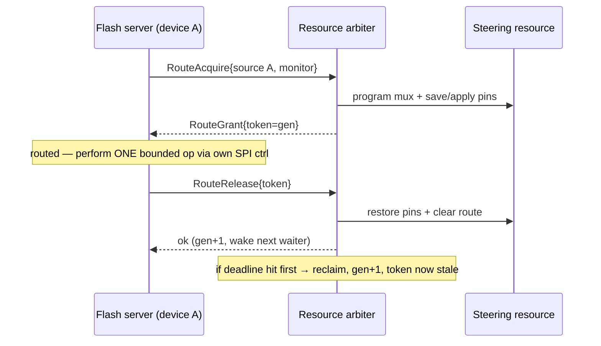

# AST10x0 Host-Flash Shared-Resource Arbiter (Option C)

Status: design proposal
Scope: how the AST10x0 host-flash path serves both monitored host flashes
(BMC on SPI1, PCH on SPI2), which share the single SCU internal-master mux, from
separate per-device flash servers without collapsing per-device isolation.

The general pattern (several flash devices behind one single-owner steering
resource) could recur on other targets, but the concrete steering resource here
is the AST10x0 SCU `SCU0F0` mux, so this design lives with the AST10x0 backend.

Related: [host-flash-design.md](host-flash-design.md) and
[host-flash-gaps.md](host-flash-gaps.md).

## 1. Problem

The flash service binds one server to one device. But several flash devices can
share a single-owner steering resource that serves one device at a time.
Independent servers would race on it, so they can't run as peers. Something must
arbitrate access to that resource while still letting callers address each
device independently.

Concretely on AST10x0: reaching a monitored host flash (BMC on SPI1, PCH on SPI2)
requires steering the RoT's SPI master onto the target bus through the shared SCU
internal-master mux (`SCU0F0`), then restoring passthrough. Only one bus can be
routed at a time, and the mux is a single shared register.

## 2. Decision

Adopt **Option C**: keep a **separate flash server per device** (each owns its own
SPI controller and flash, its own IPC channel, its own access control and fault
isolation), and move the contended steering resource into a dedicated **arbiter
service** that is its sole owner. Each device server performs
`acquire → one operation → release` against the arbiter.

Rejected alternatives:
- **Option A (device selector):** one server owns the steering resource and all
  devices behind one channel with a per-request `device` field. Cheapest at
  runtime (no IPC hop), but folds multiple devices into one process — losing
  fault isolation and per-device access control — and changes the request wire
  format.
- **Option B (per-device channels):** one owner process, one channel per device.
  No wire-format change and per-device access control, but still one process
  owning every device (no fault isolation between them).

Option C is chosen for **fault isolation and per-device access control**: a fault
or compromise in one device's server cannot corrupt another device or the shared
resource, because the only component touching the resource is the small, trusted
arbiter.

## 3. Architecture

The arbiter is the **sole owner** of the steering resource's MMIO. No device
server maps it. That single fact satisfies the "sole owner of the steering
resource" safety invariant by construction.

```
flash server A ──┐  (owns SPI ctrl A + flash A; no steering MMIO)
                 ├──IPC──► resource arbiter (sole owner of steering MMIO)
flash server B ──┘  (owns SPI ctrl B + flash B; no steering MMIO)
```

Independent flashes that do **not** share the resource (e.g. the RoT's own boot
flash) stay on their own standalone server and never touch the arbiter.

## 4. The critical section spans an IPC boundary

The resource must stay steered to device X *while* device X's server drives its
SPI transaction — but those are two different processes. The arbiter therefore
guards a critical section that spans an IPC boundary:
`acquire (arbiter) → do work (device server) → release (arbiter)`. Every hard
part of the design below follows from that.

## 5. Protocol

Two lease-based operations, on the arbiter's own channel (separate from the flash
op protocol, which is unchanged):

```rust
// request
struct RouteAcquire { source: SteerSource, monitor: MonitorId }
struct RouteRelease { token: u64 }
// reply
struct RouteGrant   { token: u64 }
```

- **ACQUIRE** — if free and the client is authorized for `source`: program the
  mux, save/apply the proprietary pin state, mark busy, start a deadline, return
  a `token`. If busy: **queue the request and respond when it is this client's
  turn** (blocking grant), rather than returning BUSY-and-poll.
- **RELEASE** — validate the token, restore pin state, clear the route, mark
  free, wake the next waiter.

The arbiter — not the client — owns the register encoding (`source → mux value`).
Clients pass a *logical* source; the arbiter maps it and enforces authorization.

## 6. Lease lifecycle and token

```
FREE ──acquire──► HELD(gen) ──release(token==gen)──► FREE (gen+1)
                     │
                     └──deadline expires──► reclaim: restore default, gen+1
```

The `token` carries a **generation counter** bumped on every release and every
reclaim. RELEASE checks `token.gen == current.gen`; a stale release (from a slow
client whose lease was already reclaimed and re-granted) fails the check and is a
no-op. This is the ABA guard.

## 7. Timeout + reclaim (the crux)

If a holder dies or stalls, the resource must not stay steered forever — leaving
it routed to a dead client means that device never returns to its default owner
(on AST10x0: the host bus never returns to passthrough → a host outage). So:

- Every lease has a **deadline**. On expiry the arbiter forcibly restores the
  default state (post-config + clear route) and bumps the generation.
- **Hazard:** reclaiming mid-transaction would yank routing out from under an
  in-flight flash command → a corrupt erase/program. Mitigation: **lease
  granularity = one bounded operation** (one sector erase / one page program /
  one bounded read), so the maximum hold time is known and the deadline can be
  set to `max single-op time + margin`. Reclaim then only ever fires on a
  genuinely stuck client, never a healthy in-flight one.

This maps directly onto the existing driver: today `route_bus` routes per
operation with a `Drop` guard. Under Option C, `route_bus` becomes "ACQUIRE from
arbiter" and the `Drop` guard becomes "RELEASE to arbiter" — same shape, same
per-op boundedness, plus one IPC hop.

## 8. Fairness and access control

- **Fairness:** a FIFO queue of waiters; grant to the head when the resource
  frees. Prevents one device starving another (e.g. a long recovery on one bus
  locking out the other).
- **Access control:** each client channel is provisioned with the set of
  `source`s it may route to; the arbiter rejects an ACQUIRE outside that set.
  This is what preserves per-device isolation — device A's server physically
  cannot steer the resource to device B's bus.

## 9. Failure modes

| Event | Arbiter response |
|-------|------------------|
| Holder dies mid-lease | Deadline reclaim → restore default, gen+1 |
| Holder slow past deadline | Same; its later RELEASE is a stale no-op |
| Double / late RELEASE | Generation mismatch → no-op |
| ACQUIRE while busy | Queued; granted in FIFO order |
| Unauthorized `source` | Rejected |
| **Arbiter itself dies** | Catastrophic (resource stuck). Mitigation: arbiter is small/trusted/verified and **forces the default state on startup** |

## 10. Sequence



## 11. Latency

Option C adds latency from two sources:

1. **Extra IPC round-trips per op** — each flash op gains an ACQUIRE and a
   RELEASE (client → flash server, then flash server → arbiter ×2, plus context
   switches).
2. **Queueing under contention** — when both devices are active, one waits in the
   arbiter FIFO. This wait is inherent to the single-owner resource, but Option C
   makes it a cross-process block.

Impact depends on the op mix:
- **Bulk-dominated ops** (full-image recovery, mostly time inside erase/program):
  the ACQUIRE/RELEASE overhead is negligible next to the flash's WIP-poll time.
- **Many small ops** (lots of 256 B programs / small reads): per-op IPC overhead
  is paid repeatedly and can dominate.

## 12. Recommendations

1. **Scope the arbiter to only the devices that share the resource.** Keep
   independent flashes (the RoT's own boot flash) on standalone servers; do not
   route them through the arbiter. The selector/arbiter complexity is only worth
   paying where the hardware forces it.
2. **Lease granularity = one bounded operation.** Do not batch multiple ops per
   lease initially. It keeps the hold time bounded, makes deadline reclaim safe,
   and matches the existing per-op `route_bus`/`Drop` structure. Revisit batching
   only if measurement proves the per-op hop is the bottleneck.
3. **Use blocking, queued grants (FIFO), not BUSY-and-poll.** It fits the
   existing `object_wait`/`handle_one` server loop and avoids busy retries.
4. **Opaque token with a generation counter; RELEASE validates it; stale releases
   are no-ops.** This is the ABA guard against a reclaimed-then-late release.
5. **Deadline-based reclaim, sized from the measured worst-case single op plus
   margin.** Force the default (passthrough) state on both reclaim and arbiter
   startup, so a stuck or restarted arbiter re-establishes a safe baseline.
6. **The arbiter owns the register encoding and enforces per-client source
   authorization.** Clients pass a logical source only; they can never steer to
   an unauthorized bus. This is where the isolation guarantee actually lives.
7. **Do not change the flash op wire format.** Device selection is by separate
   per-device server/channel, not a `device` field in `EraseOp`/`ReadOp`/etc.
   The arbiter has its own small opcode set; the flash ops in
   `services/flash/opcode.rs` stay as they are.
8. **Measure before optimizing.** If high-op-count recovery latency proves
   unacceptable, the escape hatch is to fold the arbiter into the device server
   (Options A/B), turning ACQUIRE/RELEASE back into in-process calls at the cost
   of inter-device fault isolation. Keep that trade explicit for the review.
9. **Keep the arbiter small and trusted.** It is the sole owner of the steering
   resource and a single point of failure; its correctness is load-bearing, so
   minimize its surface and verify the reclaim/startup-restore paths.

## 13. Open questions

- Can the arbiter observe client channel death directly (immediate reclaim)
  instead of waiting for the deadline? Depends on kernel primitives.
- Exact deadline value — needs the measured worst-case single-op time
  (4 KiB erase / 256 B program WIP-poll) plus margin.
- Is the per-op IPC hop acceptable for full-image recovery throughput, or does
  that workload push back toward the single-server design?
