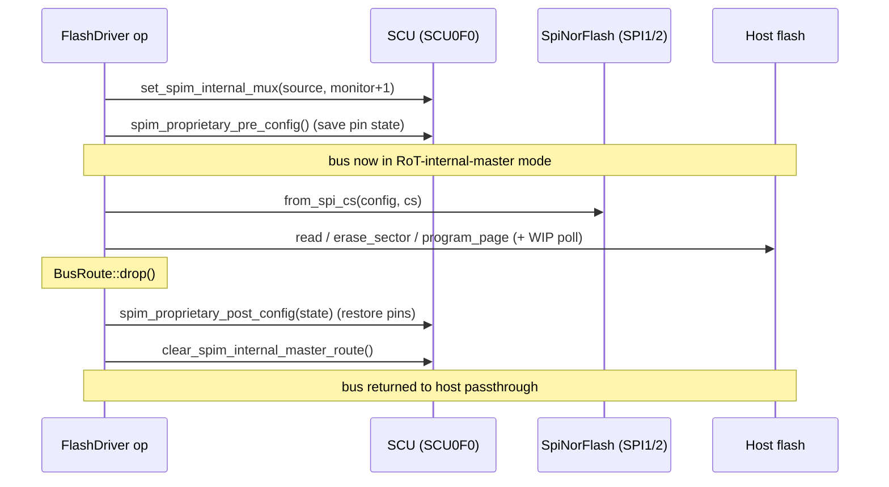

# AST10x0 External Host SPI Flash Backend — Design

Status: implemented (`flash-multi-device`, commit `ca5b075`)
Component: `target/ast10x0/backend/flash/src/host.rs`

## 1. Motivation

A Root-of-Trust (RoT) that performs PFR-style protection needs two capabilities
on the BMC/PCH SPI flash buses it guards:

1. **Enforcement** — restrict what the *host* (BMC/PCH) may do to its own flash.
2. **Access** — drive that same flash *itself*, to read it for verification and
   to erase/program it for recovery or update.

Capability (1) is provided by `ast10x0_board::spi_monitor::Ast1060SpiMonitor`,
which programs the SPI monitor (SPIPF) blocks with per-region read/write
privileges, mux control, and a one-way policy lock.

This design provides (2): a `FlashDriver` binding that lets the RoT take
temporary ownership of a monitored SPI1/SPI2 bus and issue real flash commands.
Together the two form the complete PFR path — the monitor enforces host access
while the driver gives the RoT its own read/erase/program access to the same
flash. It is the OpenPRoT equivalent of aspeed-zephyr-project's
`BMC_PCH_SPI_Command` path in `lib/hrot_hal/flash/flash_aspeed.c`.

## 2. Background: two ways to reach a monitored flash

Each guarded bus sits behind a SPI monitor (SPIM) instance with an external mux.
There are two operating modes:

- **Passthrough** — the host owns the bus; the SPIM observes and filters traffic
  against the locked policy. This is the steady state.
- **RoT internal master** — the RoT's own SPI controller is routed onto the bus
  through the SCU internal mux (`SCU0F0`). The host is momentarily disconnected;
  the RoT issues commands directly.

The access path must switch a bus into *RoT internal master* mode only for the
duration of one operation, then return it to *passthrough*, keeping the host's
outage window as small as possible.

## 3. Where it fits

Both AST10x0 flash backends implement the same low-level trait, so everything
above them (page/window splitting, IPC service) is identical regardless of which
physical flash is targeted.

```
services_flash_server::FlashIpcServer         (IPC opcodes)
        │
hal_flash::BlockingFlash                       (page/window splitting, bounds)
        │
hal_flash_driver::FlashDriver                  (start-poll-complete contract)
        ├── Ast10x0FmcFlashDriver     → RoT's own boot flash on the FMC (CS0)
        └── Ast10x0SpiHostFlashDriver → external BMC/PCH flash on SPI1/SPI2   ← new
                    │
        ast10x0_peripherals::smc::SpiNorFlash  (WREN/RDSR/PP/SE, 3/4-byte addr)
        ast10x0_peripherals::scu               (internal-master mux routing)
```

`host.rs` is a module of the existing `flash-backend` crate, so it reuses that
crate's `map_smc_error`, `DEFAULT_CONFIG` geometry, and `JedecId` re-export.

## 4. Public API

```rust
pub struct SpiHostFlashParams {
    pub controller: SmcController,      // Spi1 or Spi2 (Fmc rejected)
    pub cs: ChipSelect,                 // Cs0 or Cs1
    pub monitor: SpiMonitorInstance,    // SPIM path the bus is routed through
    pub config: FlashConfig,            // geometry / clock
}

pub struct Ast10x0SpiHostFlashDriver { /* … */ }

impl Ast10x0SpiHostFlashDriver {
    pub unsafe fn new(params: SpiHostFlashParams) -> Result<Self, ErrorCode>;
    pub fn read_jedec(&mut self) -> Result<JedecId, ErrorCode>;
}

impl FlashDriver for Ast10x0SpiHostFlashDriver { /* read / start_erase / start_program / … */ }
```

`controller` determines both the monitor source and the host bus topology:

| controller | source            | topology                       |
|------------|-------------------|--------------------------------|
| `Spi1`     | `SpiMonitorSource::Spi1` | `HostSpi { master_idx: 0 }`   |
| `Spi2`     | `SpiMonitorSource::Spi2` | `NormalSpi { master_idx: 2 }` |
| `Fmc`      | — (rejected: `FLASH_AST10X0_INVALID_CHIP_SELECT`) | |

## 5. Per-operation bus routing

Every `FlashDriver` method (and `read_jedec`) wraps its flash access in a scoped
route. Routing up and teardown are symmetric; teardown is guaranteed by a Drop
guard so an early `?` return still restores passthrough.



The guard:

```rust
struct BusRoute<'a> { scu: &'a ScuRegisters, proprietary: Option<SpimGpioOriVal> }

impl Drop for BusRoute<'_> {
    fn drop(&mut self) {
        if let Some(state) = self.proprietary.take() {
            self.scu.spim_proprietary_post_config(state);
        }
        self.scu.clear_spim_internal_master_route();
    }
}
```

A subtlety worth noting: the `SpiNorFlash` facade is built from `&mut self.spi`
*inside* the routed section while `BusRoute` holds `&self.scu`. These are disjoint
field borrows, so the construction is inlined per method rather than routed
through a `&mut self` helper (which would borrow the whole struct and conflict
with the outstanding `&self.scu`).

This mirrors the proven `reset_one_bmc_flash` sequence in
`target/ast10x0/tests/spimonitor/setup_all_spim.rs`.

## 6. Geometry, addressing, and sizing

- Trait constants come from the shared `DEFAULT_CONFIG` geometry:
  `PROGRAM_WINDOW_SIZE = 256` (page), `PAGE_SIZE = 4096` (erase sector),
  `MAX_READ_SIZE = 4096`, `READ_ALIGNMENT = 4`, `PROGRAM_ALIGNMENT = 1`.
- `new` rejects any `config` whose page/sector geometry differs
  (`FLASH_AST10X0_DEVICE_NOT_SUPPORTED`).
- Runtime `size()` derives from `config.capacity_mb`, so a 128 MiB BMC part and a
  32 MiB part share one driver type.
- The SMC device layer selects 4-byte addressing automatically for capacities
  above 16 MiB, so large host flashes work without extra configuration.

## 7. Safety contract

`new` is `unsafe`. The caller must guarantee:

- Sole ownership of the selected SPI1/SPI2 controller block.
- Coordinated access to the **shared SCU** — this driver programs the internal
  SPI-master mux (`SCU0F0`) on every operation.
- The SPI monitor policy for `monitor` is not locked in a way that blocks the
  RoT internal master (the monitor must permit RoT access, or be configured
  before its one-way lock is applied).
- The controller pinmux has already been applied by the kernel target's pre-task
  init.
- The constructor is called at most once per bus.

## 8. Error mapping

Peripheral `SmcError`s pass through the crate-shared `map_smc_error`, yielding the
same `FLASH_AST10X0_*` codes used by the FMC backend. Additional cases:

- Route setup failure (`set_spim_internal_mux`) → `FLASH_AST10X0_HARDWARE_ERROR`.
- Short read (bytes returned ≠ requested) → `FLASH_AST10X0_SHORT_READ`.
- Wrong erase size → `FLASH_GENERIC_ERASE_INVALID_SIZE`.

## 9. Relationship to aspeed-zephyr-project

| aspeed-zephyr (`flash_aspeed.c`)     | OpenPRoT (`host.rs`)                         |
|--------------------------------------|---------------------------------------------|
| `BMC_PCH_SPI_Command` dispatch       | `FlashDriver` impl                          |
| device-id table (`Flash_Devices_List`) | `SpiHostFlashParams { controller, cs }`   |
| Zephyr `flash_read/write/erase`      | `SpiNorFlash::read/program_page/erase_sector` |
| faked `WREN`/`RDSR`                  | real WREN + RDSR/WIP polling                |
| (mux handled elsewhere in SDK)       | explicit per-op SCU internal-master routing |

## 10. Limitations / future work

Driver-level gaps between this driver and full BMC/PCH update parity are tracked
separately in [host-flash-gaps.md](host-flash-gaps.md); the highlights:

- **Single-lane I/O.** Reads use single-lane fast-read; dual/quad modes are not
  yet wired (throughput, not correctness).
- **No dual-flash spanning.** One driver instance targets one chip select; the
  BMC dual-flash "spill onto the second chip past size" behavior is not modeled.
- **Erase granularity.** Only 4 KiB sector erase is exposed; block/chip erase
  would need peripheral-layer support.
- **Validation.** Builds clean for `--config=virt_ast10x0`. Functional
  validation requires EVB hardware — QEMU's `ast1030-evb` does not model the
  SPI1/SPI2 host flashes behind the SPIM mux, so there is no QEMU test.
- **Routing scope.** Routing is per-operation. A future batched/session variant
  could hold the route across a verify sweep to reduce mux churn, at the cost of
  a longer host outage.
```
